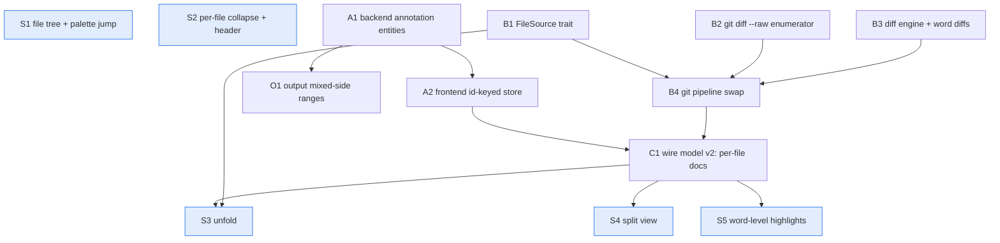

# Diff Redesign — DAG Overview

GitHub-shaped diff review: file tree, per-file collapse, unfold between hunks,
unified/split toggle, word-level highlights. Full settled context: see the
grill session restatement (2026-07-10). Anchor: getting lost in big multi-file diffs.

## Conventions

- One file per node. Frontmatter: `id`, `kind` (refactor|story), `wave`,
  `depends_on` (list of node ids), `status`.
- `status: ready` — full /design-spec shape, implementable by a fresh session.
- `status: fogged` — primer only: goal, edge rationale, settled constraints,
  pointers. **Clear the fog before starting**: when a fogged node's deps are
  done, rewrite it into full spec shape (aim may have shifted — that's the point).
- `status: done` — landed; keep for archaeology.

## Settled decisions (do not relitigate in node sessions)

1. **Substrate (b)**: git mode loads full texts per side (`git diff --raw` →
   OIDs → `git cat-file --batch`; zero OID = working tree = fs read) and
   computes hunks in-process. Patch parsing (`unidiff` in `src-tauri/src/diff.rs`)
   survives only for raw `diff_content` — which gets **no unfold affordance**.
2. **Annotation identity**: id-keyed entities; anchor is two-endpoint
   `{path, start: {side, line}, end: {side, line}}` (mixed-side ranges cover
   replacements, GitHub's `start_side`/`side` model). Context lines anchor
   new-side (old for deleted files). Display index = ephemeral selection only.
3. **Content-source seam**: `side → full text | None` trait. Tiers:
   RawPatch → GitShell → (parked) JjLib.
4. **Chrome**: tree = toggleable sidebar + palette fuzzy-jump, hidden by default;
   files expanded by default, auto-collapse huge ones; unified default, split
   behind persisted toggle.

**Parked (seams only, no nodes)**: jj-lib tier, stateful reviews /
changed-since-amend, detached reviews + agent threads, in-window file editing,
commit-metadata amending, viewed-checkboxes, staging.

## The DAG

## Waves

| Wave | Lanes (parallel) |
|---|---|
| 0 | S1, S2 · A1 · B1, B2, B3 |
| 1 | A2 · B4 · O1 |
| 2 | C1 (the join — keep it thin: mostly reshaping + deletion) |
| 3 | S5 (cheapest) · S3 · S4 |

Critical path: **B3 → B4 → C1 → S4**. Trunk A has slack.

## Method (why the graph looks like this)

- Nodes are the codebase's current *lies* flipped true (T1 identity, T2 full
  texts, T3 computed hunks, T4 per-file wire model); stories are thin leaves
  consuming truths.
- An edge exists only if "this diff gets smaller/safer if that lands first".
- Every node leaves the repo green and shippable. B4 is the strangler swap:
  new producer, old contract. C1 changes the contract once, after both trunks.
- S1/S2 ride the *current* model for early value; they take a small refit at C1.
