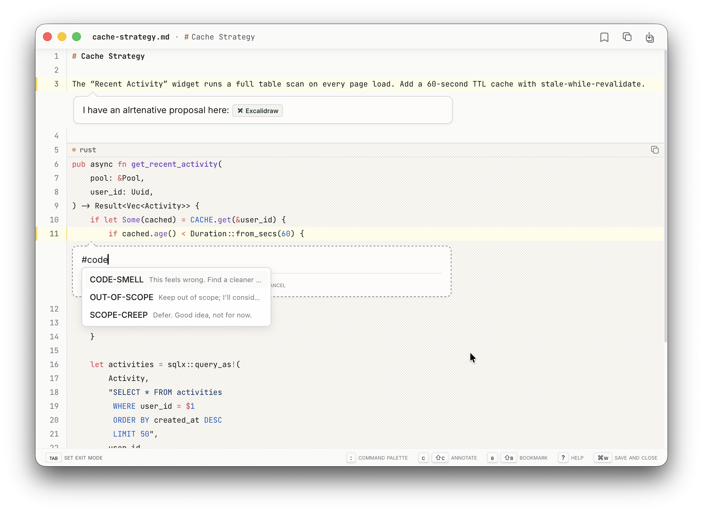

# annot

An annotation tool for human-in-the-loop AI workflows.

> **Platform**: macOS only (Apple Silicon). Not tested on Linux or Windows.



## Install

```bash
brew install denolehov/tap/annot
```

<details>
<summary>Build from source</summary>

```bash
git clone https://github.com/denolehov/annot.git && cd annot
pnpm install
pnpm tauri build
```

</details>

## Quick start

### With Claude Code

Add to your MCP settings (`~/.claude/settings.json` or project `.claude/settings.json`):

```json
{
  "mcpServers": {
    "annot": {
      "command": "annot",
      "args": ["mcp"]
    }
  }
}
```

Claude now has three tools: `review_file`, `review_diff`, and `review_content`. Ask it to review something and a window opens for your feedback.

### Standalone

```bash
annot file.rs           # Open a file for annotation
annot --json file.rs    # Output as JSON (for agent consumption)
```

## How it works

1. A window opens with your content (code, diff, or markdown)
2. Click line numbers to select ranges, then type your annotation
3. Weave tags into prose for structured feedback: `[# VERIFY] this claim with a test`
4. Select an exit mode (Tab) to signal intent — "Apply", "Reject", "Needs changes"
5. Close the window — structured annotations return to the caller

No data leaves your machine. No accounts. No cloud.

## Features

### Tags

Composable mini-prompts you build over time. Type `/` in the annotation editor to insert one:

```
[# VERIFY] this with a dedicated test
Make this configurable. Add a new section in @config.rs.
[# ELABORATE] on the error handling here
```

Tags carry semantic meaning that LLMs interpret. They appear in a LEGEND block in the output. Create your own via the command palette (`:`).

### Exit modes

Signal *intent* when closing a review. Instead of just closing, indicate what should happen next.

**User-defined modes** persist across sessions. **Agent-defined modes** are ephemeral and passed via MCP:

```json
{
  "exit_modes": [
    {"name": "Apply", "instruction": "Apply all changes exactly as annotated", "color": "green"},
    {"name": "Reject", "instruction": "Reject and explain reasoning", "color": "red"}
  ]
}
```

### Session context

Press `g` to add comments that apply to the entire review — framing context like "focus on error handling, ignore style."

### More

- **Syntax highlighting** for 50+ languages
- **Mermaid diagrams** rendered inline
- **Portal links** — embed live code from other files
- **Bookmarks** — save and recall annotations across sessions
- **`/excalidraw`** — draw diagrams inside annotations
- **`/replace`** — propose inline code changes

## MCP tools

### `review_file`

| Parameter | Type | Required | Description |
|-----------|------|----------|-------------|
| `file_path` | string | yes | Absolute or relative path to the file |
| `exit_modes` | array | no | Ephemeral exit modes for this session |

### `review_diff`

| Parameter | Type | Required | Description |
|-----------|------|----------|-------------|
| `git_diff_args` | array | no* | Git diff arguments (e.g., `["--staged"]`) |
| `diff_content` | string | no* | Raw unified diff content |
| `label` | string | no | Display name (default: "diff") |
| `exit_modes` | array | no | Ephemeral exit modes for this session |

*Either `git_diff_args` or `diff_content` must be provided.

### `review_content`

| Parameter | Type | Required | Description |
|-----------|------|----------|-------------|
| `content` | string | yes | Markdown-formatted text content |
| `label` | string | yes | Display name with .md extension |
| `exit_modes` | array | no | Ephemeral exit modes for this session |

## Keyboard shortcuts

| Shortcut | Function |
|---|---|
| Click line numbers | Select/deselect lines |
| Shift+Click | Select range |
| `/` (in editor) | Tag autocomplete menu |
| Tab / Shift+Tab | Cycle exit modes |
| g | Session context editor |
| : | Command palette |

## License

[AGPL-3.0](LICENSE)
