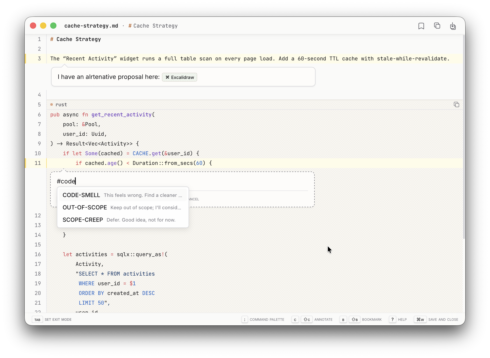

# annot

An annotation tool for human-in-the-loop AI workflows.

> **Platform**: macOS (Apple Silicon), Linux (NixOS/Wayland tested), and Windows (build from source).



## Why

AI agents work fast, but "make it better" is a lossy feedback channel. When an agent drafts a plan, proposes a refactor, or generates code — you need a way to point at specific lines and say what you actually mean, before any of it becomes real.

annot is that moment of review. It opens a window, you shape the content with located, structured feedback, then it closes and gets out of the way.

## Install

**macOS:**

```bash
brew install denolehov/tap/annot
```

<details>
<summary>Build from source (macOS)</summary>

```bash
git clone https://github.com/denolehov/annot.git && cd annot
pnpm install
pnpm tauri build
```

</details>

<details>
<summary>Build from source (macOS — with Nix)</summary>

```bash
git clone https://github.com/denolehov/annot.git && cd annot
nix develop          # enter dev shell with all build dependencies
pnpm install
pnpm tauri build     # .app bundle at src-tauri/target/release/bundle/macos/
```

</details>

<details>
<summary>Build from source (Ubuntu)</summary>

Install system dependencies:

```bash
sudo apt-get update
sudo apt-get install -y \
  libwebkit2gtk-4.1-dev \
  build-essential \
  file \
  libxdo-dev \
  libssl-dev \
  libayatana-appindicator3-dev \
  librsvg2-dev \
  libgstreamer1.0-dev \
  libgstreamer-plugins-base1.0-dev \
  gstreamer1.0-plugins-good \
  gstreamer1.0-plugins-bad \
  libgstreamer-plugins-bad1.0-dev
```

Install Rust, Node.js 24, and pnpm, then build:

```bash
curl --proto '=https' --tlsv1.2 -sSf https://sh.rustup.rs | sh
git clone https://github.com/denolehov/annot.git && cd annot
pnpm install
pnpm tauri build     # binary at src-tauri/target/release/annot
```

</details>

<details>
<summary>Build from source (NixOS)</summary>

```bash
git clone https://github.com/denolehov/annot.git && cd annot
nix develop          # enter dev shell with all build dependencies
pnpm install
pnpm tauri build     # binary at src-tauri/target/release/annot
```

Or install into your Nix profile (wraps the binary with required env vars):

```bash
nix profile add path:.
```

> **Wayland note**: The installed binary automatically sets `GDK_BACKEND=x11` and
> `WEBKIT_DISABLE_DMABUF_RENDERER=1` via the Nix wrapper, which prevents broken
> text rendering in WebKit2GTK under Wayland.

</details>

<details>
<summary>Build from source (Windows)</summary>

Install prerequisites:

1. **Rust** — install via [rustup](https://rustup.rs/)
2. **Node.js 24** — install via [nodejs.org](https://nodejs.org/)
3. **pnpm** — `npm install -g pnpm`
4. **WebView2 Runtime** — preinstalled on Windows 11; Windows 10 users can download the
   [Evergreen Bootstrapper](https://developer.microsoft.com/microsoft-edge/webview2/) from Microsoft.

Clone and build:

```powershell
git clone https://github.com/denolehov/annot.git
cd annot
pnpm install
pnpm tauri build
```

The binary is at `src-tauri\target\release\annot.exe`. There is no installer bundle yet —
add the `src-tauri\target\release\` directory to your `PATH`, or reference the `.exe` directly.

</details>

## Quick start

### With Claude Code

Same command on macOS, Linux, and Windows:

```bash
claude mcp add --scope user annot annot mcp
```

Claude now has review tools (`review_file`, `review_diff`, `review_content`). Ask it to review something and a window opens for your feedback.

> **Windows note**: `annot.exe` must be on your `PATH` (see build instructions above),
> or pass the full path: `claude mcp add --scope user annot "C:\path\to\annot.exe" mcp`.

### Standalone

```bash
annot file.rs                 # Open a file for annotation
cat file.go | annot -l main.go  # Pipe from stdin (label sets highlighting)
annot --json file.rs          # Output as JSON (for agent consumption)
annot diff                    # Review uncommitted changes
annot diff 4f7d4491           # Review one revision against its parent
annot diff main..HEAD         # Review a revision range (main...HEAD for merge base)
annot diff --staged           # Review staged changes (git only — jj has no index)
annot diff -- src/ '*.rs'     # Limit the diff (pathspecs; jj filesets in a jj repo)
```

## How it works

1. A window opens with your content (code, diff, or markdown)
2. Click line numbers to select ranges, then type your annotation
3. Weave tags into prose for structured feedback: `[# VERIFY] this claim with a test`
4. Select an exit mode (Tab) to signal intent — "Apply", "Reject", "Needs changes"
5. Close the window — structured annotations return to the caller

No data leaves your machine. No accounts. No cloud.

## Features

| Feature | What it does |
|---|---|
| **File review** | Any source file, syntax highlighting for 50+ languages |
| **Diff review** | git & jj: working copy, revision, range, staged — or raw diffs via stdin/MCP |
| **Content review** | Agent-generated markdown — plans, drafts, analysis |
| **Tags** | Semantic mini-prompts (`[# VERIFY]`) woven into annotations |
| **Exit modes** | Signal intent on close — "Apply", "Reject", agent-defined per session |
| **Session context** | Review-wide framing comment (`Shift+C`) |
| **Replace blocks** | Propose inline code changes (`/replace`) |
| **Excalidraw** | Sketch diagrams inside annotations (`/excalidraw`); convert Mermaid to sketch |
| **Mermaid** | Diagrams rendered inline from markdown code blocks |
| **Portal links** | Embed live code from other files into markdown under review |
| **Images** | Paste screenshots directly into annotations |
| **References** | `@`-link annotations, sections, and project files |
| **Diff navigation** | File tree sidebar (`Cmd+B`), per-file collapse, unified/split view, unfold context |
| **Command palette** | `:` — tags, exit modes, file jump, copy, save, theme |
| **Export** | Save to markdown file, send to Obsidian |
| **Structured output** | LLM-ready text or `--json` with embedded images |

Full detail in [docs/features.md](docs/features.md). Three highlights:

### Tags

Composable mini-prompts you build over time. Type `#` in the annotation editor to insert one:

```
[# VERIFY] this with a dedicated test
Make this configurable. Add a new section in @config.rs.
[# ELABORATE] on the error handling here
```

Tags carry semantic meaning that LLMs interpret. They appear in a LEGEND block in the output. Create your own via the command palette (`:`).

### Exit modes

Signal *intent* when closing a review. Instead of just closing, indicate what should happen next.

**User-defined modes** persist across sessions. **Agent-defined modes** are ephemeral and passed via MCP:

```json
{
  "exit_modes": [
    {"name": "Apply", "instruction": "Apply all changes exactly as annotated", "color": "green"},
    {"name": "Reject", "instruction": "Reject and explain reasoning", "color": "red"}
  ]
}
```

### Session context

Press `Shift+C` to add comments that apply to the entire review — framing context like "focus on error handling, ignore style."

## MCP tools

### `review_file`

| Parameter | Type | Required | Description |
|-----------|------|----------|-------------|
| `file_path` | string | yes | Absolute or relative path to the file |
| `exit_modes` | array | no | Ephemeral exit modes for this session |

### `review_diff`

| Parameter | Type | Required | Description |
|-----------|------|----------|-------------|
| `working_dir` | string | no | The repository to review — any directory inside it works. Defaults to annot's own process directory (see below) |
| `target` | object | no* | What to diff: `{"kind": "working_copy"}` (default), `{"kind": "revision", "rev": "@-"}`, `{"kind": "range", "from": "main", "to": "HEAD", "merge_base": true}`, or `{"kind": "staged"}` (git only) |
| `pathspecs` | array | no | Pathspecs limiting the diff (e.g., `["src/", "*.rs"]`); jj filesets in a jj repo |
| `diff_content` | string | no* | Raw unified diff content (mutually exclusive with `target`/`pathspecs`) |
| `label` | string | no | Display name (default: "diff") |
| `exit_modes` | array | no | Ephemeral exit modes for this session |

*`target` defaults to `working_copy` — in git, worktree vs HEAD (staged + unstaged, untracked included); in jj, `@` vs its parents after snapshotting the working copy. `range` with `merge_base: true` diffs from `merge_base(from, to)` to `to`, like `from...to`.

**Agents working across repositories should pass `working_dir`.** annot's MCP server runs as a sidecar of your agent and inherits the directory the agent was *launched* from — which is frequently not the repository being edited. Left to default, it finds whatever repo encloses that launch directory and reviews it: a real diff, confidently rendered, from somewhere else entirely. `working_dir` names the repo explicitly; it also roots the file picker and `:save` for the session. It accepts any directory inside the repo (annot searches upward for the root), and errors if the path doesn't exist.

**Works with git and [jj](https://jj-vcs.github.io/jj/) alike**, colocated or not. `rev` strings are the repository's own dialect — git revspecs, or jj revsets (`@-`, `trunk()`) in a jj repo. In a jj repo annot snapshots the working copy the way every `jj` command does (one `snapshot working copy` op — annot's only write), and conflicted files render as jj's marker text instead of erroring.

### `review_content`

| Parameter | Type | Required | Description |
|-----------|------|----------|-------------|
| `content` | string | yes | Markdown-formatted text content |
| `label` | string | yes | Display name with .md extension |
| `exit_modes` | array | no | Ephemeral exit modes for this session |

## Keyboard shortcuts

| Shortcut | Function |
|---|---|
| Click line numbers | Select/deselect lines |
| Shift+Drag | Select range |
| c | Comment hovered line |
| Shift+C | Session context (global comment) |
| Tab / Shift+Tab | Cycle exit modes |
| Alt+Tab | Exit mode picker |
| : | Command palette |
| Cmd+F / Ctrl+F | Search |
| Cmd+B / Ctrl+B | Toggle file tree (diffs) |
| Cmd+= / Cmd+- / Cmd+0 | Zoom in / out / reset |
| Cmd+S / Ctrl+S | Save to file |
| Cmd+W / Ctrl+W | Save and close |
| ? | Help overlay |

**In annotation editor:**

| Shortcut | Function |
|---|---|
| # | Insert tag |
| @ | Reference (annotations, sections, files) |
| / | Slash commands (/replace, /excalidraw) |

## License

[AGPL-3.0](LICENSE)
