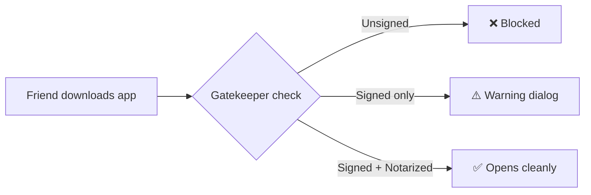

# Distributing a Signed macOS App to Friends

**TL;DR**: You need to ==code sign + notarize== your app, then distribute the `.dmg` or `.app`. Without this, Gatekeeper blocks the app.

---

## The Problem: Gatekeeper

When your friend double-clicks your app, macOS asks: "Is this trustworthy?"



**Notarization** = Apple scans your app and says "we checked it, it's not malware."

---

## What You Need

| Thing                                | Where to get it                       | What it is                   |
| ------------------------------------ | ------------------------------------- | ---------------------------- |
| Developer ID Application certificate | Apple Developer portal → Certificates | Signs the app binary         |
| Developer ID Installer certificate   | Same place (optional)                 | Signs `.pkg` installers      |
| Apple ID + App-specific password     | appleid.apple.com → Security          | For notarization API         |
| Team ID                              | Apple Developer portal → Membership   | 10-char ID like `ABCD1234EF` |

---

## The Process (End-to-End)

### Step 1: Create the signing certificate

1. Open **Keychain Access** → Certificate Assistant → Request Certificate from CA
2. Enter your email, leave CA Email blank, choose "Saved to disk"
3. Go to [developer.apple.com/account/resources/certificates](https://developer.apple.com/account/resources/certificates)
4. Create new certificate → **Developer ID Application**
5. Upload your `.certSigningRequest` file
6. Download and double-click to install in Keychain

### Step 2: Create app-specific password for notarization

1. Go to [appleid.apple.com](https://appleid.apple.com) → Security
2. Generate an App-Specific Password (call it "notarization" or similar)
3. Save it somewhere safe

### Step 3: Configure Tauri for signing

Set these environment variables before building:

```bash
# Your signing identity (find it with: security find-identity -v -p codesigning)
export APPLE_SIGNING_IDENTITY="Developer ID Application: Your Name (TEAMID1234)"

# For notarization
export APPLE_ID="your@email.com"
export APPLE_PASSWORD="xxxx-xxxx-xxxx-xxxx"  # The app-specific password
export APPLE_TEAM_ID="TEAMID1234"
```

### Step 4: Build with signing enabled

```bash
# This builds, signs, AND notarizes in one step
pnpm tauri build
```

Tauri v2 handles signing and notarization automatically when these env vars are set.

### Step 5: Distribute

The signed+notarized app is in:
```
target/release/bundle/macos/annot.app
# or as DMG:
target/release/bundle/dmg/annot_0.1.0_aarch64.dmg
```

Zip it up or share the DMG. Your friend can open it without Gatekeeper complaints.

---

## Quick Reference: The Commands

```bash
# Find your signing identity
security find-identity -v -p codesigning

# Verify an app is signed
codesign -dv --verbose=4 /path/to/annot.app

# Check notarization status
spctl -a -vv /path/to/annot.app

# Manually notarize (if needed)
xcrun notarytool submit annot.dmg \
  --apple-id "your@email.com" \
  --password "xxxx-xxxx-xxxx-xxxx" \
  --team-id "TEAMID1234" \
  --wait
```

---

## Common Gotchas

| Problem                                      | Solution                                                              |
| -------------------------------------------- | --------------------------------------------------------------------- |
| "Developer cannot be verified"               | App wasn't notarized — check env vars and rebuild                     |
| Notarization fails with "invalid signature"  | Certificate not in keychain, or wrong identity name                   |
| Build succeeds but friend still gets warning | DMG itself needs signing — use `pnpm tauri build` which handles this  |
| "App is damaged and can't be opened"         | Quarantine flag issue — friend can run `xattr -cr /path/to/annot.app` |