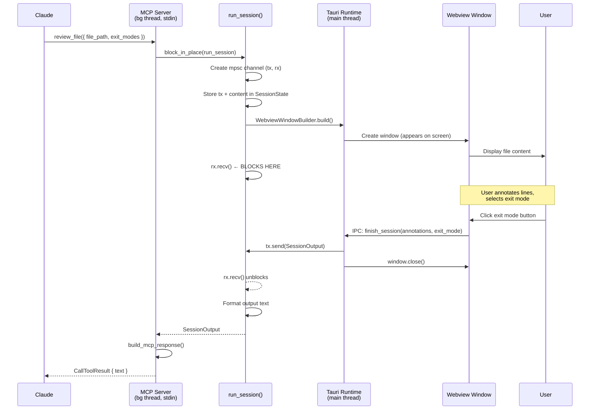

# Spec: annot MCP Integration

## Goal

Enable annot to run as an MCP server (`annot mcp`) that exposes `review_file` and `review_content` tools. Each tool call opens an annotation window, blocks until the user finishes, and returns structured output to Claude.

## Design

### Architecture Overview

```
┌─────────────────────────────────────────────────────────────────┐
│                        annot process                            │
├─────────────────────────────────────────────────────────────────┤
│                                                                 │
│  ┌─────────────────────┐      ┌──────────────────────────────┐  │
│  │     Main Thread     │      │     Background Thread        │  │
│  │   (Tauri Runtime)   │      │      (MCP Server)            │  │
│  │                     │      │                              │  │
│  │  ┌───────────────┐  │      │  ┌────────────────────────┐  │  │
│  │  │  Event Loop   │  │      │  │ rmcp stdio server      │  │  │
│  │  │  .run()       │  │      │  │ reads stdin directly   │  │  │
│  │  └───────────────┘  │      │  │   - review_file        │  │  │
│  │         ▲          │      │  │   - review_content     │  │  │
│  │         │          │      │  └──────────┬─────────────┘  │  │
│  │  ┌──────┴────────┐  │      │             │                │  │
│  │  │ Window Events │  │      │             ▼                │  │
│  │  │ IPC Commands  │  │      │  ┌────────────────────────┐  │  │
│  │  └───────────────┘  │      │  │   run_session()        │  │  │
│  │                     │      │  │   - create window      │  │  │
│  └─────────────────────┘      │  │   - rx.recv() BLOCKS   │  │  │
│                               │  └────────────────────────┘  │  │
│                               └──────────────────────────────┘  │
│                                                                 │
│  Shared: Arc<Mutex<SessionState>>                               │
│  Flag: AtomicBool (should_exit)                                 │
└─────────────────────────────────────────────────────────────────┘
```

**Stdin flow:** The background thread runs the rmcp server which reads stdin directly via `rmcp::transport::stdio()`. The main thread never touches stdin — it only runs the Tauri event loop and handles window/IPC events.

### Startup Sequence

```
annot mcp
    │
    ├─► Parse CLI (clap subcommand)
    │
    ├─► Set accessory mode (hide dock/taskbar icon)
    │   macOS: app.set_activation_policy(ActivationPolicy::Accessory)
    │   Linux/Windows: start without visible window (no extra action needed)
    │
    ├─► Initialize shared state
    │
    ├─► spawn MCP thread ──────────────────┐
    │   run_mcp(app_handle.clone())        │
    │                                      ▼
    │                           ┌────────────────────┐
    │                           │ rmcp stdio server  │
    │                           │ blocks on stdin    │
    │                           └────────────────────┘
    │
    └─► Tauri app.run() (main thread, no visible window)
```

### Tool Call Sequence



### Mode Enum

```rust
enum Mode {
    File(PathBuf),  // annot <file>
    Stdin,          // cat file | annot
    Mcp,            // annot mcp
}
```

All modes use the same `run_session()` core. The difference:
- **File/Stdin**: print result to stdout, then exit
- **Mcp**: return result to MCP handler, keep app running for next call

### MCP Server Implementation

```rust
#[derive(Clone)]
pub struct AnnotServer {
    app_handle: AppHandle,
    tool_router: ToolRouter<Self>,
}

#[tool_router]
impl AnnotServer {
    pub fn new(app_handle: AppHandle) -> Self {
        Self {
            app_handle,
            tool_router: Self::tool_router(),
        }
    }

    #[tool(description = "Opens a file for annotation. Blocks until browser closes.")]
    async fn review_file(&self, params: ReviewFileInput) -> Result<CallToolResult, McpError> {
        let output = tokio::task::block_in_place(|| {
            run_session(&self.app_handle, SessionInput::File(params))
        })?;
        Ok(build_mcp_response(output))
    }

    #[tool(description = "Opens ephemeral content for annotation. Blocks until browser closes.")]
    async fn review_content(&self, params: ReviewContentInput) -> Result<CallToolResult, McpError> {
        let output = tokio::task::block_in_place(|| {
            run_session(&self.app_handle, SessionInput::Content(params))
        })?;
        Ok(build_mcp_response(output))
    }
}

pub fn run_mcp(app_handle: AppHandle) {
    let rt = tokio::runtime::Runtime::new().unwrap();
    rt.block_on(async {
        let server = AnnotServer::new(app_handle);
        let service = server.serve(rmcp::transport::stdio()).await.unwrap();
        service.waiting().await.unwrap();
    });
}
```

### Input Types

```rust
#[derive(Serialize, Deserialize, JsonSchema)]
pub struct ReviewFileInput {
    #[schemars(description = "absolute or relative path to the file")]
    pub file_path: String,
    #[schemars(description = "optional exit modes for the review session")]
    pub exit_modes: Option<Vec<ExitModeInput>>,
}

#[derive(Serialize, Deserialize, JsonSchema)]
pub struct ReviewContentInput {
    #[schemars(description = "markdown-formatted text content to review")]
    pub content: String,
    #[schemars(description = "display name with .md extension")]
    pub label: String,
    pub exit_modes: Option<Vec<ExitModeInput>>,
}

#[derive(Serialize, Deserialize, JsonSchema)]
pub struct ExitModeInput {
    pub name: String,
    pub instruction: String,
    #[schemars(description = "color: green, yellow, red, blue, purple, orange")]
    pub color: Option<String>,
}
```

### Output Format

```rust
pub struct SessionOutput {
    pub text: String,
}

fn build_mcp_response(output: SessionOutput) -> CallToolResult {
    let text = if output.text.is_empty() {
        "=== REVIEW SESSION COMPLETE ===\nNo annotations.".to_string()
    } else {
        format!("=== REVIEW SESSION COMPLETE ===\n{}", output.text)
    };
    CallToolResult::success(vec![Content::text(text)])
}
```

### Panic Handling

```rust
std::thread::spawn(move || {
    if let Err(e) = std::panic::catch_unwind(AssertUnwindSafe(|| run_mcp(app_handle))) {
        eprintln!("MCP server panicked: {:?}", e);
        std::process::exit(1);
    }
});
```

### Background App Mode

In MCP mode, the app should not show a dock/taskbar icon until a window is created.

```rust
// In setup, after detecting MCP mode:
#[cfg(target_os = "macos")]
{
    use tauri::ActivationPolicy;
    app.set_activation_policy(ActivationPolicy::Accessory);
}
// Linux/Windows: No action needed — app starts without visible window,
// and windows appear normally when created. No persistent taskbar icon.
```

**macOS**: `ActivationPolicy::Accessory` hides the dock icon; windows still appear normally.
**Linux**: No dock icon by default until a window is shown.
**Windows**: No taskbar icon until a window is created (default behavior).

### File Structure

```
src-tauri/src/
├── main.rs              # CLI parsing, mode detection, Tauri setup
├── mcp/
│   ├── mod.rs           # AnnotServer, tool_router, run_mcp()
│   └── tools.rs         # Input/output types (ReviewFileInput, etc.)
├── session.rs           # run_session(), SessionInput, SessionOutput
├── state.rs             # SessionState (shared between MCP and IPC)
└── commands.rs          # Tauri IPC commands (existing)
```

## Decisions

| Decision            | Choice                      | Rationale                                   |
| ------------------- | --------------------------- | ------------------------------------------- |
| MCP runs on         | Background thread           | Main thread must run Tauri event loop       |
| Stdin handling      | Background thread via rmcp  | rmcp's stdio transport reads stdin directly |
| Blocking mechanism  | mpsc::channel               | Simple, proven in PoC                       |
| Async ↔ sync bridge | block_in_place()            | Allows blocking in async handler            |
| Panic handling      | catch_unwind + exit(1)      | Clean shutdown with error message           |
| Dock visibility     | ActivationPolicy::Accessory | Built-in Tauri API                          |
| Concurrent sessions | Not supported               | One MCP server per Claude session           |

## Open Questions

None — all questions resolved during whiteboarding.

## Scope

### In
- `annot mcp` subcommand
- `review_file` tool
- `review_content` tool  
- Accessory mode (no dock icon)
- Exit prevention (app stays running between tool calls)
- Panic handling with clean exit

### Out (Deferred)
- `review_diff` tool (needs diff parsing first)
- Image/diagram support in output
- Syntax highlighting
- Tag persistence
- Exit mode persistence
