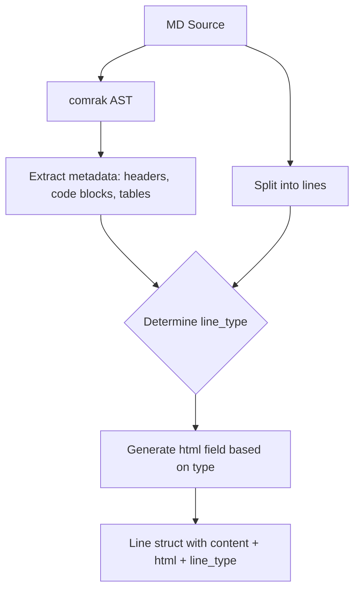

# Spec: Markdown Raw Source Display

## Goal
Display markdown files as raw source text (preserving structural markers like `#`, `-`, `>`) while rendering inline formatting (bold, italic, code, links) as HTML and syntax highlighting code blocks with syntect.

## Design

### Flow


### Data Model

```rust
struct Line {
    content: String,       // Raw source (always preserved)
    html: Option<String>,  // Rendered HTML:
                           //   - Headers/plain/lists: inline formatting
                           //   - Code blocks: syntect output
                           //   - Tables: reformatted + aligned
    line_type: LineType,
}

enum LineType {
    Plain,
    Header { level: u8 },
    CodeBlockStart { language: Option<String> },
    CodeBlockContent,
    CodeBlockEnd,
    TableRow,
    ListItem { ordered: bool },
    BlockQuote,
    HorizontalRule,
}
```

### Rendering Rules

| Line Type  | html field contains              |
| ---------- | -------------------------------- |
| Header     | #  + inline HTML (** → <strong>) |
| Plain      | Inline HTML                      |
| List item  | -  or 1.  + inline HTML          |
| BlockQuote | >  + inline HTML                 |
| Code block | Syntect-highlighted HTML         |
| Table row  | Reformatted/aligned raw text     |
| HR         | Raw text (no inline processing)  |

### Inline Rendering (AST-based)

```rust
fn render_inline(text: &str) -> String {
    // 1. Parse text with comrak
    // 2. Walk AST inline nodes
    // 3. Emit HTML for: Strong, Emph, Code, Link, Strikethrough
    // 4. Escape plain Text nodes
}
```

For structural lines (headers, lists, blockquotes):
1. Extract marker (`# `, `- `, `> `)
2. Call `render_inline()` on content after marker
3. Prepend HTML-escaped marker

## Decisions

- **Line numbers**: Use array index (Option C) - metadata tracks ranges, no explicit field needed
- **Mermaid detection**: Derive from `language == "mermaid"` at call site, not stored in data model
- **Table formatting**: Reuse existing `format_table()` from markdown.rs
- **Inline rendering**: AST-based via comrak for correctness (handles nested formatting, escapes)

## Scope

### In
- Raw source display with structural markers preserved
- Inline formatting rendered as HTML (bold, italic, code, links)
- Code block syntax highlighting via syntect
- Table column alignment
- LineType metadata for UI features (smart header, copy buttons, mermaid preview)

### Out
- Full markdown preview mode (future feature)
- Mermaid diagram rendering (future - just detection for now)
- Changes to frontend display components (separate task if needed)

## Files to Modify

- `src-tauri/src/state.rs`:
  - Add `LineType` enum
  - Modify `from_markdown()` to set `line_type` and generate `html` per rules
  - Add/modify `render_inline()` for AST-based inline rendering
  - Keep structural markers in output, only process content after them

- `src-tauri/src/markdown.rs`:
  - Already has metadata extraction (sections, code_blocks, tables) ✓
  - May need to expose line-level type info

- `src/styles/code-viewer.css`:
  - Ensure CSS classes (`.md-h1`, `.md-list`, etc.) style appropriately
