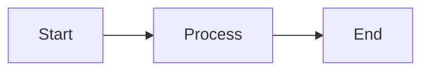

# Code Block Language Colors

This fixture showcases code blocks in various programming languages to test the language-colored circle indicator.

## Systems Languages

```rust
fn main() {
    println!("Hello, Rust!");
}
```

```go
package main

import "fmt"

func main() {
    fmt.Println("Hello, Go!")
}
```

```c
#include <stdio.h>

int main() {
    printf("Hello, C!\n");
    return 0;
}
```

```cpp
#include <iostream>

int main() {
    std::cout << "Hello, C++!" << std::endl;
    return 0;
}
```

## Web Languages

```javascript
const greeting = "Hello, JavaScript!";
console.log(greeting);
```

```typescript
const greeting: string = "Hello, TypeScript!";
console.log(greeting);
```

```html
<!DOCTYPE html>
<html>
  <body>
    <h1>Hello, HTML!</h1>
  </body>
</html>
```

```css
.greeting {
  color: #333;
  font-family: sans-serif;
}
```

## Scripting Languages

```python
def greet():
    print("Hello, Python!")

greet()
```

```ruby
def greet
  puts "Hello, Ruby!"
end

greet
```

```bash
#!/bin/bash
echo "Hello, Bash!"
```

## JVM Languages

```java
public class Main {
    public static void main(String[] args) {
        System.out.println("Hello, Java!");
    }
}
```

```kotlin
fun main() {
    println("Hello, Kotlin!")
}
```

```scala
object Main extends App {
  println("Hello, Scala!")
}
```

## Functional Languages

```haskell
main :: IO ()
main = putStrLn "Hello, Haskell!"
```

```elixir
defmodule Greeter do
  def hello do
    IO.puts("Hello, Elixir!")
  end
end
```

## Data & Config

```json
{
  "greeting": "Hello, JSON!"
}
```

```yaml
greeting: Hello, YAML!
```

```toml
greeting = "Hello, TOML!"
```

```sql
SELECT 'Hello, SQL!' AS greeting;
```

## Frontend Frameworks

```svelte
<script>
  let name = 'Svelte';
</script>

<h1>Hello, {name}!</h1>
```

```vue
<template>
  <h1>Hello, Vue!</h1>
</template>

<script>
export default {
  name: 'Greeting'
}
</script>
```

## No Language Specified

```
Plain code block without language hint.
Falls back to accent color.
```

## Diagram


