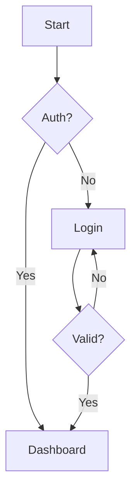

# Large Test File for Performance Testing

This file contains many code blocks in different languages to test syntax highlighting performance.

Generated: 2025-12-22T16:20:37+01:00

---

## Section 1: Rust

```rust
/// A generic result type for operations that can fail.
pub type Result<T> = std::result::Result<T, Error>;

#[derive(Debug, Clone)]
pub struct Config {
    pub name: String,
    pub value: i64,
    pub enabled: bool,
}

impl Config {
    pub fn new(name: &str) -> Self {
        Self {
            name: name.to_string(),
            value: 42,
            enabled: true,
        }
    }
}
```

## Section 1: TypeScript

```typescript
interface User {
  id: string;
  name: string;
  email: string;
}

async function fetchUser(id: string): Promise<User | null> {
  const response = await fetch(`/api/users/${id}`);
  if (!response.ok) return null;
  return response.json();
}

const processUsers = <T extends User>(users: T[]): Map<string, T> => {
  return new Map(users.map(u => [u.id, u]));
};
```

## Section 1: Python

```python
from dataclasses import dataclass
from typing import List

@dataclass
class Task:
    id: int
    name: str
    completed: bool = False

class TaskManager:
    def __init__(self):
        self._tasks: List[Task] = []

    async def add_task(self, name: str) -> Task:
        task = Task(id=len(self._tasks), name=name)
        self._tasks.append(task)
        return task
```

## Section 1: Go

```go
package main

import (
    "context"
    "sync"
)

type Worker struct {
    id     int
    jobs   <-chan Job
    result chan<- Result
    mu     sync.Mutex
}

func (w *Worker) Start(ctx context.Context) {
    go func() {
        for {
            select {
            case job := <-w.jobs:
                w.result <- w.process(job)
            case <-ctx.Done():
                return
            }
        }
    }()
}
```

## Section 1: SQL

```sql
CREATE TABLE users (
    id SERIAL PRIMARY KEY,
    email VARCHAR(255) UNIQUE NOT NULL,
    name VARCHAR(100) NOT NULL
);

WITH ranked AS (
    SELECT user_id, order_total,
           ROW_NUMBER() OVER (PARTITION BY user_id ORDER BY order_total DESC) as rank
    FROM orders
)
SELECT * FROM ranked WHERE rank = 1;
```

## Section 1: YAML

```yaml
apiVersion: apps/v1
kind: Deployment
metadata:
  name: api-server
spec:
  replicas: 3
  template:
    spec:
      containers:
        - name: api
          image: myapp:v1.2.3
          ports:
            - containerPort: 8080
```

## Section 1: Mermaid



---

## Section 2: Rust

```rust
/// A generic result type for operations that can fail.
pub type Result<T> = std::result::Result<T, Error>;

#[derive(Debug, Clone)]
pub struct Config {
    pub name: String,
    pub value: i64,
    pub enabled: bool,
}

impl Config {
    pub fn new(name: &str) -> Self {
        Self {
            name: name.to_string(),
            value: 42,
            enabled: true,
        }
    }
}
```

## Section 2: TypeScript

```typescript
interface User {
  id: string;
  name: string;
  email: string;
}

async function fetchUser(id: string): Promise<User | null> {
  const response = await fetch(`/api/users/${id}`);
  if (!response.ok) return null;
  return response.json();
}

const processUsers = <T extends User>(users: T[]): Map<string, T> => {
  return new Map(users.map(u => [u.id, u]));
};
```

## Section 2: Python

```python
from dataclasses import dataclass
from typing import List

@dataclass
class Task:
    id: int
    name: str
    completed: bool = False

class TaskManager:
    def __init__(self):
        self._tasks: List[Task] = []

    async def add_task(self, name: str) -> Task:
        task = Task(id=len(self._tasks), name=name)
        self._tasks.append(task)
        return task
```

## Section 2: Go

```go
package main

import (
    "context"
    "sync"
)

type Worker struct {
    id     int
    jobs   <-chan Job
    result chan<- Result
    mu     sync.Mutex
}

func (w *Worker) Start(ctx context.Context) {
    go func() {
        for {
            select {
            case job := <-w.jobs:
                w.result <- w.process(job)
            case <-ctx.Done():
                return
            }
        }
    }()
}
```

## Section 2: SQL

```sql
CREATE TABLE users (
    id SERIAL PRIMARY KEY,
    email VARCHAR(255) UNIQUE NOT NULL,
    name VARCHAR(100) NOT NULL
);

WITH ranked AS (
    SELECT user_id, order_total,
           ROW_NUMBER() OVER (PARTITION BY user_id ORDER BY order_total DESC) as rank
    FROM orders
)
SELECT * FROM ranked WHERE rank = 1;
```

## Section 2: YAML

```yaml
apiVersion: apps/v1
kind: Deployment
metadata:
  name: api-server
spec:
  replicas: 3
  template:
    spec:
      containers:
        - name: api
          image: myapp:v1.2.3
          ports:
            - containerPort: 8080
```

## Section 2: Mermaid


---

## Section 3: Rust

```rust
/// A generic result type for operations that can fail.
pub type Result<T> = std::result::Result<T, Error>;

#[derive(Debug, Clone)]
pub struct Config {
    pub name: String,
    pub value: i64,
    pub enabled: bool,
}

impl Config {
    pub fn new(name: &str) -> Self {
        Self {
            name: name.to_string(),
            value: 42,
            enabled: true,
        }
    }
}
```

## Section 3: TypeScript

```typescript
interface User {
  id: string;
  name: string;
  email: string;
}

async function fetchUser(id: string): Promise<User | null> {
  const response = await fetch(`/api/users/${id}`);
  if (!response.ok) return null;
  return response.json();
}

const processUsers = <T extends User>(users: T[]): Map<string, T> => {
  return new Map(users.map(u => [u.id, u]));
};
```

## Section 3: Python

```python
from dataclasses import dataclass
from typing import List

@dataclass
class Task:
    id: int
    name: str
    completed: bool = False

class TaskManager:
    def __init__(self):
        self._tasks: List[Task] = []

    async def add_task(self, name: str) -> Task:
        task = Task(id=len(self._tasks), name=name)
        self._tasks.append(task)
        return task
```

## Section 3: Go

```go
package main

import (
    "context"
    "sync"
)

type Worker struct {
    id     int
    jobs   <-chan Job
    result chan<- Result
    mu     sync.Mutex
}

func (w *Worker) Start(ctx context.Context) {
    go func() {
        for {
            select {
            case job := <-w.jobs:
                w.result <- w.process(job)
            case <-ctx.Done():
                return
            }
        }
    }()
}
```

## Section 3: SQL

```sql
CREATE TABLE users (
    id SERIAL PRIMARY KEY,
    email VARCHAR(255) UNIQUE NOT NULL,
    name VARCHAR(100) NOT NULL
);

WITH ranked AS (
    SELECT user_id, order_total,
           ROW_NUMBER() OVER (PARTITION BY user_id ORDER BY order_total DESC) as rank
    FROM orders
)
SELECT * FROM ranked WHERE rank = 1;
```

## Section 3: YAML

```yaml
apiVersion: apps/v1
kind: Deployment
metadata:
  name: api-server
spec:
  replicas: 3
  template:
    spec:
      containers:
        - name: api
          image: myapp:v1.2.3
          ports:
            - containerPort: 8080
```

## Section 3: Mermaid


---

## Section 4: Rust

```rust
/// A generic result type for operations that can fail.
pub type Result<T> = std::result::Result<T, Error>;

#[derive(Debug, Clone)]
pub struct Config {
    pub name: String,
    pub value: i64,
    pub enabled: bool,
}

impl Config {
    pub fn new(name: &str) -> Self {
        Self {
            name: name.to_string(),
            value: 42,
            enabled: true,
        }
    }
}
```

## Section 4: TypeScript

```typescript
interface User {
  id: string;
  name: string;
  email: string;
}

async function fetchUser(id: string): Promise<User | null> {
  const response = await fetch(`/api/users/${id}`);
  if (!response.ok) return null;
  return response.json();
}

const processUsers = <T extends User>(users: T[]): Map<string, T> => {
  return new Map(users.map(u => [u.id, u]));
};
```

## Section 4: Python

```python
from dataclasses import dataclass
from typing import List

@dataclass
class Task:
    id: int
    name: str
    completed: bool = False

class TaskManager:
    def __init__(self):
        self._tasks: List[Task] = []

    async def add_task(self, name: str) -> Task:
        task = Task(id=len(self._tasks), name=name)
        self._tasks.append(task)
        return task
```

## Section 4: Go

```go
package main

import (
    "context"
    "sync"
)

type Worker struct {
    id     int
    jobs   <-chan Job
    result chan<- Result
    mu     sync.Mutex
}

func (w *Worker) Start(ctx context.Context) {
    go func() {
        for {
            select {
            case job := <-w.jobs:
                w.result <- w.process(job)
            case <-ctx.Done():
                return
            }
        }
    }()
}
```

## Section 4: SQL

```sql
CREATE TABLE users (
    id SERIAL PRIMARY KEY,
    email VARCHAR(255) UNIQUE NOT NULL,
    name VARCHAR(100) NOT NULL
);

WITH ranked AS (
    SELECT user_id, order_total,
           ROW_NUMBER() OVER (PARTITION BY user_id ORDER BY order_total DESC) as rank
    FROM orders
)
SELECT * FROM ranked WHERE rank = 1;
```

## Section 4: YAML

```yaml
apiVersion: apps/v1
kind: Deployment
metadata:
  name: api-server
spec:
  replicas: 3
  template:
    spec:
      containers:
        - name: api
          image: myapp:v1.2.3
          ports:
            - containerPort: 8080
```

## Section 4: Mermaid


---

## Section 5: Rust

```rust
/// A generic result type for operations that can fail.
pub type Result<T> = std::result::Result<T, Error>;

#[derive(Debug, Clone)]
pub struct Config {
    pub name: String,
    pub value: i64,
    pub enabled: bool,
}

impl Config {
    pub fn new(name: &str) -> Self {
        Self {
            name: name.to_string(),
            value: 42,
            enabled: true,
        }
    }
}
```

## Section 5: TypeScript

```typescript
interface User {
  id: string;
  name: string;
  email: string;
}

async function fetchUser(id: string): Promise<User | null> {
  const response = await fetch(`/api/users/${id}`);
  if (!response.ok) return null;
  return response.json();
}

const processUsers = <T extends User>(users: T[]): Map<string, T> => {
  return new Map(users.map(u => [u.id, u]));
};
```

## Section 5: Python

```python
from dataclasses import dataclass
from typing import List

@dataclass
class Task:
    id: int
    name: str
    completed: bool = False

class TaskManager:
    def __init__(self):
        self._tasks: List[Task] = []

    async def add_task(self, name: str) -> Task:
        task = Task(id=len(self._tasks), name=name)
        self._tasks.append(task)
        return task
```

## Section 5: Go

```go
package main

import (
    "context"
    "sync"
)

type Worker struct {
    id     int
    jobs   <-chan Job
    result chan<- Result
    mu     sync.Mutex
}

func (w *Worker) Start(ctx context.Context) {
    go func() {
        for {
            select {
            case job := <-w.jobs:
                w.result <- w.process(job)
            case <-ctx.Done():
                return
            }
        }
    }()
}
```

## Section 5: SQL

```sql
CREATE TABLE users (
    id SERIAL PRIMARY KEY,
    email VARCHAR(255) UNIQUE NOT NULL,
    name VARCHAR(100) NOT NULL
);

WITH ranked AS (
    SELECT user_id, order_total,
           ROW_NUMBER() OVER (PARTITION BY user_id ORDER BY order_total DESC) as rank
    FROM orders
)
SELECT * FROM ranked WHERE rank = 1;
```

## Section 5: YAML

```yaml
apiVersion: apps/v1
kind: Deployment
metadata:
  name: api-server
spec:
  replicas: 3
  template:
    spec:
      containers:
        - name: api
          image: myapp:v1.2.3
          ports:
            - containerPort: 8080
```

## Section 5: Mermaid


---

## Section 6: Rust

```rust
/// A generic result type for operations that can fail.
pub type Result<T> = std::result::Result<T, Error>;

#[derive(Debug, Clone)]
pub struct Config {
    pub name: String,
    pub value: i64,
    pub enabled: bool,
}

impl Config {
    pub fn new(name: &str) -> Self {
        Self {
            name: name.to_string(),
            value: 42,
            enabled: true,
        }
    }
}
```

## Section 6: TypeScript

```typescript
interface User {
  id: string;
  name: string;
  email: string;
}

async function fetchUser(id: string): Promise<User | null> {
  const response = await fetch(`/api/users/${id}`);
  if (!response.ok) return null;
  return response.json();
}

const processUsers = <T extends User>(users: T[]): Map<string, T> => {
  return new Map(users.map(u => [u.id, u]));
};
```

## Section 6: Python

```python
from dataclasses import dataclass
from typing import List

@dataclass
class Task:
    id: int
    name: str
    completed: bool = False

class TaskManager:
    def __init__(self):
        self._tasks: List[Task] = []

    async def add_task(self, name: str) -> Task:
        task = Task(id=len(self._tasks), name=name)
        self._tasks.append(task)
        return task
```

## Section 6: Go

```go
package main

import (
    "context"
    "sync"
)

type Worker struct {
    id     int
    jobs   <-chan Job
    result chan<- Result
    mu     sync.Mutex
}

func (w *Worker) Start(ctx context.Context) {
    go func() {
        for {
            select {
            case job := <-w.jobs:
                w.result <- w.process(job)
            case <-ctx.Done():
                return
            }
        }
    }()
}
```

## Section 6: SQL

```sql
CREATE TABLE users (
    id SERIAL PRIMARY KEY,
    email VARCHAR(255) UNIQUE NOT NULL,
    name VARCHAR(100) NOT NULL
);

WITH ranked AS (
    SELECT user_id, order_total,
           ROW_NUMBER() OVER (PARTITION BY user_id ORDER BY order_total DESC) as rank
    FROM orders
)
SELECT * FROM ranked WHERE rank = 1;
```

## Section 6: YAML

```yaml
apiVersion: apps/v1
kind: Deployment
metadata:
  name: api-server
spec:
  replicas: 3
  template:
    spec:
      containers:
        - name: api
          image: myapp:v1.2.3
          ports:
            - containerPort: 8080
```

## Section 6: Mermaid


---

## Section 7: Rust

```rust
/// A generic result type for operations that can fail.
pub type Result<T> = std::result::Result<T, Error>;

#[derive(Debug, Clone)]
pub struct Config {
    pub name: String,
    pub value: i64,
    pub enabled: bool,
}

impl Config {
    pub fn new(name: &str) -> Self {
        Self {
            name: name.to_string(),
            value: 42,
            enabled: true,
        }
    }
}
```

## Section 7: TypeScript

```typescript
interface User {
  id: string;
  name: string;
  email: string;
}

async function fetchUser(id: string): Promise<User | null> {
  const response = await fetch(`/api/users/${id}`);
  if (!response.ok) return null;
  return response.json();
}

const processUsers = <T extends User>(users: T[]): Map<string, T> => {
  return new Map(users.map(u => [u.id, u]));
};
```

## Section 7: Python

```python
from dataclasses import dataclass
from typing import List

@dataclass
class Task:
    id: int
    name: str
    completed: bool = False

class TaskManager:
    def __init__(self):
        self._tasks: List[Task] = []

    async def add_task(self, name: str) -> Task:
        task = Task(id=len(self._tasks), name=name)
        self._tasks.append(task)
        return task
```

## Section 7: Go

```go
package main

import (
    "context"
    "sync"
)

type Worker struct {
    id     int
    jobs   <-chan Job
    result chan<- Result
    mu     sync.Mutex
}

func (w *Worker) Start(ctx context.Context) {
    go func() {
        for {
            select {
            case job := <-w.jobs:
                w.result <- w.process(job)
            case <-ctx.Done():
                return
            }
        }
    }()
}
```

## Section 7: SQL

```sql
CREATE TABLE users (
    id SERIAL PRIMARY KEY,
    email VARCHAR(255) UNIQUE NOT NULL,
    name VARCHAR(100) NOT NULL
);

WITH ranked AS (
    SELECT user_id, order_total,
           ROW_NUMBER() OVER (PARTITION BY user_id ORDER BY order_total DESC) as rank
    FROM orders
)
SELECT * FROM ranked WHERE rank = 1;
```

## Section 7: YAML

```yaml
apiVersion: apps/v1
kind: Deployment
metadata:
  name: api-server
spec:
  replicas: 3
  template:
    spec:
      containers:
        - name: api
          image: myapp:v1.2.3
          ports:
            - containerPort: 8080
```

## Section 7: Mermaid


---

## Section 8: Rust

```rust
/// A generic result type for operations that can fail.
pub type Result<T> = std::result::Result<T, Error>;

#[derive(Debug, Clone)]
pub struct Config {
    pub name: String,
    pub value: i64,
    pub enabled: bool,
}

impl Config {
    pub fn new(name: &str) -> Self {
        Self {
            name: name.to_string(),
            value: 42,
            enabled: true,
        }
    }
}
```

## Section 8: TypeScript

```typescript
interface User {
  id: string;
  name: string;
  email: string;
}

async function fetchUser(id: string): Promise<User | null> {
  const response = await fetch(`/api/users/${id}`);
  if (!response.ok) return null;
  return response.json();
}

const processUsers = <T extends User>(users: T[]): Map<string, T> => {
  return new Map(users.map(u => [u.id, u]));
};
```

## Section 8: Python

```python
from dataclasses import dataclass
from typing import List

@dataclass
class Task:
    id: int
    name: str
    completed: bool = False

class TaskManager:
    def __init__(self):
        self._tasks: List[Task] = []

    async def add_task(self, name: str) -> Task:
        task = Task(id=len(self._tasks), name=name)
        self._tasks.append(task)
        return task
```

## Section 8: Go

```go
package main

import (
    "context"
    "sync"
)

type Worker struct {
    id     int
    jobs   <-chan Job
    result chan<- Result
    mu     sync.Mutex
}

func (w *Worker) Start(ctx context.Context) {
    go func() {
        for {
            select {
            case job := <-w.jobs:
                w.result <- w.process(job)
            case <-ctx.Done():
                return
            }
        }
    }()
}
```

## Section 8: SQL

```sql
CREATE TABLE users (
    id SERIAL PRIMARY KEY,
    email VARCHAR(255) UNIQUE NOT NULL,
    name VARCHAR(100) NOT NULL
);

WITH ranked AS (
    SELECT user_id, order_total,
           ROW_NUMBER() OVER (PARTITION BY user_id ORDER BY order_total DESC) as rank
    FROM orders
)
SELECT * FROM ranked WHERE rank = 1;
```

## Section 8: YAML

```yaml
apiVersion: apps/v1
kind: Deployment
metadata:
  name: api-server
spec:
  replicas: 3
  template:
    spec:
      containers:
        - name: api
          image: myapp:v1.2.3
          ports:
            - containerPort: 8080
```

## Section 8: Mermaid


---

## Section 9: Rust

```rust
/// A generic result type for operations that can fail.
pub type Result<T> = std::result::Result<T, Error>;

#[derive(Debug, Clone)]
pub struct Config {
    pub name: String,
    pub value: i64,
    pub enabled: bool,
}

impl Config {
    pub fn new(name: &str) -> Self {
        Self {
            name: name.to_string(),
            value: 42,
            enabled: true,
        }
    }
}
```

## Section 9: TypeScript

```typescript
interface User {
  id: string;
  name: string;
  email: string;
}

async function fetchUser(id: string): Promise<User | null> {
  const response = await fetch(`/api/users/${id}`);
  if (!response.ok) return null;
  return response.json();
}

const processUsers = <T extends User>(users: T[]): Map<string, T> => {
  return new Map(users.map(u => [u.id, u]));
};
```

## Section 9: Python

```python
from dataclasses import dataclass
from typing import List

@dataclass
class Task:
    id: int
    name: str
    completed: bool = False

class TaskManager:
    def __init__(self):
        self._tasks: List[Task] = []

    async def add_task(self, name: str) -> Task:
        task = Task(id=len(self._tasks), name=name)
        self._tasks.append(task)
        return task
```

## Section 9: Go

```go
package main

import (
    "context"
    "sync"
)

type Worker struct {
    id     int
    jobs   <-chan Job
    result chan<- Result
    mu     sync.Mutex
}

func (w *Worker) Start(ctx context.Context) {
    go func() {
        for {
            select {
            case job := <-w.jobs:
                w.result <- w.process(job)
            case <-ctx.Done():
                return
            }
        }
    }()
}
```

## Section 9: SQL

```sql
CREATE TABLE users (
    id SERIAL PRIMARY KEY,
    email VARCHAR(255) UNIQUE NOT NULL,
    name VARCHAR(100) NOT NULL
);

WITH ranked AS (
    SELECT user_id, order_total,
           ROW_NUMBER() OVER (PARTITION BY user_id ORDER BY order_total DESC) as rank
    FROM orders
)
SELECT * FROM ranked WHERE rank = 1;
```

## Section 9: YAML

```yaml
apiVersion: apps/v1
kind: Deployment
metadata:
  name: api-server
spec:
  replicas: 3
  template:
    spec:
      containers:
        - name: api
          image: myapp:v1.2.3
          ports:
            - containerPort: 8080
```

## Section 9: Mermaid


---

## Section 10: Rust

```rust
/// A generic result type for operations that can fail.
pub type Result<T> = std::result::Result<T, Error>;

#[derive(Debug, Clone)]
pub struct Config {
    pub name: String,
    pub value: i64,
    pub enabled: bool,
}

impl Config {
    pub fn new(name: &str) -> Self {
        Self {
            name: name.to_string(),
            value: 42,
            enabled: true,
        }
    }
}
```

## Section 10: TypeScript

```typescript
interface User {
  id: string;
  name: string;
  email: string;
}

async function fetchUser(id: string): Promise<User | null> {
  const response = await fetch(`/api/users/${id}`);
  if (!response.ok) return null;
  return response.json();
}

const processUsers = <T extends User>(users: T[]): Map<string, T> => {
  return new Map(users.map(u => [u.id, u]));
};
```

## Section 10: Python

```python
from dataclasses import dataclass
from typing import List

@dataclass
class Task:
    id: int
    name: str
    completed: bool = False

class TaskManager:
    def __init__(self):
        self._tasks: List[Task] = []

    async def add_task(self, name: str) -> Task:
        task = Task(id=len(self._tasks), name=name)
        self._tasks.append(task)
        return task
```

## Section 10: Go

```go
package main

import (
    "context"
    "sync"
)

type Worker struct {
    id     int
    jobs   <-chan Job
    result chan<- Result
    mu     sync.Mutex
}

func (w *Worker) Start(ctx context.Context) {
    go func() {
        for {
            select {
            case job := <-w.jobs:
                w.result <- w.process(job)
            case <-ctx.Done():
                return
            }
        }
    }()
}
```

## Section 10: SQL

```sql
CREATE TABLE users (
    id SERIAL PRIMARY KEY,
    email VARCHAR(255) UNIQUE NOT NULL,
    name VARCHAR(100) NOT NULL
);

WITH ranked AS (
    SELECT user_id, order_total,
           ROW_NUMBER() OVER (PARTITION BY user_id ORDER BY order_total DESC) as rank
    FROM orders
)
SELECT * FROM ranked WHERE rank = 1;
```

## Section 10: YAML

```yaml
apiVersion: apps/v1
kind: Deployment
metadata:
  name: api-server
spec:
  replicas: 3
  template:
    spec:
      containers:
        - name: api
          image: myapp:v1.2.3
          ports:
            - containerPort: 8080
```

## Section 10: Mermaid


---

## Section 11: Rust

```rust
/// A generic result type for operations that can fail.
pub type Result<T> = std::result::Result<T, Error>;

#[derive(Debug, Clone)]
pub struct Config {
    pub name: String,
    pub value: i64,
    pub enabled: bool,
}

impl Config {
    pub fn new(name: &str) -> Self {
        Self {
            name: name.to_string(),
            value: 42,
            enabled: true,
        }
    }
}
```

## Section 11: TypeScript

```typescript
interface User {
  id: string;
  name: string;
  email: string;
}

async function fetchUser(id: string): Promise<User | null> {
  const response = await fetch(`/api/users/${id}`);
  if (!response.ok) return null;
  return response.json();
}

const processUsers = <T extends User>(users: T[]): Map<string, T> => {
  return new Map(users.map(u => [u.id, u]));
};
```

## Section 11: Python

```python
from dataclasses import dataclass
from typing import List

@dataclass
class Task:
    id: int
    name: str
    completed: bool = False

class TaskManager:
    def __init__(self):
        self._tasks: List[Task] = []

    async def add_task(self, name: str) -> Task:
        task = Task(id=len(self._tasks), name=name)
        self._tasks.append(task)
        return task
```

## Section 11: Go

```go
package main

import (
    "context"
    "sync"
)

type Worker struct {
    id     int
    jobs   <-chan Job
    result chan<- Result
    mu     sync.Mutex
}

func (w *Worker) Start(ctx context.Context) {
    go func() {
        for {
            select {
            case job := <-w.jobs:
                w.result <- w.process(job)
            case <-ctx.Done():
                return
            }
        }
    }()
}
```

## Section 11: SQL

```sql
CREATE TABLE users (
    id SERIAL PRIMARY KEY,
    email VARCHAR(255) UNIQUE NOT NULL,
    name VARCHAR(100) NOT NULL
);

WITH ranked AS (
    SELECT user_id, order_total,
           ROW_NUMBER() OVER (PARTITION BY user_id ORDER BY order_total DESC) as rank
    FROM orders
)
SELECT * FROM ranked WHERE rank = 1;
```

## Section 11: YAML

```yaml
apiVersion: apps/v1
kind: Deployment
metadata:
  name: api-server
spec:
  replicas: 3
  template:
    spec:
      containers:
        - name: api
          image: myapp:v1.2.3
          ports:
            - containerPort: 8080
```

## Section 11: Mermaid


---

## Section 12: Rust

```rust
/// A generic result type for operations that can fail.
pub type Result<T> = std::result::Result<T, Error>;

#[derive(Debug, Clone)]
pub struct Config {
    pub name: String,
    pub value: i64,
    pub enabled: bool,
}

impl Config {
    pub fn new(name: &str) -> Self {
        Self {
            name: name.to_string(),
            value: 42,
            enabled: true,
        }
    }
}
```

## Section 12: TypeScript

```typescript
interface User {
  id: string;
  name: string;
  email: string;
}

async function fetchUser(id: string): Promise<User | null> {
  const response = await fetch(`/api/users/${id}`);
  if (!response.ok) return null;
  return response.json();
}

const processUsers = <T extends User>(users: T[]): Map<string, T> => {
  return new Map(users.map(u => [u.id, u]));
};
```

## Section 12: Python

```python
from dataclasses import dataclass
from typing import List

@dataclass
class Task:
    id: int
    name: str
    completed: bool = False

class TaskManager:
    def __init__(self):
        self._tasks: List[Task] = []

    async def add_task(self, name: str) -> Task:
        task = Task(id=len(self._tasks), name=name)
        self._tasks.append(task)
        return task
```

## Section 12: Go

```go
package main

import (
    "context"
    "sync"
)

type Worker struct {
    id     int
    jobs   <-chan Job
    result chan<- Result
    mu     sync.Mutex
}

func (w *Worker) Start(ctx context.Context) {
    go func() {
        for {
            select {
            case job := <-w.jobs:
                w.result <- w.process(job)
            case <-ctx.Done():
                return
            }
        }
    }()
}
```

## Section 12: SQL

```sql
CREATE TABLE users (
    id SERIAL PRIMARY KEY,
    email VARCHAR(255) UNIQUE NOT NULL,
    name VARCHAR(100) NOT NULL
);

WITH ranked AS (
    SELECT user_id, order_total,
           ROW_NUMBER() OVER (PARTITION BY user_id ORDER BY order_total DESC) as rank
    FROM orders
)
SELECT * FROM ranked WHERE rank = 1;
```

## Section 12: YAML

```yaml
apiVersion: apps/v1
kind: Deployment
metadata:
  name: api-server
spec:
  replicas: 3
  template:
    spec:
      containers:
        - name: api
          image: myapp:v1.2.3
          ports:
            - containerPort: 8080
```

## Section 12: Mermaid


---

## Section 13: Rust

```rust
/// A generic result type for operations that can fail.
pub type Result<T> = std::result::Result<T, Error>;

#[derive(Debug, Clone)]
pub struct Config {
    pub name: String,
    pub value: i64,
    pub enabled: bool,
}

impl Config {
    pub fn new(name: &str) -> Self {
        Self {
            name: name.to_string(),
            value: 42,
            enabled: true,
        }
    }
}
```

## Section 13: TypeScript

```typescript
interface User {
  id: string;
  name: string;
  email: string;
}

async function fetchUser(id: string): Promise<User | null> {
  const response = await fetch(`/api/users/${id}`);
  if (!response.ok) return null;
  return response.json();
}

const processUsers = <T extends User>(users: T[]): Map<string, T> => {
  return new Map(users.map(u => [u.id, u]));
};
```

## Section 13: Python

```python
from dataclasses import dataclass
from typing import List

@dataclass
class Task:
    id: int
    name: str
    completed: bool = False

class TaskManager:
    def __init__(self):
        self._tasks: List[Task] = []

    async def add_task(self, name: str) -> Task:
        task = Task(id=len(self._tasks), name=name)
        self._tasks.append(task)
        return task
```

## Section 13: Go

```go
package main

import (
    "context"
    "sync"
)

type Worker struct {
    id     int
    jobs   <-chan Job
    result chan<- Result
    mu     sync.Mutex
}

func (w *Worker) Start(ctx context.Context) {
    go func() {
        for {
            select {
            case job := <-w.jobs:
                w.result <- w.process(job)
            case <-ctx.Done():
                return
            }
        }
    }()
}
```

## Section 13: SQL

```sql
CREATE TABLE users (
    id SERIAL PRIMARY KEY,
    email VARCHAR(255) UNIQUE NOT NULL,
    name VARCHAR(100) NOT NULL
);

WITH ranked AS (
    SELECT user_id, order_total,
           ROW_NUMBER() OVER (PARTITION BY user_id ORDER BY order_total DESC) as rank
    FROM orders
)
SELECT * FROM ranked WHERE rank = 1;
```

## Section 13: YAML

```yaml
apiVersion: apps/v1
kind: Deployment
metadata:
  name: api-server
spec:
  replicas: 3
  template:
    spec:
      containers:
        - name: api
          image: myapp:v1.2.3
          ports:
            - containerPort: 8080
```

## Section 13: Mermaid


---

## Section 14: Rust

```rust
/// A generic result type for operations that can fail.
pub type Result<T> = std::result::Result<T, Error>;

#[derive(Debug, Clone)]
pub struct Config {
    pub name: String,
    pub value: i64,
    pub enabled: bool,
}

impl Config {
    pub fn new(name: &str) -> Self {
        Self {
            name: name.to_string(),
            value: 42,
            enabled: true,
        }
    }
}
```

## Section 14: TypeScript

```typescript
interface User {
  id: string;
  name: string;
  email: string;
}

async function fetchUser(id: string): Promise<User | null> {
  const response = await fetch(`/api/users/${id}`);
  if (!response.ok) return null;
  return response.json();
}

const processUsers = <T extends User>(users: T[]): Map<string, T> => {
  return new Map(users.map(u => [u.id, u]));
};
```

## Section 14: Python

```python
from dataclasses import dataclass
from typing import List

@dataclass
class Task:
    id: int
    name: str
    completed: bool = False

class TaskManager:
    def __init__(self):
        self._tasks: List[Task] = []

    async def add_task(self, name: str) -> Task:
        task = Task(id=len(self._tasks), name=name)
        self._tasks.append(task)
        return task
```

## Section 14: Go

```go
package main

import (
    "context"
    "sync"
)

type Worker struct {
    id     int
    jobs   <-chan Job
    result chan<- Result
    mu     sync.Mutex
}

func (w *Worker) Start(ctx context.Context) {
    go func() {
        for {
            select {
            case job := <-w.jobs:
                w.result <- w.process(job)
            case <-ctx.Done():
                return
            }
        }
    }()
}
```

## Section 14: SQL

```sql
CREATE TABLE users (
    id SERIAL PRIMARY KEY,
    email VARCHAR(255) UNIQUE NOT NULL,
    name VARCHAR(100) NOT NULL
);

WITH ranked AS (
    SELECT user_id, order_total,
           ROW_NUMBER() OVER (PARTITION BY user_id ORDER BY order_total DESC) as rank
    FROM orders
)
SELECT * FROM ranked WHERE rank = 1;
```

## Section 14: YAML

```yaml
apiVersion: apps/v1
kind: Deployment
metadata:
  name: api-server
spec:
  replicas: 3
  template:
    spec:
      containers:
        - name: api
          image: myapp:v1.2.3
          ports:
            - containerPort: 8080
```

## Section 14: Mermaid


---

## Section 15: Rust

```rust
/// A generic result type for operations that can fail.
pub type Result<T> = std::result::Result<T, Error>;

#[derive(Debug, Clone)]
pub struct Config {
    pub name: String,
    pub value: i64,
    pub enabled: bool,
}

impl Config {
    pub fn new(name: &str) -> Self {
        Self {
            name: name.to_string(),
            value: 42,
            enabled: true,
        }
    }
}
```

## Section 15: TypeScript

```typescript
interface User {
  id: string;
  name: string;
  email: string;
}

async function fetchUser(id: string): Promise<User | null> {
  const response = await fetch(`/api/users/${id}`);
  if (!response.ok) return null;
  return response.json();
}

const processUsers = <T extends User>(users: T[]): Map<string, T> => {
  return new Map(users.map(u => [u.id, u]));
};
```

## Section 15: Python

```python
from dataclasses import dataclass
from typing import List

@dataclass
class Task:
    id: int
    name: str
    completed: bool = False

class TaskManager:
    def __init__(self):
        self._tasks: List[Task] = []

    async def add_task(self, name: str) -> Task:
        task = Task(id=len(self._tasks), name=name)
        self._tasks.append(task)
        return task
```

## Section 15: Go

```go
package main

import (
    "context"
    "sync"
)

type Worker struct {
    id     int
    jobs   <-chan Job
    result chan<- Result
    mu     sync.Mutex
}

func (w *Worker) Start(ctx context.Context) {
    go func() {
        for {
            select {
            case job := <-w.jobs:
                w.result <- w.process(job)
            case <-ctx.Done():
                return
            }
        }
    }()
}
```

## Section 15: SQL

```sql
CREATE TABLE users (
    id SERIAL PRIMARY KEY,
    email VARCHAR(255) UNIQUE NOT NULL,
    name VARCHAR(100) NOT NULL
);

WITH ranked AS (
    SELECT user_id, order_total,
           ROW_NUMBER() OVER (PARTITION BY user_id ORDER BY order_total DESC) as rank
    FROM orders
)
SELECT * FROM ranked WHERE rank = 1;
```

## Section 15: YAML

```yaml
apiVersion: apps/v1
kind: Deployment
metadata:
  name: api-server
spec:
  replicas: 3
  template:
    spec:
      containers:
        - name: api
          image: myapp:v1.2.3
          ports:
            - containerPort: 8080
```

## Section 15: Mermaid


---

## Section 16: Rust

```rust
/// A generic result type for operations that can fail.
pub type Result<T> = std::result::Result<T, Error>;

#[derive(Debug, Clone)]
pub struct Config {
    pub name: String,
    pub value: i64,
    pub enabled: bool,
}

impl Config {
    pub fn new(name: &str) -> Self {
        Self {
            name: name.to_string(),
            value: 42,
            enabled: true,
        }
    }
}
```

## Section 16: TypeScript

```typescript
interface User {
  id: string;
  name: string;
  email: string;
}

async function fetchUser(id: string): Promise<User | null> {
  const response = await fetch(`/api/users/${id}`);
  if (!response.ok) return null;
  return response.json();
}

const processUsers = <T extends User>(users: T[]): Map<string, T> => {
  return new Map(users.map(u => [u.id, u]));
};
```

## Section 16: Python

```python
from dataclasses import dataclass
from typing import List

@dataclass
class Task:
    id: int
    name: str
    completed: bool = False

class TaskManager:
    def __init__(self):
        self._tasks: List[Task] = []

    async def add_task(self, name: str) -> Task:
        task = Task(id=len(self._tasks), name=name)
        self._tasks.append(task)
        return task
```

## Section 16: Go

```go
package main

import (
    "context"
    "sync"
)

type Worker struct {
    id     int
    jobs   <-chan Job
    result chan<- Result
    mu     sync.Mutex
}

func (w *Worker) Start(ctx context.Context) {
    go func() {
        for {
            select {
            case job := <-w.jobs:
                w.result <- w.process(job)
            case <-ctx.Done():
                return
            }
        }
    }()
}
```

## Section 16: SQL

```sql
CREATE TABLE users (
    id SERIAL PRIMARY KEY,
    email VARCHAR(255) UNIQUE NOT NULL,
    name VARCHAR(100) NOT NULL
);

WITH ranked AS (
    SELECT user_id, order_total,
           ROW_NUMBER() OVER (PARTITION BY user_id ORDER BY order_total DESC) as rank
    FROM orders
)
SELECT * FROM ranked WHERE rank = 1;
```

## Section 16: YAML

```yaml
apiVersion: apps/v1
kind: Deployment
metadata:
  name: api-server
spec:
  replicas: 3
  template:
    spec:
      containers:
        - name: api
          image: myapp:v1.2.3
          ports:
            - containerPort: 8080
```

## Section 16: Mermaid


---

## Section 17: Rust

```rust
/// A generic result type for operations that can fail.
pub type Result<T> = std::result::Result<T, Error>;

#[derive(Debug, Clone)]
pub struct Config {
    pub name: String,
    pub value: i64,
    pub enabled: bool,
}

impl Config {
    pub fn new(name: &str) -> Self {
        Self {
            name: name.to_string(),
            value: 42,
            enabled: true,
        }
    }
}
```

## Section 17: TypeScript

```typescript
interface User {
  id: string;
  name: string;
  email: string;
}

async function fetchUser(id: string): Promise<User | null> {
  const response = await fetch(`/api/users/${id}`);
  if (!response.ok) return null;
  return response.json();
}

const processUsers = <T extends User>(users: T[]): Map<string, T> => {
  return new Map(users.map(u => [u.id, u]));
};
```

## Section 17: Python

```python
from dataclasses import dataclass
from typing import List

@dataclass
class Task:
    id: int
    name: str
    completed: bool = False

class TaskManager:
    def __init__(self):
        self._tasks: List[Task] = []

    async def add_task(self, name: str) -> Task:
        task = Task(id=len(self._tasks), name=name)
        self._tasks.append(task)
        return task
```

## Section 17: Go

```go
package main

import (
    "context"
    "sync"
)

type Worker struct {
    id     int
    jobs   <-chan Job
    result chan<- Result
    mu     sync.Mutex
}

func (w *Worker) Start(ctx context.Context) {
    go func() {
        for {
            select {
            case job := <-w.jobs:
                w.result <- w.process(job)
            case <-ctx.Done():
                return
            }
        }
    }()
}
```

## Section 17: SQL

```sql
CREATE TABLE users (
    id SERIAL PRIMARY KEY,
    email VARCHAR(255) UNIQUE NOT NULL,
    name VARCHAR(100) NOT NULL
);

WITH ranked AS (
    SELECT user_id, order_total,
           ROW_NUMBER() OVER (PARTITION BY user_id ORDER BY order_total DESC) as rank
    FROM orders
)
SELECT * FROM ranked WHERE rank = 1;
```

## Section 17: YAML

```yaml
apiVersion: apps/v1
kind: Deployment
metadata:
  name: api-server
spec:
  replicas: 3
  template:
    spec:
      containers:
        - name: api
          image: myapp:v1.2.3
          ports:
            - containerPort: 8080
```

## Section 17: Mermaid


---

## Section 18: Rust

```rust
/// A generic result type for operations that can fail.
pub type Result<T> = std::result::Result<T, Error>;

#[derive(Debug, Clone)]
pub struct Config {
    pub name: String,
    pub value: i64,
    pub enabled: bool,
}

impl Config {
    pub fn new(name: &str) -> Self {
        Self {
            name: name.to_string(),
            value: 42,
            enabled: true,
        }
    }
}
```

## Section 18: TypeScript

```typescript
interface User {
  id: string;
  name: string;
  email: string;
}

async function fetchUser(id: string): Promise<User | null> {
  const response = await fetch(`/api/users/${id}`);
  if (!response.ok) return null;
  return response.json();
}

const processUsers = <T extends User>(users: T[]): Map<string, T> => {
  return new Map(users.map(u => [u.id, u]));
};
```

## Section 18: Python

```python
from dataclasses import dataclass
from typing import List

@dataclass
class Task:
    id: int
    name: str
    completed: bool = False

class TaskManager:
    def __init__(self):
        self._tasks: List[Task] = []

    async def add_task(self, name: str) -> Task:
        task = Task(id=len(self._tasks), name=name)
        self._tasks.append(task)
        return task
```

## Section 18: Go

```go
package main

import (
    "context"
    "sync"
)

type Worker struct {
    id     int
    jobs   <-chan Job
    result chan<- Result
    mu     sync.Mutex
}

func (w *Worker) Start(ctx context.Context) {
    go func() {
        for {
            select {
            case job := <-w.jobs:
                w.result <- w.process(job)
            case <-ctx.Done():
                return
            }
        }
    }()
}
```

## Section 18: SQL

```sql
CREATE TABLE users (
    id SERIAL PRIMARY KEY,
    email VARCHAR(255) UNIQUE NOT NULL,
    name VARCHAR(100) NOT NULL
);

WITH ranked AS (
    SELECT user_id, order_total,
           ROW_NUMBER() OVER (PARTITION BY user_id ORDER BY order_total DESC) as rank
    FROM orders
)
SELECT * FROM ranked WHERE rank = 1;
```

## Section 18: YAML

```yaml
apiVersion: apps/v1
kind: Deployment
metadata:
  name: api-server
spec:
  replicas: 3
  template:
    spec:
      containers:
        - name: api
          image: myapp:v1.2.3
          ports:
            - containerPort: 8080
```

## Section 18: Mermaid


---

## Section 19: Rust

```rust
/// A generic result type for operations that can fail.
pub type Result<T> = std::result::Result<T, Error>;

#[derive(Debug, Clone)]
pub struct Config {
    pub name: String,
    pub value: i64,
    pub enabled: bool,
}

impl Config {
    pub fn new(name: &str) -> Self {
        Self {
            name: name.to_string(),
            value: 42,
            enabled: true,
        }
    }
}
```

## Section 19: TypeScript

```typescript
interface User {
  id: string;
  name: string;
  email: string;
}

async function fetchUser(id: string): Promise<User | null> {
  const response = await fetch(`/api/users/${id}`);
  if (!response.ok) return null;
  return response.json();
}

const processUsers = <T extends User>(users: T[]): Map<string, T> => {
  return new Map(users.map(u => [u.id, u]));
};
```

## Section 19: Python

```python
from dataclasses import dataclass
from typing import List

@dataclass
class Task:
    id: int
    name: str
    completed: bool = False

class TaskManager:
    def __init__(self):
        self._tasks: List[Task] = []

    async def add_task(self, name: str) -> Task:
        task = Task(id=len(self._tasks), name=name)
        self._tasks.append(task)
        return task
```

## Section 19: Go

```go
package main

import (
    "context"
    "sync"
)

type Worker struct {
    id     int
    jobs   <-chan Job
    result chan<- Result
    mu     sync.Mutex
}

func (w *Worker) Start(ctx context.Context) {
    go func() {
        for {
            select {
            case job := <-w.jobs:
                w.result <- w.process(job)
            case <-ctx.Done():
                return
            }
        }
    }()
}
```

## Section 19: SQL

```sql
CREATE TABLE users (
    id SERIAL PRIMARY KEY,
    email VARCHAR(255) UNIQUE NOT NULL,
    name VARCHAR(100) NOT NULL
);

WITH ranked AS (
    SELECT user_id, order_total,
           ROW_NUMBER() OVER (PARTITION BY user_id ORDER BY order_total DESC) as rank
    FROM orders
)
SELECT * FROM ranked WHERE rank = 1;
```

## Section 19: YAML

```yaml
apiVersion: apps/v1
kind: Deployment
metadata:
  name: api-server
spec:
  replicas: 3
  template:
    spec:
      containers:
        - name: api
          image: myapp:v1.2.3
          ports:
            - containerPort: 8080
```

## Section 19: Mermaid


---

## Section 20: Rust

```rust
/// A generic result type for operations that can fail.
pub type Result<T> = std::result::Result<T, Error>;

#[derive(Debug, Clone)]
pub struct Config {
    pub name: String,
    pub value: i64,
    pub enabled: bool,
}

impl Config {
    pub fn new(name: &str) -> Self {
        Self {
            name: name.to_string(),
            value: 42,
            enabled: true,
        }
    }
}
```

## Section 20: TypeScript

```typescript
interface User {
  id: string;
  name: string;
  email: string;
}

async function fetchUser(id: string): Promise<User | null> {
  const response = await fetch(`/api/users/${id}`);
  if (!response.ok) return null;
  return response.json();
}

const processUsers = <T extends User>(users: T[]): Map<string, T> => {
  return new Map(users.map(u => [u.id, u]));
};
```

## Section 20: Python

```python
from dataclasses import dataclass
from typing import List

@dataclass
class Task:
    id: int
    name: str
    completed: bool = False

class TaskManager:
    def __init__(self):
        self._tasks: List[Task] = []

    async def add_task(self, name: str) -> Task:
        task = Task(id=len(self._tasks), name=name)
        self._tasks.append(task)
        return task
```

## Section 20: Go

```go
package main

import (
    "context"
    "sync"
)

type Worker struct {
    id     int
    jobs   <-chan Job
    result chan<- Result
    mu     sync.Mutex
}

func (w *Worker) Start(ctx context.Context) {
    go func() {
        for {
            select {
            case job := <-w.jobs:
                w.result <- w.process(job)
            case <-ctx.Done():
                return
            }
        }
    }()
}
```

## Section 20: SQL

```sql
CREATE TABLE users (
    id SERIAL PRIMARY KEY,
    email VARCHAR(255) UNIQUE NOT NULL,
    name VARCHAR(100) NOT NULL
);

WITH ranked AS (
    SELECT user_id, order_total,
           ROW_NUMBER() OVER (PARTITION BY user_id ORDER BY order_total DESC) as rank
    FROM orders
)
SELECT * FROM ranked WHERE rank = 1;
```

## Section 20: YAML

```yaml
apiVersion: apps/v1
kind: Deployment
metadata:
  name: api-server
spec:
  replicas: 3
  template:
    spec:
      containers:
        - name: api
          image: myapp:v1.2.3
          ports:
            - containerPort: 8080
```

## Section 20: Mermaid


---

## Section 21: Rust

```rust
/// A generic result type for operations that can fail.
pub type Result<T> = std::result::Result<T, Error>;

#[derive(Debug, Clone)]
pub struct Config {
    pub name: String,
    pub value: i64,
    pub enabled: bool,
}

impl Config {
    pub fn new(name: &str) -> Self {
        Self {
            name: name.to_string(),
            value: 42,
            enabled: true,
        }
    }
}
```

## Section 21: TypeScript

```typescript
interface User {
  id: string;
  name: string;
  email: string;
}

async function fetchUser(id: string): Promise<User | null> {
  const response = await fetch(`/api/users/${id}`);
  if (!response.ok) return null;
  return response.json();
}

const processUsers = <T extends User>(users: T[]): Map<string, T> => {
  return new Map(users.map(u => [u.id, u]));
};
```

## Section 21: Python

```python
from dataclasses import dataclass
from typing import List

@dataclass
class Task:
    id: int
    name: str
    completed: bool = False

class TaskManager:
    def __init__(self):
        self._tasks: List[Task] = []

    async def add_task(self, name: str) -> Task:
        task = Task(id=len(self._tasks), name=name)
        self._tasks.append(task)
        return task
```

## Section 21: Go

```go
package main

import (
    "context"
    "sync"
)

type Worker struct {
    id     int
    jobs   <-chan Job
    result chan<- Result
    mu     sync.Mutex
}

func (w *Worker) Start(ctx context.Context) {
    go func() {
        for {
            select {
            case job := <-w.jobs:
                w.result <- w.process(job)
            case <-ctx.Done():
                return
            }
        }
    }()
}
```

## Section 21: SQL

```sql
CREATE TABLE users (
    id SERIAL PRIMARY KEY,
    email VARCHAR(255) UNIQUE NOT NULL,
    name VARCHAR(100) NOT NULL
);

WITH ranked AS (
    SELECT user_id, order_total,
           ROW_NUMBER() OVER (PARTITION BY user_id ORDER BY order_total DESC) as rank
    FROM orders
)
SELECT * FROM ranked WHERE rank = 1;
```

## Section 21: YAML

```yaml
apiVersion: apps/v1
kind: Deployment
metadata:
  name: api-server
spec:
  replicas: 3
  template:
    spec:
      containers:
        - name: api
          image: myapp:v1.2.3
          ports:
            - containerPort: 8080
```

## Section 21: Mermaid

```mermaid
graph TD
    A[Start] --> B{Auth?}
    B -->|Yes| C[Dashboard]
    B -->|No| D[Login]
    D --> E{Valid?}
    E -->|Yes| C
    E -->|No| D
```

---

## Section 22: Rust

```rust
/// A generic result type for operations that can fail.
pub type Result<T> = std::result::Result<T, Error>;

#[derive(Debug, Clone)]
pub struct Config {
    pub name: String,
    pub value: i64,
    pub enabled: bool,
}

impl Config {
    pub fn new(name: &str) -> Self {
        Self {
            name: name.to_string(),
            value: 42,
            enabled: true,
        }
    }
}
```

## Section 22: TypeScript

```typescript
interface User {
  id: string;
  name: string;
  email: string;
}

async function fetchUser(id: string): Promise<User | null> {
  const response = await fetch(`/api/users/${id}`);
  if (!response.ok) return null;
  return response.json();
}

const processUsers = <T extends User>(users: T[]): Map<string, T> => {
  return new Map(users.map(u => [u.id, u]));
};
```

## Section 22: Python

```python
from dataclasses import dataclass
from typing import List

@dataclass
class Task:
    id: int
    name: str
    completed: bool = False

class TaskManager:
    def __init__(self):
        self._tasks: List[Task] = []

    async def add_task(self, name: str) -> Task:
        task = Task(id=len(self._tasks), name=name)
        self._tasks.append(task)
        return task
```

## Section 22: Go

```go
package main

import (
    "context"
    "sync"
)

type Worker struct {
    id     int
    jobs   <-chan Job
    result chan<- Result
    mu     sync.Mutex
}

func (w *Worker) Start(ctx context.Context) {
    go func() {
        for {
            select {
            case job := <-w.jobs:
                w.result <- w.process(job)
            case <-ctx.Done():
                return
            }
        }
    }()
}
```

## Section 22: SQL

```sql
CREATE TABLE users (
    id SERIAL PRIMARY KEY,
    email VARCHAR(255) UNIQUE NOT NULL,
    name VARCHAR(100) NOT NULL
);

WITH ranked AS (
    SELECT user_id, order_total,
           ROW_NUMBER() OVER (PARTITION BY user_id ORDER BY order_total DESC) as rank
    FROM orders
)
SELECT * FROM ranked WHERE rank = 1;
```

## Section 22: YAML

```yaml
apiVersion: apps/v1
kind: Deployment
metadata:
  name: api-server
spec:
  replicas: 3
  template:
    spec:
      containers:
        - name: api
          image: myapp:v1.2.3
          ports:
            - containerPort: 8080
```

## Section 22: Mermaid

```mermaid
graph TD
    A[Start] --> B{Auth?}
    B -->|Yes| C[Dashboard]
    B -->|No| D[Login]
    D --> E{Valid?}
    E -->|Yes| C
    E -->|No| D
```

---

## Section 23: Rust

```rust
/// A generic result type for operations that can fail.
pub type Result<T> = std::result::Result<T, Error>;

#[derive(Debug, Clone)]
pub struct Config {
    pub name: String,
    pub value: i64,
    pub enabled: bool,
}

impl Config {
    pub fn new(name: &str) -> Self {
        Self {
            name: name.to_string(),
            value: 42,
            enabled: true,
        }
    }
}
```

## Section 23: TypeScript

```typescript
interface User {
  id: string;
  name: string;
  email: string;
}

async function fetchUser(id: string): Promise<User | null> {
  const response = await fetch(`/api/users/${id}`);
  if (!response.ok) return null;
  return response.json();
}

const processUsers = <T extends User>(users: T[]): Map<string, T> => {
  return new Map(users.map(u => [u.id, u]));
};
```

## Section 23: Python

```python
from dataclasses import dataclass
from typing import List

@dataclass
class Task:
    id: int
    name: str
    completed: bool = False

class TaskManager:
    def __init__(self):
        self._tasks: List[Task] = []

    async def add_task(self, name: str) -> Task:
        task = Task(id=len(self._tasks), name=name)
        self._tasks.append(task)
        return task
```

## Section 23: Go

```go
package main

import (
    "context"
    "sync"
)

type Worker struct {
    id     int
    jobs   <-chan Job
    result chan<- Result
    mu     sync.Mutex
}

func (w *Worker) Start(ctx context.Context) {
    go func() {
        for {
            select {
            case job := <-w.jobs:
                w.result <- w.process(job)
            case <-ctx.Done():
                return
            }
        }
    }()
}
```

## Section 23: SQL

```sql
CREATE TABLE users (
    id SERIAL PRIMARY KEY,
    email VARCHAR(255) UNIQUE NOT NULL,
    name VARCHAR(100) NOT NULL
);

WITH ranked AS (
    SELECT user_id, order_total,
           ROW_NUMBER() OVER (PARTITION BY user_id ORDER BY order_total DESC) as rank
    FROM orders
)
SELECT * FROM ranked WHERE rank = 1;
```

## Section 23: YAML

```yaml
apiVersion: apps/v1
kind: Deployment
metadata:
  name: api-server
spec:
  replicas: 3
  template:
    spec:
      containers:
        - name: api
          image: myapp:v1.2.3
          ports:
            - containerPort: 8080
```

## Section 23: Mermaid

```mermaid
graph TD
    A[Start] --> B{Auth?}
    B -->|Yes| C[Dashboard]
    B -->|No| D[Login]
    D --> E{Valid?}
    E -->|Yes| C
    E -->|No| D
```

---

## Section 24: Rust

```rust
/// A generic result type for operations that can fail.
pub type Result<T> = std::result::Result<T, Error>;

#[derive(Debug, Clone)]
pub struct Config {
    pub name: String,
    pub value: i64,
    pub enabled: bool,
}

impl Config {
    pub fn new(name: &str) -> Self {
        Self {
            name: name.to_string(),
            value: 42,
            enabled: true,
        }
    }
}
```

## Section 24: TypeScript

```typescript
interface User {
  id: string;
  name: string;
  email: string;
}

async function fetchUser(id: string): Promise<User | null> {
  const response = await fetch(`/api/users/${id}`);
  if (!response.ok) return null;
  return response.json();
}

const processUsers = <T extends User>(users: T[]): Map<string, T> => {
  return new Map(users.map(u => [u.id, u]));
};
```

## Section 24: Python

```python
from dataclasses import dataclass
from typing import List

@dataclass
class Task:
    id: int
    name: str
    completed: bool = False

class TaskManager:
    def __init__(self):
        self._tasks: List[Task] = []

    async def add_task(self, name: str) -> Task:
        task = Task(id=len(self._tasks), name=name)
        self._tasks.append(task)
        return task
```

## Section 24: Go

```go
package main

import (
    "context"
    "sync"
)

type Worker struct {
    id     int
    jobs   <-chan Job
    result chan<- Result
    mu     sync.Mutex
}

func (w *Worker) Start(ctx context.Context) {
    go func() {
        for {
            select {
            case job := <-w.jobs:
                w.result <- w.process(job)
            case <-ctx.Done():
                return
            }
        }
    }()
}
```

## Section 24: SQL

```sql
CREATE TABLE users (
    id SERIAL PRIMARY KEY,
    email VARCHAR(255) UNIQUE NOT NULL,
    name VARCHAR(100) NOT NULL
);

WITH ranked AS (
    SELECT user_id, order_total,
           ROW_NUMBER() OVER (PARTITION BY user_id ORDER BY order_total DESC) as rank
    FROM orders
)
SELECT * FROM ranked WHERE rank = 1;
```

## Section 24: YAML

```yaml
apiVersion: apps/v1
kind: Deployment
metadata:
  name: api-server
spec:
  replicas: 3
  template:
    spec:
      containers:
        - name: api
          image: myapp:v1.2.3
          ports:
            - containerPort: 8080
```

## Section 24: Mermaid

```mermaid
graph TD
    A[Start] --> B{Auth?}
    B -->|Yes| C[Dashboard]
    B -->|No| D[Login]
    D --> E{Valid?}
    E -->|Yes| C
    E -->|No| D
```

---

## Section 25: Rust

```rust
/// A generic result type for operations that can fail.
pub type Result<T> = std::result::Result<T, Error>;

#[derive(Debug, Clone)]
pub struct Config {
    pub name: String,
    pub value: i64,
    pub enabled: bool,
}

impl Config {
    pub fn new(name: &str) -> Self {
        Self {
            name: name.to_string(),
            value: 42,
            enabled: true,
        }
    }
}
```

## Section 25: TypeScript

```typescript
interface User {
  id: string;
  name: string;
  email: string;
}

async function fetchUser(id: string): Promise<User | null> {
  const response = await fetch(`/api/users/${id}`);
  if (!response.ok) return null;
  return response.json();
}

const processUsers = <T extends User>(users: T[]): Map<string, T> => {
  return new Map(users.map(u => [u.id, u]));
};
```

## Section 25: Python

```python
from dataclasses import dataclass
from typing import List

@dataclass
class Task:
    id: int
    name: str
    completed: bool = False

class TaskManager:
    def __init__(self):
        self._tasks: List[Task] = []

    async def add_task(self, name: str) -> Task:
        task = Task(id=len(self._tasks), name=name)
        self._tasks.append(task)
        return task
```

## Section 25: Go

```go
package main

import (
    "context"
    "sync"
)

type Worker struct {
    id     int
    jobs   <-chan Job
    result chan<- Result
    mu     sync.Mutex
}

func (w *Worker) Start(ctx context.Context) {
    go func() {
        for {
            select {
            case job := <-w.jobs:
                w.result <- w.process(job)
            case <-ctx.Done():
                return
            }
        }
    }()
}
```

## Section 25: SQL

```sql
CREATE TABLE users (
    id SERIAL PRIMARY KEY,
    email VARCHAR(255) UNIQUE NOT NULL,
    name VARCHAR(100) NOT NULL
);

WITH ranked AS (
    SELECT user_id, order_total,
           ROW_NUMBER() OVER (PARTITION BY user_id ORDER BY order_total DESC) as rank
    FROM orders
)
SELECT * FROM ranked WHERE rank = 1;
```

## Section 25: YAML

```yaml
apiVersion: apps/v1
kind: Deployment
metadata:
  name: api-server
spec:
  replicas: 3
  template:
    spec:
      containers:
        - name: api
          image: myapp:v1.2.3
          ports:
            - containerPort: 8080
```

## Section 25: Mermaid

```mermaid
graph TD
    A[Start] --> B{Auth?}
    B -->|Yes| C[Dashboard]
    B -->|No| D[Login]
    D --> E{Valid?}
    E -->|Yes| C
    E -->|No| D
```

---

## Section 26: Rust

```rust
/// A generic result type for operations that can fail.
pub type Result<T> = std::result::Result<T, Error>;

#[derive(Debug, Clone)]
pub struct Config {
    pub name: String,
    pub value: i64,
    pub enabled: bool,
}

impl Config {
    pub fn new(name: &str) -> Self {
        Self {
            name: name.to_string(),
            value: 42,
            enabled: true,
        }
    }
}
```

## Section 26: TypeScript

```typescript
interface User {
  id: string;
  name: string;
  email: string;
}

async function fetchUser(id: string): Promise<User | null> {
  const response = await fetch(`/api/users/${id}`);
  if (!response.ok) return null;
  return response.json();
}

const processUsers = <T extends User>(users: T[]): Map<string, T> => {
  return new Map(users.map(u => [u.id, u]));
};
```

## Section 26: Python

```python
from dataclasses import dataclass
from typing import List

@dataclass
class Task:
    id: int
    name: str
    completed: bool = False

class TaskManager:
    def __init__(self):
        self._tasks: List[Task] = []

    async def add_task(self, name: str) -> Task:
        task = Task(id=len(self._tasks), name=name)
        self._tasks.append(task)
        return task
```

## Section 26: Go

```go
package main

import (
    "context"
    "sync"
)

type Worker struct {
    id     int
    jobs   <-chan Job
    result chan<- Result
    mu     sync.Mutex
}

func (w *Worker) Start(ctx context.Context) {
    go func() {
        for {
            select {
            case job := <-w.jobs:
                w.result <- w.process(job)
            case <-ctx.Done():
                return
            }
        }
    }()
}
```

## Section 26: SQL

```sql
CREATE TABLE users (
    id SERIAL PRIMARY KEY,
    email VARCHAR(255) UNIQUE NOT NULL,
    name VARCHAR(100) NOT NULL
);

WITH ranked AS (
    SELECT user_id, order_total,
           ROW_NUMBER() OVER (PARTITION BY user_id ORDER BY order_total DESC) as rank
    FROM orders
)
SELECT * FROM ranked WHERE rank = 1;
```

## Section 26: YAML

```yaml
apiVersion: apps/v1
kind: Deployment
metadata:
  name: api-server
spec:
  replicas: 3
  template:
    spec:
      containers:
        - name: api
          image: myapp:v1.2.3
          ports:
            - containerPort: 8080
```

## Section 26: Mermaid

```mermaid
graph TD
    A[Start] --> B{Auth?}
    B -->|Yes| C[Dashboard]
    B -->|No| D[Login]
    D --> E{Valid?}
    E -->|Yes| C
    E -->|No| D
```

---

## Section 27: Rust

```rust
/// A generic result type for operations that can fail.
pub type Result<T> = std::result::Result<T, Error>;

#[derive(Debug, Clone)]
pub struct Config {
    pub name: String,
    pub value: i64,
    pub enabled: bool,
}

impl Config {
    pub fn new(name: &str) -> Self {
        Self {
            name: name.to_string(),
            value: 42,
            enabled: true,
        }
    }
}
```

## Section 27: TypeScript

```typescript
interface User {
  id: string;
  name: string;
  email: string;
}

async function fetchUser(id: string): Promise<User | null> {
  const response = await fetch(`/api/users/${id}`);
  if (!response.ok) return null;
  return response.json();
}

const processUsers = <T extends User>(users: T[]): Map<string, T> => {
  return new Map(users.map(u => [u.id, u]));
};
```

## Section 27: Python

```python
from dataclasses import dataclass
from typing import List

@dataclass
class Task:
    id: int
    name: str
    completed: bool = False

class TaskManager:
    def __init__(self):
        self._tasks: List[Task] = []

    async def add_task(self, name: str) -> Task:
        task = Task(id=len(self._tasks), name=name)
        self._tasks.append(task)
        return task
```

## Section 27: Go

```go
package main

import (
    "context"
    "sync"
)

type Worker struct {
    id     int
    jobs   <-chan Job
    result chan<- Result
    mu     sync.Mutex
}

func (w *Worker) Start(ctx context.Context) {
    go func() {
        for {
            select {
            case job := <-w.jobs:
                w.result <- w.process(job)
            case <-ctx.Done():
                return
            }
        }
    }()
}
```

## Section 27: SQL

```sql
CREATE TABLE users (
    id SERIAL PRIMARY KEY,
    email VARCHAR(255) UNIQUE NOT NULL,
    name VARCHAR(100) NOT NULL
);

WITH ranked AS (
    SELECT user_id, order_total,
           ROW_NUMBER() OVER (PARTITION BY user_id ORDER BY order_total DESC) as rank
    FROM orders
)
SELECT * FROM ranked WHERE rank = 1;
```

## Section 27: YAML

```yaml
apiVersion: apps/v1
kind: Deployment
metadata:
  name: api-server
spec:
  replicas: 3
  template:
    spec:
      containers:
        - name: api
          image: myapp:v1.2.3
          ports:
            - containerPort: 8080
```

## Section 27: Mermaid

```mermaid
graph TD
    A[Start] --> B{Auth?}
    B -->|Yes| C[Dashboard]
    B -->|No| D[Login]
    D --> E{Valid?}
    E -->|Yes| C
    E -->|No| D
```

---

## Section 28: Rust

```rust
/// A generic result type for operations that can fail.
pub type Result<T> = std::result::Result<T, Error>;

#[derive(Debug, Clone)]
pub struct Config {
    pub name: String,
    pub value: i64,
    pub enabled: bool,
}

impl Config {
    pub fn new(name: &str) -> Self {
        Self {
            name: name.to_string(),
            value: 42,
            enabled: true,
        }
    }
}
```

## Section 28: TypeScript

```typescript
interface User {
  id: string;
  name: string;
  email: string;
}

async function fetchUser(id: string): Promise<User | null> {
  const response = await fetch(`/api/users/${id}`);
  if (!response.ok) return null;
  return response.json();
}

const processUsers = <T extends User>(users: T[]): Map<string, T> => {
  return new Map(users.map(u => [u.id, u]));
};
```

## Section 28: Python

```python
from dataclasses import dataclass
from typing import List

@dataclass
class Task:
    id: int
    name: str
    completed: bool = False

class TaskManager:
    def __init__(self):
        self._tasks: List[Task] = []

    async def add_task(self, name: str) -> Task:
        task = Task(id=len(self._tasks), name=name)
        self._tasks.append(task)
        return task
```

## Section 28: Go

```go
package main

import (
    "context"
    "sync"
)

type Worker struct {
    id     int
    jobs   <-chan Job
    result chan<- Result
    mu     sync.Mutex
}

func (w *Worker) Start(ctx context.Context) {
    go func() {
        for {
            select {
            case job := <-w.jobs:
                w.result <- w.process(job)
            case <-ctx.Done():
                return
            }
        }
    }()
}
```

## Section 28: SQL

```sql
CREATE TABLE users (
    id SERIAL PRIMARY KEY,
    email VARCHAR(255) UNIQUE NOT NULL,
    name VARCHAR(100) NOT NULL
);

WITH ranked AS (
    SELECT user_id, order_total,
           ROW_NUMBER() OVER (PARTITION BY user_id ORDER BY order_total DESC) as rank
    FROM orders
)
SELECT * FROM ranked WHERE rank = 1;
```

## Section 28: YAML

```yaml
apiVersion: apps/v1
kind: Deployment
metadata:
  name: api-server
spec:
  replicas: 3
  template:
    spec:
      containers:
        - name: api
          image: myapp:v1.2.3
          ports:
            - containerPort: 8080
```

## Section 28: Mermaid

```mermaid
graph TD
    A[Start] --> B{Auth?}
    B -->|Yes| C[Dashboard]
    B -->|No| D[Login]
    D --> E{Valid?}
    E -->|Yes| C
    E -->|No| D
```

---

## Section 29: Rust

```rust
/// A generic result type for operations that can fail.
pub type Result<T> = std::result::Result<T, Error>;

#[derive(Debug, Clone)]
pub struct Config {
    pub name: String,
    pub value: i64,
    pub enabled: bool,
}

impl Config {
    pub fn new(name: &str) -> Self {
        Self {
            name: name.to_string(),
            value: 42,
            enabled: true,
        }
    }
}
```

## Section 29: TypeScript

```typescript
interface User {
  id: string;
  name: string;
  email: string;
}

async function fetchUser(id: string): Promise<User | null> {
  const response = await fetch(`/api/users/${id}`);
  if (!response.ok) return null;
  return response.json();
}

const processUsers = <T extends User>(users: T[]): Map<string, T> => {
  return new Map(users.map(u => [u.id, u]));
};
```

## Section 29: Python

```python
from dataclasses import dataclass
from typing import List

@dataclass
class Task:
    id: int
    name: str
    completed: bool = False

class TaskManager:
    def __init__(self):
        self._tasks: List[Task] = []

    async def add_task(self, name: str) -> Task:
        task = Task(id=len(self._tasks), name=name)
        self._tasks.append(task)
        return task
```

## Section 29: Go

```go
package main

import (
    "context"
    "sync"
)

type Worker struct {
    id     int
    jobs   <-chan Job
    result chan<- Result
    mu     sync.Mutex
}

func (w *Worker) Start(ctx context.Context) {
    go func() {
        for {
            select {
            case job := <-w.jobs:
                w.result <- w.process(job)
            case <-ctx.Done():
                return
            }
        }
    }()
}
```

## Section 29: SQL

```sql
CREATE TABLE users (
    id SERIAL PRIMARY KEY,
    email VARCHAR(255) UNIQUE NOT NULL,
    name VARCHAR(100) NOT NULL
);

WITH ranked AS (
    SELECT user_id, order_total,
           ROW_NUMBER() OVER (PARTITION BY user_id ORDER BY order_total DESC) as rank
    FROM orders
)
SELECT * FROM ranked WHERE rank = 1;
```

## Section 29: YAML

```yaml
apiVersion: apps/v1
kind: Deployment
metadata:
  name: api-server
spec:
  replicas: 3
  template:
    spec:
      containers:
        - name: api
          image: myapp:v1.2.3
          ports:
            - containerPort: 8080
```

## Section 29: Mermaid

```mermaid
graph TD
    A[Start] --> B{Auth?}
    B -->|Yes| C[Dashboard]
    B -->|No| D[Login]
    D --> E{Valid?}
    E -->|Yes| C
    E -->|No| D
```

---

## Section 30: Rust

```rust
/// A generic result type for operations that can fail.
pub type Result<T> = std::result::Result<T, Error>;

#[derive(Debug, Clone)]
pub struct Config {
    pub name: String,
    pub value: i64,
    pub enabled: bool,
}

impl Config {
    pub fn new(name: &str) -> Self {
        Self {
            name: name.to_string(),
            value: 42,
            enabled: true,
        }
    }
}
```

## Section 30: TypeScript

```typescript
interface User {
  id: string;
  name: string;
  email: string;
}

async function fetchUser(id: string): Promise<User | null> {
  const response = await fetch(`/api/users/${id}`);
  if (!response.ok) return null;
  return response.json();
}

const processUsers = <T extends User>(users: T[]): Map<string, T> => {
  return new Map(users.map(u => [u.id, u]));
};
```

## Section 30: Python

```python
from dataclasses import dataclass
from typing import List

@dataclass
class Task:
    id: int
    name: str
    completed: bool = False

class TaskManager:
    def __init__(self):
        self._tasks: List[Task] = []

    async def add_task(self, name: str) -> Task:
        task = Task(id=len(self._tasks), name=name)
        self._tasks.append(task)
        return task
```

## Section 30: Go

```go
package main

import (
    "context"
    "sync"
)

type Worker struct {
    id     int
    jobs   <-chan Job
    result chan<- Result
    mu     sync.Mutex
}

func (w *Worker) Start(ctx context.Context) {
    go func() {
        for {
            select {
            case job := <-w.jobs:
                w.result <- w.process(job)
            case <-ctx.Done():
                return
            }
        }
    }()
}
```

## Section 30: SQL

```sql
CREATE TABLE users (
    id SERIAL PRIMARY KEY,
    email VARCHAR(255) UNIQUE NOT NULL,
    name VARCHAR(100) NOT NULL
);

WITH ranked AS (
    SELECT user_id, order_total,
           ROW_NUMBER() OVER (PARTITION BY user_id ORDER BY order_total DESC) as rank
    FROM orders
)
SELECT * FROM ranked WHERE rank = 1;
```

## Section 30: YAML

```yaml
apiVersion: apps/v1
kind: Deployment
metadata:
  name: api-server
spec:
  replicas: 3
  template:
    spec:
      containers:
        - name: api
          image: myapp:v1.2.3
          ports:
            - containerPort: 8080
```

## Section 30: Mermaid

```mermaid
graph TD
    A[Start] --> B{Auth?}
    B -->|Yes| C[Dashboard]
    B -->|No| D[Login]
    D --> E{Valid?}
    E -->|Yes| C
    E -->|No| D
```

---

## Section 31: Rust

```rust
/// A generic result type for operations that can fail.
pub type Result<T> = std::result::Result<T, Error>;

#[derive(Debug, Clone)]
pub struct Config {
    pub name: String,
    pub value: i64,
    pub enabled: bool,
}

impl Config {
    pub fn new(name: &str) -> Self {
        Self {
            name: name.to_string(),
            value: 42,
            enabled: true,
        }
    }
}
```

## Section 31: TypeScript

```typescript
interface User {
  id: string;
  name: string;
  email: string;
}

async function fetchUser(id: string): Promise<User | null> {
  const response = await fetch(`/api/users/${id}`);
  if (!response.ok) return null;
  return response.json();
}

const processUsers = <T extends User>(users: T[]): Map<string, T> => {
  return new Map(users.map(u => [u.id, u]));
};
```

## Section 31: Python

```python
from dataclasses import dataclass
from typing import List

@dataclass
class Task:
    id: int
    name: str
    completed: bool = False

class TaskManager:
    def __init__(self):
        self._tasks: List[Task] = []

    async def add_task(self, name: str) -> Task:
        task = Task(id=len(self._tasks), name=name)
        self._tasks.append(task)
        return task
```

## Section 31: Go

```go
package main

import (
    "context"
    "sync"
)

type Worker struct {
    id     int
    jobs   <-chan Job
    result chan<- Result
    mu     sync.Mutex
}

func (w *Worker) Start(ctx context.Context) {
    go func() {
        for {
            select {
            case job := <-w.jobs:
                w.result <- w.process(job)
            case <-ctx.Done():
                return
            }
        }
    }()
}
```

## Section 31: SQL

```sql
CREATE TABLE users (
    id SERIAL PRIMARY KEY,
    email VARCHAR(255) UNIQUE NOT NULL,
    name VARCHAR(100) NOT NULL
);

WITH ranked AS (
    SELECT user_id, order_total,
           ROW_NUMBER() OVER (PARTITION BY user_id ORDER BY order_total DESC) as rank
    FROM orders
)
SELECT * FROM ranked WHERE rank = 1;
```

## Section 31: YAML

```yaml
apiVersion: apps/v1
kind: Deployment
metadata:
  name: api-server
spec:
  replicas: 3
  template:
    spec:
      containers:
        - name: api
          image: myapp:v1.2.3
          ports:
            - containerPort: 8080
```

## Section 31: Mermaid

```mermaid
graph TD
    A[Start] --> B{Auth?}
    B -->|Yes| C[Dashboard]
    B -->|No| D[Login]
    D --> E{Valid?}
    E -->|Yes| C
    E -->|No| D
```

---

## Section 32: Rust

```rust
/// A generic result type for operations that can fail.
pub type Result<T> = std::result::Result<T, Error>;

#[derive(Debug, Clone)]
pub struct Config {
    pub name: String,
    pub value: i64,
    pub enabled: bool,
}

impl Config {
    pub fn new(name: &str) -> Self {
        Self {
            name: name.to_string(),
            value: 42,
            enabled: true,
        }
    }
}
```

## Section 32: TypeScript

```typescript
interface User {
  id: string;
  name: string;
  email: string;
}

async function fetchUser(id: string): Promise<User | null> {
  const response = await fetch(`/api/users/${id}`);
  if (!response.ok) return null;
  return response.json();
}

const processUsers = <T extends User>(users: T[]): Map<string, T> => {
  return new Map(users.map(u => [u.id, u]));
};
```

## Section 32: Python

```python
from dataclasses import dataclass
from typing import List

@dataclass
class Task:
    id: int
    name: str
    completed: bool = False

class TaskManager:
    def __init__(self):
        self._tasks: List[Task] = []

    async def add_task(self, name: str) -> Task:
        task = Task(id=len(self._tasks), name=name)
        self._tasks.append(task)
        return task
```

## Section 32: Go

```go
package main

import (
    "context"
    "sync"
)

type Worker struct {
    id     int
    jobs   <-chan Job
    result chan<- Result
    mu     sync.Mutex
}

func (w *Worker) Start(ctx context.Context) {
    go func() {
        for {
            select {
            case job := <-w.jobs:
                w.result <- w.process(job)
            case <-ctx.Done():
                return
            }
        }
    }()
}
```

## Section 32: SQL

```sql
CREATE TABLE users (
    id SERIAL PRIMARY KEY,
    email VARCHAR(255) UNIQUE NOT NULL,
    name VARCHAR(100) NOT NULL
);

WITH ranked AS (
    SELECT user_id, order_total,
           ROW_NUMBER() OVER (PARTITION BY user_id ORDER BY order_total DESC) as rank
    FROM orders
)
SELECT * FROM ranked WHERE rank = 1;
```

## Section 32: YAML

```yaml
apiVersion: apps/v1
kind: Deployment
metadata:
  name: api-server
spec:
  replicas: 3
  template:
    spec:
      containers:
        - name: api
          image: myapp:v1.2.3
          ports:
            - containerPort: 8080
```

## Section 32: Mermaid

```mermaid
graph TD
    A[Start] --> B{Auth?}
    B -->|Yes| C[Dashboard]
    B -->|No| D[Login]
    D --> E{Valid?}
    E -->|Yes| C
    E -->|No| D
```

---

## Section 33: Rust

```rust
/// A generic result type for operations that can fail.
pub type Result<T> = std::result::Result<T, Error>;

#[derive(Debug, Clone)]
pub struct Config {
    pub name: String,
    pub value: i64,
    pub enabled: bool,
}

impl Config {
    pub fn new(name: &str) -> Self {
        Self {
            name: name.to_string(),
            value: 42,
            enabled: true,
        }
    }
}
```

## Section 33: TypeScript

```typescript
interface User {
  id: string;
  name: string;
  email: string;
}

async function fetchUser(id: string): Promise<User | null> {
  const response = await fetch(`/api/users/${id}`);
  if (!response.ok) return null;
  return response.json();
}

const processUsers = <T extends User>(users: T[]): Map<string, T> => {
  return new Map(users.map(u => [u.id, u]));
};
```

## Section 33: Python

```python
from dataclasses import dataclass
from typing import List

@dataclass
class Task:
    id: int
    name: str
    completed: bool = False

class TaskManager:
    def __init__(self):
        self._tasks: List[Task] = []

    async def add_task(self, name: str) -> Task:
        task = Task(id=len(self._tasks), name=name)
        self._tasks.append(task)
        return task
```

## Section 33: Go

```go
package main

import (
    "context"
    "sync"
)

type Worker struct {
    id     int
    jobs   <-chan Job
    result chan<- Result
    mu     sync.Mutex
}

func (w *Worker) Start(ctx context.Context) {
    go func() {
        for {
            select {
            case job := <-w.jobs:
                w.result <- w.process(job)
            case <-ctx.Done():
                return
            }
        }
    }()
}
```

## Section 33: SQL

```sql
CREATE TABLE users (
    id SERIAL PRIMARY KEY,
    email VARCHAR(255) UNIQUE NOT NULL,
    name VARCHAR(100) NOT NULL
);

WITH ranked AS (
    SELECT user_id, order_total,
           ROW_NUMBER() OVER (PARTITION BY user_id ORDER BY order_total DESC) as rank
    FROM orders
)
SELECT * FROM ranked WHERE rank = 1;
```

## Section 33: YAML

```yaml
apiVersion: apps/v1
kind: Deployment
metadata:
  name: api-server
spec:
  replicas: 3
  template:
    spec:
      containers:
        - name: api
          image: myapp:v1.2.3
          ports:
            - containerPort: 8080
```

## Section 33: Mermaid

```mermaid
graph TD
    A[Start] --> B{Auth?}
    B -->|Yes| C[Dashboard]
    B -->|No| D[Login]
    D --> E{Valid?}
    E -->|Yes| C
    E -->|No| D
```

---

## Section 34: Rust

```rust
/// A generic result type for operations that can fail.
pub type Result<T> = std::result::Result<T, Error>;

#[derive(Debug, Clone)]
pub struct Config {
    pub name: String,
    pub value: i64,
    pub enabled: bool,
}

impl Config {
    pub fn new(name: &str) -> Self {
        Self {
            name: name.to_string(),
            value: 42,
            enabled: true,
        }
    }
}
```

## Section 34: TypeScript

```typescript
interface User {
  id: string;
  name: string;
  email: string;
}

async function fetchUser(id: string): Promise<User | null> {
  const response = await fetch(`/api/users/${id}`);
  if (!response.ok) return null;
  return response.json();
}

const processUsers = <T extends User>(users: T[]): Map<string, T> => {
  return new Map(users.map(u => [u.id, u]));
};
```

## Section 34: Python

```python
from dataclasses import dataclass
from typing import List

@dataclass
class Task:
    id: int
    name: str
    completed: bool = False

class TaskManager:
    def __init__(self):
        self._tasks: List[Task] = []

    async def add_task(self, name: str) -> Task:
        task = Task(id=len(self._tasks), name=name)
        self._tasks.append(task)
        return task
```

## Section 34: Go

```go
package main

import (
    "context"
    "sync"
)

type Worker struct {
    id     int
    jobs   <-chan Job
    result chan<- Result
    mu     sync.Mutex
}

func (w *Worker) Start(ctx context.Context) {
    go func() {
        for {
            select {
            case job := <-w.jobs:
                w.result <- w.process(job)
            case <-ctx.Done():
                return
            }
        }
    }()
}
```

## Section 34: SQL

```sql
CREATE TABLE users (
    id SERIAL PRIMARY KEY,
    email VARCHAR(255) UNIQUE NOT NULL,
    name VARCHAR(100) NOT NULL
);

WITH ranked AS (
    SELECT user_id, order_total,
           ROW_NUMBER() OVER (PARTITION BY user_id ORDER BY order_total DESC) as rank
    FROM orders
)
SELECT * FROM ranked WHERE rank = 1;
```

## Section 34: YAML

```yaml
apiVersion: apps/v1
kind: Deployment
metadata:
  name: api-server
spec:
  replicas: 3
  template:
    spec:
      containers:
        - name: api
          image: myapp:v1.2.3
          ports:
            - containerPort: 8080
```

## Section 34: Mermaid

```mermaid
graph TD
    A[Start] --> B{Auth?}
    B -->|Yes| C[Dashboard]
    B -->|No| D[Login]
    D --> E{Valid?}
    E -->|Yes| C
    E -->|No| D
```

---

## Section 35: Rust

```rust
/// A generic result type for operations that can fail.
pub type Result<T> = std::result::Result<T, Error>;

#[derive(Debug, Clone)]
pub struct Config {
    pub name: String,
    pub value: i64,
    pub enabled: bool,
}

impl Config {
    pub fn new(name: &str) -> Self {
        Self {
            name: name.to_string(),
            value: 42,
            enabled: true,
        }
    }
}
```

## Section 35: TypeScript

```typescript
interface User {
  id: string;
  name: string;
  email: string;
}

async function fetchUser(id: string): Promise<User | null> {
  const response = await fetch(`/api/users/${id}`);
  if (!response.ok) return null;
  return response.json();
}

const processUsers = <T extends User>(users: T[]): Map<string, T> => {
  return new Map(users.map(u => [u.id, u]));
};
```

## Section 35: Python

```python
from dataclasses import dataclass
from typing import List

@dataclass
class Task:
    id: int
    name: str
    completed: bool = False

class TaskManager:
    def __init__(self):
        self._tasks: List[Task] = []

    async def add_task(self, name: str) -> Task:
        task = Task(id=len(self._tasks), name=name)
        self._tasks.append(task)
        return task
```

## Section 35: Go

```go
package main

import (
    "context"
    "sync"
)

type Worker struct {
    id     int
    jobs   <-chan Job
    result chan<- Result
    mu     sync.Mutex
}

func (w *Worker) Start(ctx context.Context) {
    go func() {
        for {
            select {
            case job := <-w.jobs:
                w.result <- w.process(job)
            case <-ctx.Done():
                return
            }
        }
    }()
}
```

## Section 35: SQL

```sql
CREATE TABLE users (
    id SERIAL PRIMARY KEY,
    email VARCHAR(255) UNIQUE NOT NULL,
    name VARCHAR(100) NOT NULL
);

WITH ranked AS (
    SELECT user_id, order_total,
           ROW_NUMBER() OVER (PARTITION BY user_id ORDER BY order_total DESC) as rank
    FROM orders
)
SELECT * FROM ranked WHERE rank = 1;
```

## Section 35: YAML

```yaml
apiVersion: apps/v1
kind: Deployment
metadata:
  name: api-server
spec:
  replicas: 3
  template:
    spec:
      containers:
        - name: api
          image: myapp:v1.2.3
          ports:
            - containerPort: 8080
```

## Section 35: Mermaid

```mermaid
graph TD
    A[Start] --> B{Auth?}
    B -->|Yes| C[Dashboard]
    B -->|No| D[Login]
    D --> E{Valid?}
    E -->|Yes| C
    E -->|No| D
```

---

## Section 36: Rust

```rust
/// A generic result type for operations that can fail.
pub type Result<T> = std::result::Result<T, Error>;

#[derive(Debug, Clone)]
pub struct Config {
    pub name: String,
    pub value: i64,
    pub enabled: bool,
}

impl Config {
    pub fn new(name: &str) -> Self {
        Self {
            name: name.to_string(),
            value: 42,
            enabled: true,
        }
    }
}
```

## Section 36: TypeScript

```typescript
interface User {
  id: string;
  name: string;
  email: string;
}

async function fetchUser(id: string): Promise<User | null> {
  const response = await fetch(`/api/users/${id}`);
  if (!response.ok) return null;
  return response.json();
}

const processUsers = <T extends User>(users: T[]): Map<string, T> => {
  return new Map(users.map(u => [u.id, u]));
};
```

## Section 36: Python

```python
from dataclasses import dataclass
from typing import List

@dataclass
class Task:
    id: int
    name: str
    completed: bool = False

class TaskManager:
    def __init__(self):
        self._tasks: List[Task] = []

    async def add_task(self, name: str) -> Task:
        task = Task(id=len(self._tasks), name=name)
        self._tasks.append(task)
        return task
```

## Section 36: Go

```go
package main

import (
    "context"
    "sync"
)

type Worker struct {
    id     int
    jobs   <-chan Job
    result chan<- Result
    mu     sync.Mutex
}

func (w *Worker) Start(ctx context.Context) {
    go func() {
        for {
            select {
            case job := <-w.jobs:
                w.result <- w.process(job)
            case <-ctx.Done():
                return
            }
        }
    }()
}
```

## Section 36: SQL

```sql
CREATE TABLE users (
    id SERIAL PRIMARY KEY,
    email VARCHAR(255) UNIQUE NOT NULL,
    name VARCHAR(100) NOT NULL
);

WITH ranked AS (
    SELECT user_id, order_total,
           ROW_NUMBER() OVER (PARTITION BY user_id ORDER BY order_total DESC) as rank
    FROM orders
)
SELECT * FROM ranked WHERE rank = 1;
```

## Section 36: YAML

```yaml
apiVersion: apps/v1
kind: Deployment
metadata:
  name: api-server
spec:
  replicas: 3
  template:
    spec:
      containers:
        - name: api
          image: myapp:v1.2.3
          ports:
            - containerPort: 8080
```

## Section 36: Mermaid

```mermaid
graph TD
    A[Start] --> B{Auth?}
    B -->|Yes| C[Dashboard]
    B -->|No| D[Login]
    D --> E{Valid?}
    E -->|Yes| C
    E -->|No| D
```

---

## Section 37: Rust

```rust
/// A generic result type for operations that can fail.
pub type Result<T> = std::result::Result<T, Error>;

#[derive(Debug, Clone)]
pub struct Config {
    pub name: String,
    pub value: i64,
    pub enabled: bool,
}

impl Config {
    pub fn new(name: &str) -> Self {
        Self {
            name: name.to_string(),
            value: 42,
            enabled: true,
        }
    }
}
```

## Section 37: TypeScript

```typescript
interface User {
  id: string;
  name: string;
  email: string;
}

async function fetchUser(id: string): Promise<User | null> {
  const response = await fetch(`/api/users/${id}`);
  if (!response.ok) return null;
  return response.json();
}

const processUsers = <T extends User>(users: T[]): Map<string, T> => {
  return new Map(users.map(u => [u.id, u]));
};
```

## Section 37: Python

```python
from dataclasses import dataclass
from typing import List

@dataclass
class Task:
    id: int
    name: str
    completed: bool = False

class TaskManager:
    def __init__(self):
        self._tasks: List[Task] = []

    async def add_task(self, name: str) -> Task:
        task = Task(id=len(self._tasks), name=name)
        self._tasks.append(task)
        return task
```

## Section 37: Go

```go
package main

import (
    "context"
    "sync"
)

type Worker struct {
    id     int
    jobs   <-chan Job
    result chan<- Result
    mu     sync.Mutex
}

func (w *Worker) Start(ctx context.Context) {
    go func() {
        for {
            select {
            case job := <-w.jobs:
                w.result <- w.process(job)
            case <-ctx.Done():
                return
            }
        }
    }()
}
```

## Section 37: SQL

```sql
CREATE TABLE users (
    id SERIAL PRIMARY KEY,
    email VARCHAR(255) UNIQUE NOT NULL,
    name VARCHAR(100) NOT NULL
);

WITH ranked AS (
    SELECT user_id, order_total,
           ROW_NUMBER() OVER (PARTITION BY user_id ORDER BY order_total DESC) as rank
    FROM orders
)
SELECT * FROM ranked WHERE rank = 1;
```

## Section 37: YAML

```yaml
apiVersion: apps/v1
kind: Deployment
metadata:
  name: api-server
spec:
  replicas: 3
  template:
    spec:
      containers:
        - name: api
          image: myapp:v1.2.3
          ports:
            - containerPort: 8080
```

## Section 37: Mermaid

```mermaid
graph TD
    A[Start] --> B{Auth?}
    B -->|Yes| C[Dashboard]
    B -->|No| D[Login]
    D --> E{Valid?}
    E -->|Yes| C
    E -->|No| D
```

---

## Section 38: Rust

```rust
/// A generic result type for operations that can fail.
pub type Result<T> = std::result::Result<T, Error>;

#[derive(Debug, Clone)]
pub struct Config {
    pub name: String,
    pub value: i64,
    pub enabled: bool,
}

impl Config {
    pub fn new(name: &str) -> Self {
        Self {
            name: name.to_string(),
            value: 42,
            enabled: true,
        }
    }
}
```

## Section 38: TypeScript

```typescript
interface User {
  id: string;
  name: string;
  email: string;
}

async function fetchUser(id: string): Promise<User | null> {
  const response = await fetch(`/api/users/${id}`);
  if (!response.ok) return null;
  return response.json();
}

const processUsers = <T extends User>(users: T[]): Map<string, T> => {
  return new Map(users.map(u => [u.id, u]));
};
```

## Section 38: Python

```python
from dataclasses import dataclass
from typing import List

@dataclass
class Task:
    id: int
    name: str
    completed: bool = False

class TaskManager:
    def __init__(self):
        self._tasks: List[Task] = []

    async def add_task(self, name: str) -> Task:
        task = Task(id=len(self._tasks), name=name)
        self._tasks.append(task)
        return task
```

## Section 38: Go

```go
package main

import (
    "context"
    "sync"
)

type Worker struct {
    id     int
    jobs   <-chan Job
    result chan<- Result
    mu     sync.Mutex
}

func (w *Worker) Start(ctx context.Context) {
    go func() {
        for {
            select {
            case job := <-w.jobs:
                w.result <- w.process(job)
            case <-ctx.Done():
                return
            }
        }
    }()
}
```

## Section 38: SQL

```sql
CREATE TABLE users (
    id SERIAL PRIMARY KEY,
    email VARCHAR(255) UNIQUE NOT NULL,
    name VARCHAR(100) NOT NULL
);

WITH ranked AS (
    SELECT user_id, order_total,
           ROW_NUMBER() OVER (PARTITION BY user_id ORDER BY order_total DESC) as rank
    FROM orders
)
SELECT * FROM ranked WHERE rank = 1;
```

## Section 38: YAML

```yaml
apiVersion: apps/v1
kind: Deployment
metadata:
  name: api-server
spec:
  replicas: 3
  template:
    spec:
      containers:
        - name: api
          image: myapp:v1.2.3
          ports:
            - containerPort: 8080
```

## Section 38: Mermaid

```mermaid
graph TD
    A[Start] --> B{Auth?}
    B -->|Yes| C[Dashboard]
    B -->|No| D[Login]
    D --> E{Valid?}
    E -->|Yes| C
    E -->|No| D
```

---

## Section 39: Rust

```rust
/// A generic result type for operations that can fail.
pub type Result<T> = std::result::Result<T, Error>;

#[derive(Debug, Clone)]
pub struct Config {
    pub name: String,
    pub value: i64,
    pub enabled: bool,
}

impl Config {
    pub fn new(name: &str) -> Self {
        Self {
            name: name.to_string(),
            value: 42,
            enabled: true,
        }
    }
}
```

## Section 39: TypeScript

```typescript
interface User {
  id: string;
  name: string;
  email: string;
}

async function fetchUser(id: string): Promise<User | null> {
  const response = await fetch(`/api/users/${id}`);
  if (!response.ok) return null;
  return response.json();
}

const processUsers = <T extends User>(users: T[]): Map<string, T> => {
  return new Map(users.map(u => [u.id, u]));
};
```

## Section 39: Python

```python
from dataclasses import dataclass
from typing import List

@dataclass
class Task:
    id: int
    name: str
    completed: bool = False

class TaskManager:
    def __init__(self):
        self._tasks: List[Task] = []

    async def add_task(self, name: str) -> Task:
        task = Task(id=len(self._tasks), name=name)
        self._tasks.append(task)
        return task
```

## Section 39: Go

```go
package main

import (
    "context"
    "sync"
)

type Worker struct {
    id     int
    jobs   <-chan Job
    result chan<- Result
    mu     sync.Mutex
}

func (w *Worker) Start(ctx context.Context) {
    go func() {
        for {
            select {
            case job := <-w.jobs:
                w.result <- w.process(job)
            case <-ctx.Done():
                return
            }
        }
    }()
}
```

## Section 39: SQL

```sql
CREATE TABLE users (
    id SERIAL PRIMARY KEY,
    email VARCHAR(255) UNIQUE NOT NULL,
    name VARCHAR(100) NOT NULL
);

WITH ranked AS (
    SELECT user_id, order_total,
           ROW_NUMBER() OVER (PARTITION BY user_id ORDER BY order_total DESC) as rank
    FROM orders
)
SELECT * FROM ranked WHERE rank = 1;
```

## Section 39: YAML

```yaml
apiVersion: apps/v1
kind: Deployment
metadata:
  name: api-server
spec:
  replicas: 3
  template:
    spec:
      containers:
        - name: api
          image: myapp:v1.2.3
          ports:
            - containerPort: 8080
```

## Section 39: Mermaid

```mermaid
graph TD
    A[Start] --> B{Auth?}
    B -->|Yes| C[Dashboard]
    B -->|No| D[Login]
    D --> E{Valid?}
    E -->|Yes| C
    E -->|No| D
```

---

## Section 40: Rust

```rust
/// A generic result type for operations that can fail.
pub type Result<T> = std::result::Result<T, Error>;

#[derive(Debug, Clone)]
pub struct Config {
    pub name: String,
    pub value: i64,
    pub enabled: bool,
}

impl Config {
    pub fn new(name: &str) -> Self {
        Self {
            name: name.to_string(),
            value: 42,
            enabled: true,
        }
    }
}
```

## Section 40: TypeScript

```typescript
interface User {
  id: string;
  name: string;
  email: string;
}

async function fetchUser(id: string): Promise<User | null> {
  const response = await fetch(`/api/users/${id}`);
  if (!response.ok) return null;
  return response.json();
}

const processUsers = <T extends User>(users: T[]): Map<string, T> => {
  return new Map(users.map(u => [u.id, u]));
};
```

## Section 40: Python

```python
from dataclasses import dataclass
from typing import List

@dataclass
class Task:
    id: int
    name: str
    completed: bool = False

class TaskManager:
    def __init__(self):
        self._tasks: List[Task] = []

    async def add_task(self, name: str) -> Task:
        task = Task(id=len(self._tasks), name=name)
        self._tasks.append(task)
        return task
```

## Section 40: Go

```go
package main

import (
    "context"
    "sync"
)

type Worker struct {
    id     int
    jobs   <-chan Job
    result chan<- Result
    mu     sync.Mutex
}

func (w *Worker) Start(ctx context.Context) {
    go func() {
        for {
            select {
            case job := <-w.jobs:
                w.result <- w.process(job)
            case <-ctx.Done():
                return
            }
        }
    }()
}
```

## Section 40: SQL

```sql
CREATE TABLE users (
    id SERIAL PRIMARY KEY,
    email VARCHAR(255) UNIQUE NOT NULL,
    name VARCHAR(100) NOT NULL
);

WITH ranked AS (
    SELECT user_id, order_total,
           ROW_NUMBER() OVER (PARTITION BY user_id ORDER BY order_total DESC) as rank
    FROM orders
)
SELECT * FROM ranked WHERE rank = 1;
```

## Section 40: YAML

```yaml
apiVersion: apps/v1
kind: Deployment
metadata:
  name: api-server
spec:
  replicas: 3
  template:
    spec:
      containers:
        - name: api
          image: myapp:v1.2.3
          ports:
            - containerPort: 8080
```

## Section 40: Mermaid

```mermaid
graph TD
    A[Start] --> B{Auth?}
    B -->|Yes| C[Dashboard]
    B -->|No| D[Login]
    D --> E{Valid?}
    E -->|Yes| C
    E -->|No| D
```

---

## Section 41: Rust

```rust
/// A generic result type for operations that can fail.
pub type Result<T> = std::result::Result<T, Error>;

#[derive(Debug, Clone)]
pub struct Config {
    pub name: String,
    pub value: i64,
    pub enabled: bool,
}

impl Config {
    pub fn new(name: &str) -> Self {
        Self {
            name: name.to_string(),
            value: 42,
            enabled: true,
        }
    }
}
```

## Section 41: TypeScript

```typescript
interface User {
  id: string;
  name: string;
  email: string;
}

async function fetchUser(id: string): Promise<User | null> {
  const response = await fetch(`/api/users/${id}`);
  if (!response.ok) return null;
  return response.json();
}

const processUsers = <T extends User>(users: T[]): Map<string, T> => {
  return new Map(users.map(u => [u.id, u]));
};
```

## Section 41: Python

```python
from dataclasses import dataclass
from typing import List

@dataclass
class Task:
    id: int
    name: str
    completed: bool = False

class TaskManager:
    def __init__(self):
        self._tasks: List[Task] = []

    async def add_task(self, name: str) -> Task:
        task = Task(id=len(self._tasks), name=name)
        self._tasks.append(task)
        return task
```

## Section 41: Go

```go
package main

import (
    "context"
    "sync"
)

type Worker struct {
    id     int
    jobs   <-chan Job
    result chan<- Result
    mu     sync.Mutex
}

func (w *Worker) Start(ctx context.Context) {
    go func() {
        for {
            select {
            case job := <-w.jobs:
                w.result <- w.process(job)
            case <-ctx.Done():
                return
            }
        }
    }()
}
```

## Section 41: SQL

```sql
CREATE TABLE users (
    id SERIAL PRIMARY KEY,
    email VARCHAR(255) UNIQUE NOT NULL,
    name VARCHAR(100) NOT NULL
);

WITH ranked AS (
    SELECT user_id, order_total,
           ROW_NUMBER() OVER (PARTITION BY user_id ORDER BY order_total DESC) as rank
    FROM orders
)
SELECT * FROM ranked WHERE rank = 1;
```

## Section 41: YAML

```yaml
apiVersion: apps/v1
kind: Deployment
metadata:
  name: api-server
spec:
  replicas: 3
  template:
    spec:
      containers:
        - name: api
          image: myapp:v1.2.3
          ports:
            - containerPort: 8080
```

## Section 41: Mermaid

```mermaid
graph TD
    A[Start] --> B{Auth?}
    B -->|Yes| C[Dashboard]
    B -->|No| D[Login]
    D --> E{Valid?}
    E -->|Yes| C
    E -->|No| D
```

---

## Section 42: Rust

```rust
/// A generic result type for operations that can fail.
pub type Result<T> = std::result::Result<T, Error>;

#[derive(Debug, Clone)]
pub struct Config {
    pub name: String,
    pub value: i64,
    pub enabled: bool,
}

impl Config {
    pub fn new(name: &str) -> Self {
        Self {
            name: name.to_string(),
            value: 42,
            enabled: true,
        }
    }
}
```

## Section 42: TypeScript

```typescript
interface User {
  id: string;
  name: string;
  email: string;
}

async function fetchUser(id: string): Promise<User | null> {
  const response = await fetch(`/api/users/${id}`);
  if (!response.ok) return null;
  return response.json();
}

const processUsers = <T extends User>(users: T[]): Map<string, T> => {
  return new Map(users.map(u => [u.id, u]));
};
```

## Section 42: Python

```python
from dataclasses import dataclass
from typing import List

@dataclass
class Task:
    id: int
    name: str
    completed: bool = False

class TaskManager:
    def __init__(self):
        self._tasks: List[Task] = []

    async def add_task(self, name: str) -> Task:
        task = Task(id=len(self._tasks), name=name)
        self._tasks.append(task)
        return task
```

## Section 42: Go

```go
package main

import (
    "context"
    "sync"
)

type Worker struct {
    id     int
    jobs   <-chan Job
    result chan<- Result
    mu     sync.Mutex
}

func (w *Worker) Start(ctx context.Context) {
    go func() {
        for {
            select {
            case job := <-w.jobs:
                w.result <- w.process(job)
            case <-ctx.Done():
                return
            }
        }
    }()
}
```

## Section 42: SQL

```sql
CREATE TABLE users (
    id SERIAL PRIMARY KEY,
    email VARCHAR(255) UNIQUE NOT NULL,
    name VARCHAR(100) NOT NULL
);

WITH ranked AS (
    SELECT user_id, order_total,
           ROW_NUMBER() OVER (PARTITION BY user_id ORDER BY order_total DESC) as rank
    FROM orders
)
SELECT * FROM ranked WHERE rank = 1;
```

## Section 42: YAML

```yaml
apiVersion: apps/v1
kind: Deployment
metadata:
  name: api-server
spec:
  replicas: 3
  template:
    spec:
      containers:
        - name: api
          image: myapp:v1.2.3
          ports:
            - containerPort: 8080
```

## Section 42: Mermaid

```mermaid
graph TD
    A[Start] --> B{Auth?}
    B -->|Yes| C[Dashboard]
    B -->|No| D[Login]
    D --> E{Valid?}
    E -->|Yes| C
    E -->|No| D
```

---

## Section 43: Rust

```rust
/// A generic result type for operations that can fail.
pub type Result<T> = std::result::Result<T, Error>;

#[derive(Debug, Clone)]
pub struct Config {
    pub name: String,
    pub value: i64,
    pub enabled: bool,
}

impl Config {
    pub fn new(name: &str) -> Self {
        Self {
            name: name.to_string(),
            value: 42,
            enabled: true,
        }
    }
}
```

## Section 43: TypeScript

```typescript
interface User {
  id: string;
  name: string;
  email: string;
}

async function fetchUser(id: string): Promise<User | null> {
  const response = await fetch(`/api/users/${id}`);
  if (!response.ok) return null;
  return response.json();
}

const processUsers = <T extends User>(users: T[]): Map<string, T> => {
  return new Map(users.map(u => [u.id, u]));
};
```

## Section 43: Python

```python
from dataclasses import dataclass
from typing import List

@dataclass
class Task:
    id: int
    name: str
    completed: bool = False

class TaskManager:
    def __init__(self):
        self._tasks: List[Task] = []

    async def add_task(self, name: str) -> Task:
        task = Task(id=len(self._tasks), name=name)
        self._tasks.append(task)
        return task
```

## Section 43: Go

```go
package main

import (
    "context"
    "sync"
)

type Worker struct {
    id     int
    jobs   <-chan Job
    result chan<- Result
    mu     sync.Mutex
}

func (w *Worker) Start(ctx context.Context) {
    go func() {
        for {
            select {
            case job := <-w.jobs:
                w.result <- w.process(job)
            case <-ctx.Done():
                return
            }
        }
    }()
}
```

## Section 43: SQL

```sql
CREATE TABLE users (
    id SERIAL PRIMARY KEY,
    email VARCHAR(255) UNIQUE NOT NULL,
    name VARCHAR(100) NOT NULL
);

WITH ranked AS (
    SELECT user_id, order_total,
           ROW_NUMBER() OVER (PARTITION BY user_id ORDER BY order_total DESC) as rank
    FROM orders
)
SELECT * FROM ranked WHERE rank = 1;
```

## Section 43: YAML

```yaml
apiVersion: apps/v1
kind: Deployment
metadata:
  name: api-server
spec:
  replicas: 3
  template:
    spec:
      containers:
        - name: api
          image: myapp:v1.2.3
          ports:
            - containerPort: 8080
```

## Section 43: Mermaid

```mermaid
graph TD
    A[Start] --> B{Auth?}
    B -->|Yes| C[Dashboard]
    B -->|No| D[Login]
    D --> E{Valid?}
    E -->|Yes| C
    E -->|No| D
```

---

## Section 44: Rust

```rust
/// A generic result type for operations that can fail.
pub type Result<T> = std::result::Result<T, Error>;

#[derive(Debug, Clone)]
pub struct Config {
    pub name: String,
    pub value: i64,
    pub enabled: bool,
}

impl Config {
    pub fn new(name: &str) -> Self {
        Self {
            name: name.to_string(),
            value: 42,
            enabled: true,
        }
    }
}
```

## Section 44: TypeScript

```typescript
interface User {
  id: string;
  name: string;
  email: string;
}

async function fetchUser(id: string): Promise<User | null> {
  const response = await fetch(`/api/users/${id}`);
  if (!response.ok) return null;
  return response.json();
}

const processUsers = <T extends User>(users: T[]): Map<string, T> => {
  return new Map(users.map(u => [u.id, u]));
};
```

## Section 44: Python

```python
from dataclasses import dataclass
from typing import List

@dataclass
class Task:
    id: int
    name: str
    completed: bool = False

class TaskManager:
    def __init__(self):
        self._tasks: List[Task] = []

    async def add_task(self, name: str) -> Task:
        task = Task(id=len(self._tasks), name=name)
        self._tasks.append(task)
        return task
```

## Section 44: Go

```go
package main

import (
    "context"
    "sync"
)

type Worker struct {
    id     int
    jobs   <-chan Job
    result chan<- Result
    mu     sync.Mutex
}

func (w *Worker) Start(ctx context.Context) {
    go func() {
        for {
            select {
            case job := <-w.jobs:
                w.result <- w.process(job)
            case <-ctx.Done():
                return
            }
        }
    }()
}
```

## Section 44: SQL

```sql
CREATE TABLE users (
    id SERIAL PRIMARY KEY,
    email VARCHAR(255) UNIQUE NOT NULL,
    name VARCHAR(100) NOT NULL
);

WITH ranked AS (
    SELECT user_id, order_total,
           ROW_NUMBER() OVER (PARTITION BY user_id ORDER BY order_total DESC) as rank
    FROM orders
)
SELECT * FROM ranked WHERE rank = 1;
```

## Section 44: YAML

```yaml
apiVersion: apps/v1
kind: Deployment
metadata:
  name: api-server
spec:
  replicas: 3
  template:
    spec:
      containers:
        - name: api
          image: myapp:v1.2.3
          ports:
            - containerPort: 8080
```

## Section 44: Mermaid

```mermaid
graph TD
    A[Start] --> B{Auth?}
    B -->|Yes| C[Dashboard]
    B -->|No| D[Login]
    D --> E{Valid?}
    E -->|Yes| C
    E -->|No| D
```

---

## Section 45: Rust

```rust
/// A generic result type for operations that can fail.
pub type Result<T> = std::result::Result<T, Error>;

#[derive(Debug, Clone)]
pub struct Config {
    pub name: String,
    pub value: i64,
    pub enabled: bool,
}

impl Config {
    pub fn new(name: &str) -> Self {
        Self {
            name: name.to_string(),
            value: 42,
            enabled: true,
        }
    }
}
```

## Section 45: TypeScript

```typescript
interface User {
  id: string;
  name: string;
  email: string;
}

async function fetchUser(id: string): Promise<User | null> {
  const response = await fetch(`/api/users/${id}`);
  if (!response.ok) return null;
  return response.json();
}

const processUsers = <T extends User>(users: T[]): Map<string, T> => {
  return new Map(users.map(u => [u.id, u]));
};
```

## Section 45: Python

```python
from dataclasses import dataclass
from typing import List

@dataclass
class Task:
    id: int
    name: str
    completed: bool = False

class TaskManager:
    def __init__(self):
        self._tasks: List[Task] = []

    async def add_task(self, name: str) -> Task:
        task = Task(id=len(self._tasks), name=name)
        self._tasks.append(task)
        return task
```

## Section 45: Go

```go
package main

import (
    "context"
    "sync"
)

type Worker struct {
    id     int
    jobs   <-chan Job
    result chan<- Result
    mu     sync.Mutex
}

func (w *Worker) Start(ctx context.Context) {
    go func() {
        for {
            select {
            case job := <-w.jobs:
                w.result <- w.process(job)
            case <-ctx.Done():
                return
            }
        }
    }()
}
```

## Section 45: SQL

```sql
CREATE TABLE users (
    id SERIAL PRIMARY KEY,
    email VARCHAR(255) UNIQUE NOT NULL,
    name VARCHAR(100) NOT NULL
);

WITH ranked AS (
    SELECT user_id, order_total,
           ROW_NUMBER() OVER (PARTITION BY user_id ORDER BY order_total DESC) as rank
    FROM orders
)
SELECT * FROM ranked WHERE rank = 1;
```

## Section 45: YAML

```yaml
apiVersion: apps/v1
kind: Deployment
metadata:
  name: api-server
spec:
  replicas: 3
  template:
    spec:
      containers:
        - name: api
          image: myapp:v1.2.3
          ports:
            - containerPort: 8080
```

## Section 45: Mermaid

```mermaid
graph TD
    A[Start] --> B{Auth?}
    B -->|Yes| C[Dashboard]
    B -->|No| D[Login]
    D --> E{Valid?}
    E -->|Yes| C
    E -->|No| D
```

---

## Section 46: Rust

```rust
/// A generic result type for operations that can fail.
pub type Result<T> = std::result::Result<T, Error>;

#[derive(Debug, Clone)]
pub struct Config {
    pub name: String,
    pub value: i64,
    pub enabled: bool,
}

impl Config {
    pub fn new(name: &str) -> Self {
        Self {
            name: name.to_string(),
            value: 42,
            enabled: true,
        }
    }
}
```

## Section 46: TypeScript

```typescript
interface User {
  id: string;
  name: string;
  email: string;
}

async function fetchUser(id: string): Promise<User | null> {
  const response = await fetch(`/api/users/${id}`);
  if (!response.ok) return null;
  return response.json();
}

const processUsers = <T extends User>(users: T[]): Map<string, T> => {
  return new Map(users.map(u => [u.id, u]));
};
```

## Section 46: Python

```python
from dataclasses import dataclass
from typing import List

@dataclass
class Task:
    id: int
    name: str
    completed: bool = False

class TaskManager:
    def __init__(self):
        self._tasks: List[Task] = []

    async def add_task(self, name: str) -> Task:
        task = Task(id=len(self._tasks), name=name)
        self._tasks.append(task)
        return task
```

## Section 46: Go

```go
package main

import (
    "context"
    "sync"
)

type Worker struct {
    id     int
    jobs   <-chan Job
    result chan<- Result
    mu     sync.Mutex
}

func (w *Worker) Start(ctx context.Context) {
    go func() {
        for {
            select {
            case job := <-w.jobs:
                w.result <- w.process(job)
            case <-ctx.Done():
                return
            }
        }
    }()
}
```

## Section 46: SQL

```sql
CREATE TABLE users (
    id SERIAL PRIMARY KEY,
    email VARCHAR(255) UNIQUE NOT NULL,
    name VARCHAR(100) NOT NULL
);

WITH ranked AS (
    SELECT user_id, order_total,
           ROW_NUMBER() OVER (PARTITION BY user_id ORDER BY order_total DESC) as rank
    FROM orders
)
SELECT * FROM ranked WHERE rank = 1;
```

## Section 46: YAML

```yaml
apiVersion: apps/v1
kind: Deployment
metadata:
  name: api-server
spec:
  replicas: 3
  template:
    spec:
      containers:
        - name: api
          image: myapp:v1.2.3
          ports:
            - containerPort: 8080
```

## Section 46: Mermaid

```mermaid
graph TD
    A[Start] --> B{Auth?}
    B -->|Yes| C[Dashboard]
    B -->|No| D[Login]
    D --> E{Valid?}
    E -->|Yes| C
    E -->|No| D
```

---

## Section 47: Rust

```rust
/// A generic result type for operations that can fail.
pub type Result<T> = std::result::Result<T, Error>;

#[derive(Debug, Clone)]
pub struct Config {
    pub name: String,
    pub value: i64,
    pub enabled: bool,
}

impl Config {
    pub fn new(name: &str) -> Self {
        Self {
            name: name.to_string(),
            value: 42,
            enabled: true,
        }
    }
}
```

## Section 47: TypeScript

```typescript
interface User {
  id: string;
  name: string;
  email: string;
}

async function fetchUser(id: string): Promise<User | null> {
  const response = await fetch(`/api/users/${id}`);
  if (!response.ok) return null;
  return response.json();
}

const processUsers = <T extends User>(users: T[]): Map<string, T> => {
  return new Map(users.map(u => [u.id, u]));
};
```

## Section 47: Python

```python
from dataclasses import dataclass
from typing import List

@dataclass
class Task:
    id: int
    name: str
    completed: bool = False

class TaskManager:
    def __init__(self):
        self._tasks: List[Task] = []

    async def add_task(self, name: str) -> Task:
        task = Task(id=len(self._tasks), name=name)
        self._tasks.append(task)
        return task
```

## Section 47: Go

```go
package main

import (
    "context"
    "sync"
)

type Worker struct {
    id     int
    jobs   <-chan Job
    result chan<- Result
    mu     sync.Mutex
}

func (w *Worker) Start(ctx context.Context) {
    go func() {
        for {
            select {
            case job := <-w.jobs:
                w.result <- w.process(job)
            case <-ctx.Done():
                return
            }
        }
    }()
}
```

## Section 47: SQL

```sql
CREATE TABLE users (
    id SERIAL PRIMARY KEY,
    email VARCHAR(255) UNIQUE NOT NULL,
    name VARCHAR(100) NOT NULL
);

WITH ranked AS (
    SELECT user_id, order_total,
           ROW_NUMBER() OVER (PARTITION BY user_id ORDER BY order_total DESC) as rank
    FROM orders
)
SELECT * FROM ranked WHERE rank = 1;
```

## Section 47: YAML

```yaml
apiVersion: apps/v1
kind: Deployment
metadata:
  name: api-server
spec:
  replicas: 3
  template:
    spec:
      containers:
        - name: api
          image: myapp:v1.2.3
          ports:
            - containerPort: 8080
```

## Section 47: Mermaid

```mermaid
graph TD
    A[Start] --> B{Auth?}
    B -->|Yes| C[Dashboard]
    B -->|No| D[Login]
    D --> E{Valid?}
    E -->|Yes| C
    E -->|No| D
```

---

## Section 48: Rust

```rust
/// A generic result type for operations that can fail.
pub type Result<T> = std::result::Result<T, Error>;

#[derive(Debug, Clone)]
pub struct Config {
    pub name: String,
    pub value: i64,
    pub enabled: bool,
}

impl Config {
    pub fn new(name: &str) -> Self {
        Self {
            name: name.to_string(),
            value: 42,
            enabled: true,
        }
    }
}
```

## Section 48: TypeScript

```typescript
interface User {
  id: string;
  name: string;
  email: string;
}

async function fetchUser(id: string): Promise<User | null> {
  const response = await fetch(`/api/users/${id}`);
  if (!response.ok) return null;
  return response.json();
}

const processUsers = <T extends User>(users: T[]): Map<string, T> => {
  return new Map(users.map(u => [u.id, u]));
};
```

## Section 48: Python

```python
from dataclasses import dataclass
from typing import List

@dataclass
class Task:
    id: int
    name: str
    completed: bool = False

class TaskManager:
    def __init__(self):
        self._tasks: List[Task] = []

    async def add_task(self, name: str) -> Task:
        task = Task(id=len(self._tasks), name=name)
        self._tasks.append(task)
        return task
```

## Section 48: Go

```go
package main

import (
    "context"
    "sync"
)

type Worker struct {
    id     int
    jobs   <-chan Job
    result chan<- Result
    mu     sync.Mutex
}

func (w *Worker) Start(ctx context.Context) {
    go func() {
        for {
            select {
            case job := <-w.jobs:
                w.result <- w.process(job)
            case <-ctx.Done():
                return
            }
        }
    }()
}
```

## Section 48: SQL

```sql
CREATE TABLE users (
    id SERIAL PRIMARY KEY,
    email VARCHAR(255) UNIQUE NOT NULL,
    name VARCHAR(100) NOT NULL
);

WITH ranked AS (
    SELECT user_id, order_total,
           ROW_NUMBER() OVER (PARTITION BY user_id ORDER BY order_total DESC) as rank
    FROM orders
)
SELECT * FROM ranked WHERE rank = 1;
```

## Section 48: YAML

```yaml
apiVersion: apps/v1
kind: Deployment
metadata:
  name: api-server
spec:
  replicas: 3
  template:
    spec:
      containers:
        - name: api
          image: myapp:v1.2.3
          ports:
            - containerPort: 8080
```

## Section 48: Mermaid

```mermaid
graph TD
    A[Start] --> B{Auth?}
    B -->|Yes| C[Dashboard]
    B -->|No| D[Login]
    D --> E{Valid?}
    E -->|Yes| C
    E -->|No| D
```

---

## Section 49: Rust

```rust
/// A generic result type for operations that can fail.
pub type Result<T> = std::result::Result<T, Error>;

#[derive(Debug, Clone)]
pub struct Config {
    pub name: String,
    pub value: i64,
    pub enabled: bool,
}

impl Config {
    pub fn new(name: &str) -> Self {
        Self {
            name: name.to_string(),
            value: 42,
            enabled: true,
        }
    }
}
```

## Section 49: TypeScript

```typescript
interface User {
  id: string;
  name: string;
  email: string;
}

async function fetchUser(id: string): Promise<User | null> {
  const response = await fetch(`/api/users/${id}`);
  if (!response.ok) return null;
  return response.json();
}

const processUsers = <T extends User>(users: T[]): Map<string, T> => {
  return new Map(users.map(u => [u.id, u]));
};
```

## Section 49: Python

```python
from dataclasses import dataclass
from typing import List

@dataclass
class Task:
    id: int
    name: str
    completed: bool = False

class TaskManager:
    def __init__(self):
        self._tasks: List[Task] = []

    async def add_task(self, name: str) -> Task:
        task = Task(id=len(self._tasks), name=name)
        self._tasks.append(task)
        return task
```

## Section 49: Go

```go
package main

import (
    "context"
    "sync"
)

type Worker struct {
    id     int
    jobs   <-chan Job
    result chan<- Result
    mu     sync.Mutex
}

func (w *Worker) Start(ctx context.Context) {
    go func() {
        for {
            select {
            case job := <-w.jobs:
                w.result <- w.process(job)
            case <-ctx.Done():
                return
            }
        }
    }()
}
```

## Section 49: SQL

```sql
CREATE TABLE users (
    id SERIAL PRIMARY KEY,
    email VARCHAR(255) UNIQUE NOT NULL,
    name VARCHAR(100) NOT NULL
);

WITH ranked AS (
    SELECT user_id, order_total,
           ROW_NUMBER() OVER (PARTITION BY user_id ORDER BY order_total DESC) as rank
    FROM orders
)
SELECT * FROM ranked WHERE rank = 1;
```

## Section 49: YAML

```yaml
apiVersion: apps/v1
kind: Deployment
metadata:
  name: api-server
spec:
  replicas: 3
  template:
    spec:
      containers:
        - name: api
          image: myapp:v1.2.3
          ports:
            - containerPort: 8080
```

## Section 49: Mermaid

```mermaid
graph TD
    A[Start] --> B{Auth?}
    B -->|Yes| C[Dashboard]
    B -->|No| D[Login]
    D --> E{Valid?}
    E -->|Yes| C
    E -->|No| D
```

---

## Section 50: Rust

```rust
/// A generic result type for operations that can fail.
pub type Result<T> = std::result::Result<T, Error>;

#[derive(Debug, Clone)]
pub struct Config {
    pub name: String,
    pub value: i64,
    pub enabled: bool,
}

impl Config {
    pub fn new(name: &str) -> Self {
        Self {
            name: name.to_string(),
            value: 42,
            enabled: true,
        }
    }
}
```

## Section 50: TypeScript

```typescript
interface User {
  id: string;
  name: string;
  email: string;
}

async function fetchUser(id: string): Promise<User | null> {
  const response = await fetch(`/api/users/${id}`);
  if (!response.ok) return null;
  return response.json();
}

const processUsers = <T extends User>(users: T[]): Map<string, T> => {
  return new Map(users.map(u => [u.id, u]));
};
```

## Section 50: Python

```python
from dataclasses import dataclass
from typing import List

@dataclass
class Task:
    id: int
    name: str
    completed: bool = False

class TaskManager:
    def __init__(self):
        self._tasks: List[Task] = []

    async def add_task(self, name: str) -> Task:
        task = Task(id=len(self._tasks), name=name)
        self._tasks.append(task)
        return task
```

## Section 50: Go

```go
package main

import (
    "context"
    "sync"
)

type Worker struct {
    id     int
    jobs   <-chan Job
    result chan<- Result
    mu     sync.Mutex
}

func (w *Worker) Start(ctx context.Context) {
    go func() {
        for {
            select {
            case job := <-w.jobs:
                w.result <- w.process(job)
            case <-ctx.Done():
                return
            }
        }
    }()
}
```

## Section 50: SQL

```sql
CREATE TABLE users (
    id SERIAL PRIMARY KEY,
    email VARCHAR(255) UNIQUE NOT NULL,
    name VARCHAR(100) NOT NULL
);

WITH ranked AS (
    SELECT user_id, order_total,
           ROW_NUMBER() OVER (PARTITION BY user_id ORDER BY order_total DESC) as rank
    FROM orders
)
SELECT * FROM ranked WHERE rank = 1;
```

## Section 50: YAML

```yaml
apiVersion: apps/v1
kind: Deployment
metadata:
  name: api-server
spec:
  replicas: 3
  template:
    spec:
      containers:
        - name: api
          image: myapp:v1.2.3
          ports:
            - containerPort: 8080
```

## Section 50: Mermaid

```mermaid
graph TD
    A[Start] --> B{Auth?}
    B -->|Yes| C[Dashboard]
    B -->|No| D[Login]
    D --> E{Valid?}
    E -->|Yes| C
    E -->|No| D
```

---

## Section 51: Rust

```rust
/// A generic result type for operations that can fail.
pub type Result<T> = std::result::Result<T, Error>;

#[derive(Debug, Clone)]
pub struct Config {
    pub name: String,
    pub value: i64,
    pub enabled: bool,
}

impl Config {
    pub fn new(name: &str) -> Self {
        Self {
            name: name.to_string(),
            value: 42,
            enabled: true,
        }
    }
}
```

## Section 51: TypeScript

```typescript
interface User {
  id: string;
  name: string;
  email: string;
}

async function fetchUser(id: string): Promise<User | null> {
  const response = await fetch(`/api/users/${id}`);
  if (!response.ok) return null;
  return response.json();
}

const processUsers = <T extends User>(users: T[]): Map<string, T> => {
  return new Map(users.map(u => [u.id, u]));
};
```

## Section 51: Python

```python
from dataclasses import dataclass
from typing import List

@dataclass
class Task:
    id: int
    name: str
    completed: bool = False

class TaskManager:
    def __init__(self):
        self._tasks: List[Task] = []

    async def add_task(self, name: str) -> Task:
        task = Task(id=len(self._tasks), name=name)
        self._tasks.append(task)
        return task
```

## Section 51: Go

```go
package main

import (
    "context"
    "sync"
)

type Worker struct {
    id     int
    jobs   <-chan Job
    result chan<- Result
    mu     sync.Mutex
}

func (w *Worker) Start(ctx context.Context) {
    go func() {
        for {
            select {
            case job := <-w.jobs:
                w.result <- w.process(job)
            case <-ctx.Done():
                return
            }
        }
    }()
}
```

## Section 51: SQL

```sql
CREATE TABLE users (
    id SERIAL PRIMARY KEY,
    email VARCHAR(255) UNIQUE NOT NULL,
    name VARCHAR(100) NOT NULL
);

WITH ranked AS (
    SELECT user_id, order_total,
           ROW_NUMBER() OVER (PARTITION BY user_id ORDER BY order_total DESC) as rank
    FROM orders
)
SELECT * FROM ranked WHERE rank = 1;
```

## Section 51: YAML

```yaml
apiVersion: apps/v1
kind: Deployment
metadata:
  name: api-server
spec:
  replicas: 3
  template:
    spec:
      containers:
        - name: api
          image: myapp:v1.2.3
          ports:
            - containerPort: 8080
```

## Section 51: Mermaid

```mermaid
graph TD
    A[Start] --> B{Auth?}
    B -->|Yes| C[Dashboard]
    B -->|No| D[Login]
    D --> E{Valid?}
    E -->|Yes| C
    E -->|No| D
```

---

## Section 52: Rust

```rust
/// A generic result type for operations that can fail.
pub type Result<T> = std::result::Result<T, Error>;

#[derive(Debug, Clone)]
pub struct Config {
    pub name: String,
    pub value: i64,
    pub enabled: bool,
}

impl Config {
    pub fn new(name: &str) -> Self {
        Self {
            name: name.to_string(),
            value: 42,
            enabled: true,
        }
    }
}
```

## Section 52: TypeScript

```typescript
interface User {
  id: string;
  name: string;
  email: string;
}

async function fetchUser(id: string): Promise<User | null> {
  const response = await fetch(`/api/users/${id}`);
  if (!response.ok) return null;
  return response.json();
}

const processUsers = <T extends User>(users: T[]): Map<string, T> => {
  return new Map(users.map(u => [u.id, u]));
};
```

## Section 52: Python

```python
from dataclasses import dataclass
from typing import List

@dataclass
class Task:
    id: int
    name: str
    completed: bool = False

class TaskManager:
    def __init__(self):
        self._tasks: List[Task] = []

    async def add_task(self, name: str) -> Task:
        task = Task(id=len(self._tasks), name=name)
        self._tasks.append(task)
        return task
```

## Section 52: Go

```go
package main

import (
    "context"
    "sync"
)

type Worker struct {
    id     int
    jobs   <-chan Job
    result chan<- Result
    mu     sync.Mutex
}

func (w *Worker) Start(ctx context.Context) {
    go func() {
        for {
            select {
            case job := <-w.jobs:
                w.result <- w.process(job)
            case <-ctx.Done():
                return
            }
        }
    }()
}
```

## Section 52: SQL

```sql
CREATE TABLE users (
    id SERIAL PRIMARY KEY,
    email VARCHAR(255) UNIQUE NOT NULL,
    name VARCHAR(100) NOT NULL
);

WITH ranked AS (
    SELECT user_id, order_total,
           ROW_NUMBER() OVER (PARTITION BY user_id ORDER BY order_total DESC) as rank
    FROM orders
)
SELECT * FROM ranked WHERE rank = 1;
```

## Section 52: YAML

```yaml
apiVersion: apps/v1
kind: Deployment
metadata:
  name: api-server
spec:
  replicas: 3
  template:
    spec:
      containers:
        - name: api
          image: myapp:v1.2.3
          ports:
            - containerPort: 8080
```

## Section 52: Mermaid

```mermaid
graph TD
    A[Start] --> B{Auth?}
    B -->|Yes| C[Dashboard]
    B -->|No| D[Login]
    D --> E{Valid?}
    E -->|Yes| C
    E -->|No| D
```

---

## Section 53: Rust

```rust
/// A generic result type for operations that can fail.
pub type Result<T> = std::result::Result<T, Error>;

#[derive(Debug, Clone)]
pub struct Config {
    pub name: String,
    pub value: i64,
    pub enabled: bool,
}

impl Config {
    pub fn new(name: &str) -> Self {
        Self {
            name: name.to_string(),
            value: 42,
            enabled: true,
        }
    }
}
```

## Section 53: TypeScript

```typescript
interface User {
  id: string;
  name: string;
  email: string;
}

async function fetchUser(id: string): Promise<User | null> {
  const response = await fetch(`/api/users/${id}`);
  if (!response.ok) return null;
  return response.json();
}

const processUsers = <T extends User>(users: T[]): Map<string, T> => {
  return new Map(users.map(u => [u.id, u]));
};
```

## Section 53: Python

```python
from dataclasses import dataclass
from typing import List

@dataclass
class Task:
    id: int
    name: str
    completed: bool = False

class TaskManager:
    def __init__(self):
        self._tasks: List[Task] = []

    async def add_task(self, name: str) -> Task:
        task = Task(id=len(self._tasks), name=name)
        self._tasks.append(task)
        return task
```

## Section 53: Go

```go
package main

import (
    "context"
    "sync"
)

type Worker struct {
    id     int
    jobs   <-chan Job
    result chan<- Result
    mu     sync.Mutex
}

func (w *Worker) Start(ctx context.Context) {
    go func() {
        for {
            select {
            case job := <-w.jobs:
                w.result <- w.process(job)
            case <-ctx.Done():
                return
            }
        }
    }()
}
```

## Section 53: SQL

```sql
CREATE TABLE users (
    id SERIAL PRIMARY KEY,
    email VARCHAR(255) UNIQUE NOT NULL,
    name VARCHAR(100) NOT NULL
);

WITH ranked AS (
    SELECT user_id, order_total,
           ROW_NUMBER() OVER (PARTITION BY user_id ORDER BY order_total DESC) as rank
    FROM orders
)
SELECT * FROM ranked WHERE rank = 1;
```

## Section 53: YAML

```yaml
apiVersion: apps/v1
kind: Deployment
metadata:
  name: api-server
spec:
  replicas: 3
  template:
    spec:
      containers:
        - name: api
          image: myapp:v1.2.3
          ports:
            - containerPort: 8080
```

## Section 53: Mermaid

```mermaid
graph TD
    A[Start] --> B{Auth?}
    B -->|Yes| C[Dashboard]
    B -->|No| D[Login]
    D --> E{Valid?}
    E -->|Yes| C
    E -->|No| D
```

---

## Section 54: Rust

```rust
/// A generic result type for operations that can fail.
pub type Result<T> = std::result::Result<T, Error>;

#[derive(Debug, Clone)]
pub struct Config {
    pub name: String,
    pub value: i64,
    pub enabled: bool,
}

impl Config {
    pub fn new(name: &str) -> Self {
        Self {
            name: name.to_string(),
            value: 42,
            enabled: true,
        }
    }
}
```

## Section 54: TypeScript

```typescript
interface User {
  id: string;
  name: string;
  email: string;
}

async function fetchUser(id: string): Promise<User | null> {
  const response = await fetch(`/api/users/${id}`);
  if (!response.ok) return null;
  return response.json();
}

const processUsers = <T extends User>(users: T[]): Map<string, T> => {
  return new Map(users.map(u => [u.id, u]));
};
```

## Section 54: Python

```python
from dataclasses import dataclass
from typing import List

@dataclass
class Task:
    id: int
    name: str
    completed: bool = False

class TaskManager:
    def __init__(self):
        self._tasks: List[Task] = []

    async def add_task(self, name: str) -> Task:
        task = Task(id=len(self._tasks), name=name)
        self._tasks.append(task)
        return task
```

## Section 54: Go

```go
package main

import (
    "context"
    "sync"
)

type Worker struct {
    id     int
    jobs   <-chan Job
    result chan<- Result
    mu     sync.Mutex
}

func (w *Worker) Start(ctx context.Context) {
    go func() {
        for {
            select {
            case job := <-w.jobs:
                w.result <- w.process(job)
            case <-ctx.Done():
                return
            }
        }
    }()
}
```

## Section 54: SQL

```sql
CREATE TABLE users (
    id SERIAL PRIMARY KEY,
    email VARCHAR(255) UNIQUE NOT NULL,
    name VARCHAR(100) NOT NULL
);

WITH ranked AS (
    SELECT user_id, order_total,
           ROW_NUMBER() OVER (PARTITION BY user_id ORDER BY order_total DESC) as rank
    FROM orders
)
SELECT * FROM ranked WHERE rank = 1;
```

## Section 54: YAML

```yaml
apiVersion: apps/v1
kind: Deployment
metadata:
  name: api-server
spec:
  replicas: 3
  template:
    spec:
      containers:
        - name: api
          image: myapp:v1.2.3
          ports:
            - containerPort: 8080
```

## Section 54: Mermaid

```mermaid
graph TD
    A[Start] --> B{Auth?}
    B -->|Yes| C[Dashboard]
    B -->|No| D[Login]
    D --> E{Valid?}
    E -->|Yes| C
    E -->|No| D
```

---

## Section 55: Rust

```rust
/// A generic result type for operations that can fail.
pub type Result<T> = std::result::Result<T, Error>;

#[derive(Debug, Clone)]
pub struct Config {
    pub name: String,
    pub value: i64,
    pub enabled: bool,
}

impl Config {
    pub fn new(name: &str) -> Self {
        Self {
            name: name.to_string(),
            value: 42,
            enabled: true,
        }
    }
}
```

## Section 55: TypeScript

```typescript
interface User {
  id: string;
  name: string;
  email: string;
}

async function fetchUser(id: string): Promise<User | null> {
  const response = await fetch(`/api/users/${id}`);
  if (!response.ok) return null;
  return response.json();
}

const processUsers = <T extends User>(users: T[]): Map<string, T> => {
  return new Map(users.map(u => [u.id, u]));
};
```

## Section 55: Python

```python
from dataclasses import dataclass
from typing import List

@dataclass
class Task:
    id: int
    name: str
    completed: bool = False

class TaskManager:
    def __init__(self):
        self._tasks: List[Task] = []

    async def add_task(self, name: str) -> Task:
        task = Task(id=len(self._tasks), name=name)
        self._tasks.append(task)
        return task
```

## Section 55: Go

```go
package main

import (
    "context"
    "sync"
)

type Worker struct {
    id     int
    jobs   <-chan Job
    result chan<- Result
    mu     sync.Mutex
}

func (w *Worker) Start(ctx context.Context) {
    go func() {
        for {
            select {
            case job := <-w.jobs:
                w.result <- w.process(job)
            case <-ctx.Done():
                return
            }
        }
    }()
}
```

## Section 55: SQL

```sql
CREATE TABLE users (
    id SERIAL PRIMARY KEY,
    email VARCHAR(255) UNIQUE NOT NULL,
    name VARCHAR(100) NOT NULL
);

WITH ranked AS (
    SELECT user_id, order_total,
           ROW_NUMBER() OVER (PARTITION BY user_id ORDER BY order_total DESC) as rank
    FROM orders
)
SELECT * FROM ranked WHERE rank = 1;
```

## Section 55: YAML

```yaml
apiVersion: apps/v1
kind: Deployment
metadata:
  name: api-server
spec:
  replicas: 3
  template:
    spec:
      containers:
        - name: api
          image: myapp:v1.2.3
          ports:
            - containerPort: 8080
```

## Section 55: Mermaid

```mermaid
graph TD
    A[Start] --> B{Auth?}
    B -->|Yes| C[Dashboard]
    B -->|No| D[Login]
    D --> E{Valid?}
    E -->|Yes| C
    E -->|No| D
```

---

## Section 56: Rust

```rust
/// A generic result type for operations that can fail.
pub type Result<T> = std::result::Result<T, Error>;

#[derive(Debug, Clone)]
pub struct Config {
    pub name: String,
    pub value: i64,
    pub enabled: bool,
}

impl Config {
    pub fn new(name: &str) -> Self {
        Self {
            name: name.to_string(),
            value: 42,
            enabled: true,
        }
    }
}
```

## Section 56: TypeScript

```typescript
interface User {
  id: string;
  name: string;
  email: string;
}

async function fetchUser(id: string): Promise<User | null> {
  const response = await fetch(`/api/users/${id}`);
  if (!response.ok) return null;
  return response.json();
}

const processUsers = <T extends User>(users: T[]): Map<string, T> => {
  return new Map(users.map(u => [u.id, u]));
};
```

## Section 56: Python

```python
from dataclasses import dataclass
from typing import List

@dataclass
class Task:
    id: int
    name: str
    completed: bool = False

class TaskManager:
    def __init__(self):
        self._tasks: List[Task] = []

    async def add_task(self, name: str) -> Task:
        task = Task(id=len(self._tasks), name=name)
        self._tasks.append(task)
        return task
```

## Section 56: Go

```go
package main

import (
    "context"
    "sync"
)

type Worker struct {
    id     int
    jobs   <-chan Job
    result chan<- Result
    mu     sync.Mutex
}

func (w *Worker) Start(ctx context.Context) {
    go func() {
        for {
            select {
            case job := <-w.jobs:
                w.result <- w.process(job)
            case <-ctx.Done():
                return
            }
        }
    }()
}
```

## Section 56: SQL

```sql
CREATE TABLE users (
    id SERIAL PRIMARY KEY,
    email VARCHAR(255) UNIQUE NOT NULL,
    name VARCHAR(100) NOT NULL
);

WITH ranked AS (
    SELECT user_id, order_total,
           ROW_NUMBER() OVER (PARTITION BY user_id ORDER BY order_total DESC) as rank
    FROM orders
)
SELECT * FROM ranked WHERE rank = 1;
```

## Section 56: YAML

```yaml
apiVersion: apps/v1
kind: Deployment
metadata:
  name: api-server
spec:
  replicas: 3
  template:
    spec:
      containers:
        - name: api
          image: myapp:v1.2.3
          ports:
            - containerPort: 8080
```

## Section 56: Mermaid

```mermaid
graph TD
    A[Start] --> B{Auth?}
    B -->|Yes| C[Dashboard]
    B -->|No| D[Login]
    D --> E{Valid?}
    E -->|Yes| C
    E -->|No| D
```

---

## Section 57: Rust

```rust
/// A generic result type for operations that can fail.
pub type Result<T> = std::result::Result<T, Error>;

#[derive(Debug, Clone)]
pub struct Config {
    pub name: String,
    pub value: i64,
    pub enabled: bool,
}

impl Config {
    pub fn new(name: &str) -> Self {
        Self {
            name: name.to_string(),
            value: 42,
            enabled: true,
        }
    }
}
```

## Section 57: TypeScript

```typescript
interface User {
  id: string;
  name: string;
  email: string;
}

async function fetchUser(id: string): Promise<User | null> {
  const response = await fetch(`/api/users/${id}`);
  if (!response.ok) return null;
  return response.json();
}

const processUsers = <T extends User>(users: T[]): Map<string, T> => {
  return new Map(users.map(u => [u.id, u]));
};
```

## Section 57: Python

```python
from dataclasses import dataclass
from typing import List

@dataclass
class Task:
    id: int
    name: str
    completed: bool = False

class TaskManager:
    def __init__(self):
        self._tasks: List[Task] = []

    async def add_task(self, name: str) -> Task:
        task = Task(id=len(self._tasks), name=name)
        self._tasks.append(task)
        return task
```

## Section 57: Go

```go
package main

import (
    "context"
    "sync"
)

type Worker struct {
    id     int
    jobs   <-chan Job
    result chan<- Result
    mu     sync.Mutex
}

func (w *Worker) Start(ctx context.Context) {
    go func() {
        for {
            select {
            case job := <-w.jobs:
                w.result <- w.process(job)
            case <-ctx.Done():
                return
            }
        }
    }()
}
```

## Section 57: SQL

```sql
CREATE TABLE users (
    id SERIAL PRIMARY KEY,
    email VARCHAR(255) UNIQUE NOT NULL,
    name VARCHAR(100) NOT NULL
);

WITH ranked AS (
    SELECT user_id, order_total,
           ROW_NUMBER() OVER (PARTITION BY user_id ORDER BY order_total DESC) as rank
    FROM orders
)
SELECT * FROM ranked WHERE rank = 1;
```

## Section 57: YAML

```yaml
apiVersion: apps/v1
kind: Deployment
metadata:
  name: api-server
spec:
  replicas: 3
  template:
    spec:
      containers:
        - name: api
          image: myapp:v1.2.3
          ports:
            - containerPort: 8080
```

## Section 57: Mermaid

```mermaid
graph TD
    A[Start] --> B{Auth?}
    B -->|Yes| C[Dashboard]
    B -->|No| D[Login]
    D --> E{Valid?}
    E -->|Yes| C
    E -->|No| D
```

---

## Section 58: Rust

```rust
/// A generic result type for operations that can fail.
pub type Result<T> = std::result::Result<T, Error>;

#[derive(Debug, Clone)]
pub struct Config {
    pub name: String,
    pub value: i64,
    pub enabled: bool,
}

impl Config {
    pub fn new(name: &str) -> Self {
        Self {
            name: name.to_string(),
            value: 42,
            enabled: true,
        }
    }
}
```

## Section 58: TypeScript

```typescript
interface User {
  id: string;
  name: string;
  email: string;
}

async function fetchUser(id: string): Promise<User | null> {
  const response = await fetch(`/api/users/${id}`);
  if (!response.ok) return null;
  return response.json();
}

const processUsers = <T extends User>(users: T[]): Map<string, T> => {
  return new Map(users.map(u => [u.id, u]));
};
```

## Section 58: Python

```python
from dataclasses import dataclass
from typing import List

@dataclass
class Task:
    id: int
    name: str
    completed: bool = False

class TaskManager:
    def __init__(self):
        self._tasks: List[Task] = []

    async def add_task(self, name: str) -> Task:
        task = Task(id=len(self._tasks), name=name)
        self._tasks.append(task)
        return task
```

## Section 58: Go

```go
package main

import (
    "context"
    "sync"
)

type Worker struct {
    id     int
    jobs   <-chan Job
    result chan<- Result
    mu     sync.Mutex
}

func (w *Worker) Start(ctx context.Context) {
    go func() {
        for {
            select {
            case job := <-w.jobs:
                w.result <- w.process(job)
            case <-ctx.Done():
                return
            }
        }
    }()
}
```

## Section 58: SQL

```sql
CREATE TABLE users (
    id SERIAL PRIMARY KEY,
    email VARCHAR(255) UNIQUE NOT NULL,
    name VARCHAR(100) NOT NULL
);

WITH ranked AS (
    SELECT user_id, order_total,
           ROW_NUMBER() OVER (PARTITION BY user_id ORDER BY order_total DESC) as rank
    FROM orders
)
SELECT * FROM ranked WHERE rank = 1;
```

## Section 58: YAML

```yaml
apiVersion: apps/v1
kind: Deployment
metadata:
  name: api-server
spec:
  replicas: 3
  template:
    spec:
      containers:
        - name: api
          image: myapp:v1.2.3
          ports:
            - containerPort: 8080
```

## Section 58: Mermaid

```mermaid
graph TD
    A[Start] --> B{Auth?}
    B -->|Yes| C[Dashboard]
    B -->|No| D[Login]
    D --> E{Valid?}
    E -->|Yes| C
    E -->|No| D
```

---

## Section 59: Rust

```rust
/// A generic result type for operations that can fail.
pub type Result<T> = std::result::Result<T, Error>;

#[derive(Debug, Clone)]
pub struct Config {
    pub name: String,
    pub value: i64,
    pub enabled: bool,
}

impl Config {
    pub fn new(name: &str) -> Self {
        Self {
            name: name.to_string(),
            value: 42,
            enabled: true,
        }
    }
}
```

## Section 59: TypeScript

```typescript
interface User {
  id: string;
  name: string;
  email: string;
}

async function fetchUser(id: string): Promise<User | null> {
  const response = await fetch(`/api/users/${id}`);
  if (!response.ok) return null;
  return response.json();
}

const processUsers = <T extends User>(users: T[]): Map<string, T> => {
  return new Map(users.map(u => [u.id, u]));
};
```

## Section 59: Python

```python
from dataclasses import dataclass
from typing import List

@dataclass
class Task:
    id: int
    name: str
    completed: bool = False

class TaskManager:
    def __init__(self):
        self._tasks: List[Task] = []

    async def add_task(self, name: str) -> Task:
        task = Task(id=len(self._tasks), name=name)
        self._tasks.append(task)
        return task
```

## Section 59: Go

```go
package main

import (
    "context"
    "sync"
)

type Worker struct {
    id     int
    jobs   <-chan Job
    result chan<- Result
    mu     sync.Mutex
}

func (w *Worker) Start(ctx context.Context) {
    go func() {
        for {
            select {
            case job := <-w.jobs:
                w.result <- w.process(job)
            case <-ctx.Done():
                return
            }
        }
    }()
}
```

## Section 59: SQL

```sql
CREATE TABLE users (
    id SERIAL PRIMARY KEY,
    email VARCHAR(255) UNIQUE NOT NULL,
    name VARCHAR(100) NOT NULL
);

WITH ranked AS (
    SELECT user_id, order_total,
           ROW_NUMBER() OVER (PARTITION BY user_id ORDER BY order_total DESC) as rank
    FROM orders
)
SELECT * FROM ranked WHERE rank = 1;
```

## Section 59: YAML

```yaml
apiVersion: apps/v1
kind: Deployment
metadata:
  name: api-server
spec:
  replicas: 3
  template:
    spec:
      containers:
        - name: api
          image: myapp:v1.2.3
          ports:
            - containerPort: 8080
```

## Section 59: Mermaid

```mermaid
graph TD
    A[Start] --> B{Auth?}
    B -->|Yes| C[Dashboard]
    B -->|No| D[Login]
    D --> E{Valid?}
    E -->|Yes| C
    E -->|No| D
```

---

## Section 60: Rust

```rust
/// A generic result type for operations that can fail.
pub type Result<T> = std::result::Result<T, Error>;

#[derive(Debug, Clone)]
pub struct Config {
    pub name: String,
    pub value: i64,
    pub enabled: bool,
}

impl Config {
    pub fn new(name: &str) -> Self {
        Self {
            name: name.to_string(),
            value: 42,
            enabled: true,
        }
    }
}
```

## Section 60: TypeScript

```typescript
interface User {
  id: string;
  name: string;
  email: string;
}

async function fetchUser(id: string): Promise<User | null> {
  const response = await fetch(`/api/users/${id}`);
  if (!response.ok) return null;
  return response.json();
}

const processUsers = <T extends User>(users: T[]): Map<string, T> => {
  return new Map(users.map(u => [u.id, u]));
};
```

## Section 60: Python

```python
from dataclasses import dataclass
from typing import List

@dataclass
class Task:
    id: int
    name: str
    completed: bool = False

class TaskManager:
    def __init__(self):
        self._tasks: List[Task] = []

    async def add_task(self, name: str) -> Task:
        task = Task(id=len(self._tasks), name=name)
        self._tasks.append(task)
        return task
```

## Section 60: Go

```go
package main

import (
    "context"
    "sync"
)

type Worker struct {
    id     int
    jobs   <-chan Job
    result chan<- Result
    mu     sync.Mutex
}

func (w *Worker) Start(ctx context.Context) {
    go func() {
        for {
            select {
            case job := <-w.jobs:
                w.result <- w.process(job)
            case <-ctx.Done():
                return
            }
        }
    }()
}
```

## Section 60: SQL

```sql
CREATE TABLE users (
    id SERIAL PRIMARY KEY,
    email VARCHAR(255) UNIQUE NOT NULL,
    name VARCHAR(100) NOT NULL
);

WITH ranked AS (
    SELECT user_id, order_total,
           ROW_NUMBER() OVER (PARTITION BY user_id ORDER BY order_total DESC) as rank
    FROM orders
)
SELECT * FROM ranked WHERE rank = 1;
```

## Section 60: YAML

```yaml
apiVersion: apps/v1
kind: Deployment
metadata:
  name: api-server
spec:
  replicas: 3
  template:
    spec:
      containers:
        - name: api
          image: myapp:v1.2.3
          ports:
            - containerPort: 8080
```

## Section 60: Mermaid

```mermaid
graph TD
    A[Start] --> B{Auth?}
    B -->|Yes| C[Dashboard]
    B -->|No| D[Login]
    D --> E{Valid?}
    E -->|Yes| C
    E -->|No| D
```

---

## Section 61: Rust

```rust
/// A generic result type for operations that can fail.
pub type Result<T> = std::result::Result<T, Error>;

#[derive(Debug, Clone)]
pub struct Config {
    pub name: String,
    pub value: i64,
    pub enabled: bool,
}

impl Config {
    pub fn new(name: &str) -> Self {
        Self {
            name: name.to_string(),
            value: 42,
            enabled: true,
        }
    }
}
```

## Section 61: TypeScript

```typescript
interface User {
  id: string;
  name: string;
  email: string;
}

async function fetchUser(id: string): Promise<User | null> {
  const response = await fetch(`/api/users/${id}`);
  if (!response.ok) return null;
  return response.json();
}

const processUsers = <T extends User>(users: T[]): Map<string, T> => {
  return new Map(users.map(u => [u.id, u]));
};
```

## Section 61: Python

```python
from dataclasses import dataclass
from typing import List

@dataclass
class Task:
    id: int
    name: str
    completed: bool = False

class TaskManager:
    def __init__(self):
        self._tasks: List[Task] = []

    async def add_task(self, name: str) -> Task:
        task = Task(id=len(self._tasks), name=name)
        self._tasks.append(task)
        return task
```

## Section 61: Go

```go
package main

import (
    "context"
    "sync"
)

type Worker struct {
    id     int
    jobs   <-chan Job
    result chan<- Result
    mu     sync.Mutex
}

func (w *Worker) Start(ctx context.Context) {
    go func() {
        for {
            select {
            case job := <-w.jobs:
                w.result <- w.process(job)
            case <-ctx.Done():
                return
            }
        }
    }()
}
```

## Section 61: SQL

```sql
CREATE TABLE users (
    id SERIAL PRIMARY KEY,
    email VARCHAR(255) UNIQUE NOT NULL,
    name VARCHAR(100) NOT NULL
);

WITH ranked AS (
    SELECT user_id, order_total,
           ROW_NUMBER() OVER (PARTITION BY user_id ORDER BY order_total DESC) as rank
    FROM orders
)
SELECT * FROM ranked WHERE rank = 1;
```

## Section 61: YAML

```yaml
apiVersion: apps/v1
kind: Deployment
metadata:
  name: api-server
spec:
  replicas: 3
  template:
    spec:
      containers:
        - name: api
          image: myapp:v1.2.3
          ports:
            - containerPort: 8080
```

## Section 61: Mermaid

```mermaid
graph TD
    A[Start] --> B{Auth?}
    B -->|Yes| C[Dashboard]
    B -->|No| D[Login]
    D --> E{Valid?}
    E -->|Yes| C
    E -->|No| D
```

---

## Section 62: Rust

```rust
/// A generic result type for operations that can fail.
pub type Result<T> = std::result::Result<T, Error>;

#[derive(Debug, Clone)]
pub struct Config {
    pub name: String,
    pub value: i64,
    pub enabled: bool,
}

impl Config {
    pub fn new(name: &str) -> Self {
        Self {
            name: name.to_string(),
            value: 42,
            enabled: true,
        }
    }
}
```

## Section 62: TypeScript

```typescript
interface User {
  id: string;
  name: string;
  email: string;
}

async function fetchUser(id: string): Promise<User | null> {
  const response = await fetch(`/api/users/${id}`);
  if (!response.ok) return null;
  return response.json();
}

const processUsers = <T extends User>(users: T[]): Map<string, T> => {
  return new Map(users.map(u => [u.id, u]));
};
```

## Section 62: Python

```python
from dataclasses import dataclass
from typing import List

@dataclass
class Task:
    id: int
    name: str
    completed: bool = False

class TaskManager:
    def __init__(self):
        self._tasks: List[Task] = []

    async def add_task(self, name: str) -> Task:
        task = Task(id=len(self._tasks), name=name)
        self._tasks.append(task)
        return task
```

## Section 62: Go

```go
package main

import (
    "context"
    "sync"
)

type Worker struct {
    id     int
    jobs   <-chan Job
    result chan<- Result
    mu     sync.Mutex
}

func (w *Worker) Start(ctx context.Context) {
    go func() {
        for {
            select {
            case job := <-w.jobs:
                w.result <- w.process(job)
            case <-ctx.Done():
                return
            }
        }
    }()
}
```

## Section 62: SQL

```sql
CREATE TABLE users (
    id SERIAL PRIMARY KEY,
    email VARCHAR(255) UNIQUE NOT NULL,
    name VARCHAR(100) NOT NULL
);

WITH ranked AS (
    SELECT user_id, order_total,
           ROW_NUMBER() OVER (PARTITION BY user_id ORDER BY order_total DESC) as rank
    FROM orders
)
SELECT * FROM ranked WHERE rank = 1;
```

## Section 62: YAML

```yaml
apiVersion: apps/v1
kind: Deployment
metadata:
  name: api-server
spec:
  replicas: 3
  template:
    spec:
      containers:
        - name: api
          image: myapp:v1.2.3
          ports:
            - containerPort: 8080
```

## Section 62: Mermaid

```mermaid
graph TD
    A[Start] --> B{Auth?}
    B -->|Yes| C[Dashboard]
    B -->|No| D[Login]
    D --> E{Valid?}
    E -->|Yes| C
    E -->|No| D
```

---

## Section 63: Rust

```rust
/// A generic result type for operations that can fail.
pub type Result<T> = std::result::Result<T, Error>;

#[derive(Debug, Clone)]
pub struct Config {
    pub name: String,
    pub value: i64,
    pub enabled: bool,
}

impl Config {
    pub fn new(name: &str) -> Self {
        Self {
            name: name.to_string(),
            value: 42,
            enabled: true,
        }
    }
}
```

## Section 63: TypeScript

```typescript
interface User {
  id: string;
  name: string;
  email: string;
}

async function fetchUser(id: string): Promise<User | null> {
  const response = await fetch(`/api/users/${id}`);
  if (!response.ok) return null;
  return response.json();
}

const processUsers = <T extends User>(users: T[]): Map<string, T> => {
  return new Map(users.map(u => [u.id, u]));
};
```

## Section 63: Python

```python
from dataclasses import dataclass
from typing import List

@dataclass
class Task:
    id: int
    name: str
    completed: bool = False

class TaskManager:
    def __init__(self):
        self._tasks: List[Task] = []

    async def add_task(self, name: str) -> Task:
        task = Task(id=len(self._tasks), name=name)
        self._tasks.append(task)
        return task
```

## Section 63: Go

```go
package main

import (
    "context"
    "sync"
)

type Worker struct {
    id     int
    jobs   <-chan Job
    result chan<- Result
    mu     sync.Mutex
}

func (w *Worker) Start(ctx context.Context) {
    go func() {
        for {
            select {
            case job := <-w.jobs:
                w.result <- w.process(job)
            case <-ctx.Done():
                return
            }
        }
    }()
}
```

## Section 63: SQL

```sql
CREATE TABLE users (
    id SERIAL PRIMARY KEY,
    email VARCHAR(255) UNIQUE NOT NULL,
    name VARCHAR(100) NOT NULL
);

WITH ranked AS (
    SELECT user_id, order_total,
           ROW_NUMBER() OVER (PARTITION BY user_id ORDER BY order_total DESC) as rank
    FROM orders
)
SELECT * FROM ranked WHERE rank = 1;
```

## Section 63: YAML

```yaml
apiVersion: apps/v1
kind: Deployment
metadata:
  name: api-server
spec:
  replicas: 3
  template:
    spec:
      containers:
        - name: api
          image: myapp:v1.2.3
          ports:
            - containerPort: 8080
```

## Section 63: Mermaid

```mermaid
graph TD
    A[Start] --> B{Auth?}
    B -->|Yes| C[Dashboard]
    B -->|No| D[Login]
    D --> E{Valid?}
    E -->|Yes| C
    E -->|No| D
```

---

## Section 64: Rust

```rust
/// A generic result type for operations that can fail.
pub type Result<T> = std::result::Result<T, Error>;

#[derive(Debug, Clone)]
pub struct Config {
    pub name: String,
    pub value: i64,
    pub enabled: bool,
}

impl Config {
    pub fn new(name: &str) -> Self {
        Self {
            name: name.to_string(),
            value: 42,
            enabled: true,
        }
    }
}
```

## Section 64: TypeScript

```typescript
interface User {
  id: string;
  name: string;
  email: string;
}

async function fetchUser(id: string): Promise<User | null> {
  const response = await fetch(`/api/users/${id}`);
  if (!response.ok) return null;
  return response.json();
}

const processUsers = <T extends User>(users: T[]): Map<string, T> => {
  return new Map(users.map(u => [u.id, u]));
};
```

## Section 64: Python

```python
from dataclasses import dataclass
from typing import List

@dataclass
class Task:
    id: int
    name: str
    completed: bool = False

class TaskManager:
    def __init__(self):
        self._tasks: List[Task] = []

    async def add_task(self, name: str) -> Task:
        task = Task(id=len(self._tasks), name=name)
        self._tasks.append(task)
        return task
```

## Section 64: Go

```go
package main

import (
    "context"
    "sync"
)

type Worker struct {
    id     int
    jobs   <-chan Job
    result chan<- Result
    mu     sync.Mutex
}

func (w *Worker) Start(ctx context.Context) {
    go func() {
        for {
            select {
            case job := <-w.jobs:
                w.result <- w.process(job)
            case <-ctx.Done():
                return
            }
        }
    }()
}
```

## Section 64: SQL

```sql
CREATE TABLE users (
    id SERIAL PRIMARY KEY,
    email VARCHAR(255) UNIQUE NOT NULL,
    name VARCHAR(100) NOT NULL
);

WITH ranked AS (
    SELECT user_id, order_total,
           ROW_NUMBER() OVER (PARTITION BY user_id ORDER BY order_total DESC) as rank
    FROM orders
)
SELECT * FROM ranked WHERE rank = 1;
```

## Section 64: YAML

```yaml
apiVersion: apps/v1
kind: Deployment
metadata:
  name: api-server
spec:
  replicas: 3
  template:
    spec:
      containers:
        - name: api
          image: myapp:v1.2.3
          ports:
            - containerPort: 8080
```

## Section 64: Mermaid

```mermaid
graph TD
    A[Start] --> B{Auth?}
    B -->|Yes| C[Dashboard]
    B -->|No| D[Login]
    D --> E{Valid?}
    E -->|Yes| C
    E -->|No| D
```

---

## Section 65: Rust

```rust
/// A generic result type for operations that can fail.
pub type Result<T> = std::result::Result<T, Error>;

#[derive(Debug, Clone)]
pub struct Config {
    pub name: String,
    pub value: i64,
    pub enabled: bool,
}

impl Config {
    pub fn new(name: &str) -> Self {
        Self {
            name: name.to_string(),
            value: 42,
            enabled: true,
        }
    }
}
```

## Section 65: TypeScript

```typescript
interface User {
  id: string;
  name: string;
  email: string;
}

async function fetchUser(id: string): Promise<User | null> {
  const response = await fetch(`/api/users/${id}`);
  if (!response.ok) return null;
  return response.json();
}

const processUsers = <T extends User>(users: T[]): Map<string, T> => {
  return new Map(users.map(u => [u.id, u]));
};
```

## Section 65: Python

```python
from dataclasses import dataclass
from typing import List

@dataclass
class Task:
    id: int
    name: str
    completed: bool = False

class TaskManager:
    def __init__(self):
        self._tasks: List[Task] = []

    async def add_task(self, name: str) -> Task:
        task = Task(id=len(self._tasks), name=name)
        self._tasks.append(task)
        return task
```

## Section 65: Go

```go
package main

import (
    "context"
    "sync"
)

type Worker struct {
    id     int
    jobs   <-chan Job
    result chan<- Result
    mu     sync.Mutex
}

func (w *Worker) Start(ctx context.Context) {
    go func() {
        for {
            select {
            case job := <-w.jobs:
                w.result <- w.process(job)
            case <-ctx.Done():
                return
            }
        }
    }()
}
```

## Section 65: SQL

```sql
CREATE TABLE users (
    id SERIAL PRIMARY KEY,
    email VARCHAR(255) UNIQUE NOT NULL,
    name VARCHAR(100) NOT NULL
);

WITH ranked AS (
    SELECT user_id, order_total,
           ROW_NUMBER() OVER (PARTITION BY user_id ORDER BY order_total DESC) as rank
    FROM orders
)
SELECT * FROM ranked WHERE rank = 1;
```

## Section 65: YAML

```yaml
apiVersion: apps/v1
kind: Deployment
metadata:
  name: api-server
spec:
  replicas: 3
  template:
    spec:
      containers:
        - name: api
          image: myapp:v1.2.3
          ports:
            - containerPort: 8080
```

## Section 65: Mermaid

```mermaid
graph TD
    A[Start] --> B{Auth?}
    B -->|Yes| C[Dashboard]
    B -->|No| D[Login]
    D --> E{Valid?}
    E -->|Yes| C
    E -->|No| D
```

---

## Section 66: Rust

```rust
/// A generic result type for operations that can fail.
pub type Result<T> = std::result::Result<T, Error>;

#[derive(Debug, Clone)]
pub struct Config {
    pub name: String,
    pub value: i64,
    pub enabled: bool,
}

impl Config {
    pub fn new(name: &str) -> Self {
        Self {
            name: name.to_string(),
            value: 42,
            enabled: true,
        }
    }
}
```

## Section 66: TypeScript

```typescript
interface User {
  id: string;
  name: string;
  email: string;
}

async function fetchUser(id: string): Promise<User | null> {
  const response = await fetch(`/api/users/${id}`);
  if (!response.ok) return null;
  return response.json();
}

const processUsers = <T extends User>(users: T[]): Map<string, T> => {
  return new Map(users.map(u => [u.id, u]));
};
```

## Section 66: Python

```python
from dataclasses import dataclass
from typing import List

@dataclass
class Task:
    id: int
    name: str
    completed: bool = False

class TaskManager:
    def __init__(self):
        self._tasks: List[Task] = []

    async def add_task(self, name: str) -> Task:
        task = Task(id=len(self._tasks), name=name)
        self._tasks.append(task)
        return task
```

## Section 66: Go

```go
package main

import (
    "context"
    "sync"
)

type Worker struct {
    id     int
    jobs   <-chan Job
    result chan<- Result
    mu     sync.Mutex
}

func (w *Worker) Start(ctx context.Context) {
    go func() {
        for {
            select {
            case job := <-w.jobs:
                w.result <- w.process(job)
            case <-ctx.Done():
                return
            }
        }
    }()
}
```

## Section 66: SQL

```sql
CREATE TABLE users (
    id SERIAL PRIMARY KEY,
    email VARCHAR(255) UNIQUE NOT NULL,
    name VARCHAR(100) NOT NULL
);

WITH ranked AS (
    SELECT user_id, order_total,
           ROW_NUMBER() OVER (PARTITION BY user_id ORDER BY order_total DESC) as rank
    FROM orders
)
SELECT * FROM ranked WHERE rank = 1;
```

## Section 66: YAML

```yaml
apiVersion: apps/v1
kind: Deployment
metadata:
  name: api-server
spec:
  replicas: 3
  template:
    spec:
      containers:
        - name: api
          image: myapp:v1.2.3
          ports:
            - containerPort: 8080
```

## Section 66: Mermaid

```mermaid
graph TD
    A[Start] --> B{Auth?}
    B -->|Yes| C[Dashboard]
    B -->|No| D[Login]
    D --> E{Valid?}
    E -->|Yes| C
    E -->|No| D
```

---

## Section 67: Rust

```rust
/// A generic result type for operations that can fail.
pub type Result<T> = std::result::Result<T, Error>;

#[derive(Debug, Clone)]
pub struct Config {
    pub name: String,
    pub value: i64,
    pub enabled: bool,
}

impl Config {
    pub fn new(name: &str) -> Self {
        Self {
            name: name.to_string(),
            value: 42,
            enabled: true,
        }
    }
}
```

## Section 67: TypeScript

```typescript
interface User {
  id: string;
  name: string;
  email: string;
}

async function fetchUser(id: string): Promise<User | null> {
  const response = await fetch(`/api/users/${id}`);
  if (!response.ok) return null;
  return response.json();
}

const processUsers = <T extends User>(users: T[]): Map<string, T> => {
  return new Map(users.map(u => [u.id, u]));
};
```

## Section 67: Python

```python
from dataclasses import dataclass
from typing import List

@dataclass
class Task:
    id: int
    name: str
    completed: bool = False

class TaskManager:
    def __init__(self):
        self._tasks: List[Task] = []

    async def add_task(self, name: str) -> Task:
        task = Task(id=len(self._tasks), name=name)
        self._tasks.append(task)
        return task
```

## Section 67: Go

```go
package main

import (
    "context"
    "sync"
)

type Worker struct {
    id     int
    jobs   <-chan Job
    result chan<- Result
    mu     sync.Mutex
}

func (w *Worker) Start(ctx context.Context) {
    go func() {
        for {
            select {
            case job := <-w.jobs:
                w.result <- w.process(job)
            case <-ctx.Done():
                return
            }
        }
    }()
}
```

## Section 67: SQL

```sql
CREATE TABLE users (
    id SERIAL PRIMARY KEY,
    email VARCHAR(255) UNIQUE NOT NULL,
    name VARCHAR(100) NOT NULL
);

WITH ranked AS (
    SELECT user_id, order_total,
           ROW_NUMBER() OVER (PARTITION BY user_id ORDER BY order_total DESC) as rank
    FROM orders
)
SELECT * FROM ranked WHERE rank = 1;
```

## Section 67: YAML

```yaml
apiVersion: apps/v1
kind: Deployment
metadata:
  name: api-server
spec:
  replicas: 3
  template:
    spec:
      containers:
        - name: api
          image: myapp:v1.2.3
          ports:
            - containerPort: 8080
```

## Section 67: Mermaid

```mermaid
graph TD
    A[Start] --> B{Auth?}
    B -->|Yes| C[Dashboard]
    B -->|No| D[Login]
    D --> E{Valid?}
    E -->|Yes| C
    E -->|No| D
```

---

## Section 68: Rust

```rust
/// A generic result type for operations that can fail.
pub type Result<T> = std::result::Result<T, Error>;

#[derive(Debug, Clone)]
pub struct Config {
    pub name: String,
    pub value: i64,
    pub enabled: bool,
}

impl Config {
    pub fn new(name: &str) -> Self {
        Self {
            name: name.to_string(),
            value: 42,
            enabled: true,
        }
    }
}
```

## Section 68: TypeScript

```typescript
interface User {
  id: string;
  name: string;
  email: string;
}

async function fetchUser(id: string): Promise<User | null> {
  const response = await fetch(`/api/users/${id}`);
  if (!response.ok) return null;
  return response.json();
}

const processUsers = <T extends User>(users: T[]): Map<string, T> => {
  return new Map(users.map(u => [u.id, u]));
};
```

## Section 68: Python

```python
from dataclasses import dataclass
from typing import List

@dataclass
class Task:
    id: int
    name: str
    completed: bool = False

class TaskManager:
    def __init__(self):
        self._tasks: List[Task] = []

    async def add_task(self, name: str) -> Task:
        task = Task(id=len(self._tasks), name=name)
        self._tasks.append(task)
        return task
```

## Section 68: Go

```go
package main

import (
    "context"
    "sync"
)

type Worker struct {
    id     int
    jobs   <-chan Job
    result chan<- Result
    mu     sync.Mutex
}

func (w *Worker) Start(ctx context.Context) {
    go func() {
        for {
            select {
            case job := <-w.jobs:
                w.result <- w.process(job)
            case <-ctx.Done():
                return
            }
        }
    }()
}
```

## Section 68: SQL

```sql
CREATE TABLE users (
    id SERIAL PRIMARY KEY,
    email VARCHAR(255) UNIQUE NOT NULL,
    name VARCHAR(100) NOT NULL
);

WITH ranked AS (
    SELECT user_id, order_total,
           ROW_NUMBER() OVER (PARTITION BY user_id ORDER BY order_total DESC) as rank
    FROM orders
)
SELECT * FROM ranked WHERE rank = 1;
```

## Section 68: YAML

```yaml
apiVersion: apps/v1
kind: Deployment
metadata:
  name: api-server
spec:
  replicas: 3
  template:
    spec:
      containers:
        - name: api
          image: myapp:v1.2.3
          ports:
            - containerPort: 8080
```

## Section 68: Mermaid

```mermaid
graph TD
    A[Start] --> B{Auth?}
    B -->|Yes| C[Dashboard]
    B -->|No| D[Login]
    D --> E{Valid?}
    E -->|Yes| C
    E -->|No| D
```

---

## Section 69: Rust

```rust
/// A generic result type for operations that can fail.
pub type Result<T> = std::result::Result<T, Error>;

#[derive(Debug, Clone)]
pub struct Config {
    pub name: String,
    pub value: i64,
    pub enabled: bool,
}

impl Config {
    pub fn new(name: &str) -> Self {
        Self {
            name: name.to_string(),
            value: 42,
            enabled: true,
        }
    }
}
```

## Section 69: TypeScript

```typescript
interface User {
  id: string;
  name: string;
  email: string;
}

async function fetchUser(id: string): Promise<User | null> {
  const response = await fetch(`/api/users/${id}`);
  if (!response.ok) return null;
  return response.json();
}

const processUsers = <T extends User>(users: T[]): Map<string, T> => {
  return new Map(users.map(u => [u.id, u]));
};
```

## Section 69: Python

```python
from dataclasses import dataclass
from typing import List

@dataclass
class Task:
    id: int
    name: str
    completed: bool = False

class TaskManager:
    def __init__(self):
        self._tasks: List[Task] = []

    async def add_task(self, name: str) -> Task:
        task = Task(id=len(self._tasks), name=name)
        self._tasks.append(task)
        return task
```

## Section 69: Go

```go
package main

import (
    "context"
    "sync"
)

type Worker struct {
    id     int
    jobs   <-chan Job
    result chan<- Result
    mu     sync.Mutex
}

func (w *Worker) Start(ctx context.Context) {
    go func() {
        for {
            select {
            case job := <-w.jobs:
                w.result <- w.process(job)
            case <-ctx.Done():
                return
            }
        }
    }()
}
```

## Section 69: SQL

```sql
CREATE TABLE users (
    id SERIAL PRIMARY KEY,
    email VARCHAR(255) UNIQUE NOT NULL,
    name VARCHAR(100) NOT NULL
);

WITH ranked AS (
    SELECT user_id, order_total,
           ROW_NUMBER() OVER (PARTITION BY user_id ORDER BY order_total DESC) as rank
    FROM orders
)
SELECT * FROM ranked WHERE rank = 1;
```

## Section 69: YAML

```yaml
apiVersion: apps/v1
kind: Deployment
metadata:
  name: api-server
spec:
  replicas: 3
  template:
    spec:
      containers:
        - name: api
          image: myapp:v1.2.3
          ports:
            - containerPort: 8080
```

## Section 69: Mermaid

```mermaid
graph TD
    A[Start] --> B{Auth?}
    B -->|Yes| C[Dashboard]
    B -->|No| D[Login]
    D --> E{Valid?}
    E -->|Yes| C
    E -->|No| D
```

