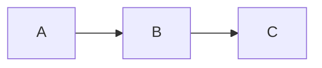
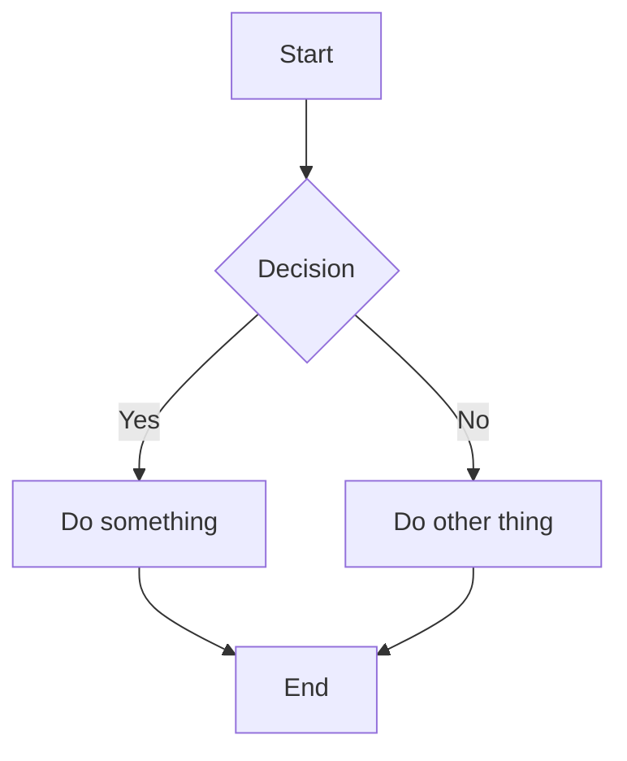
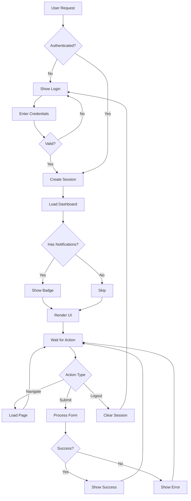
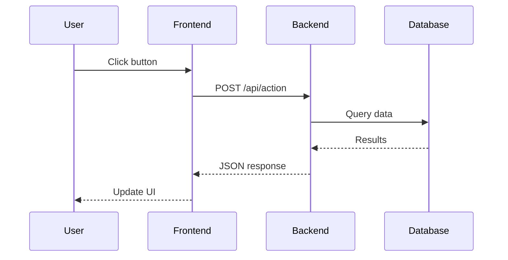
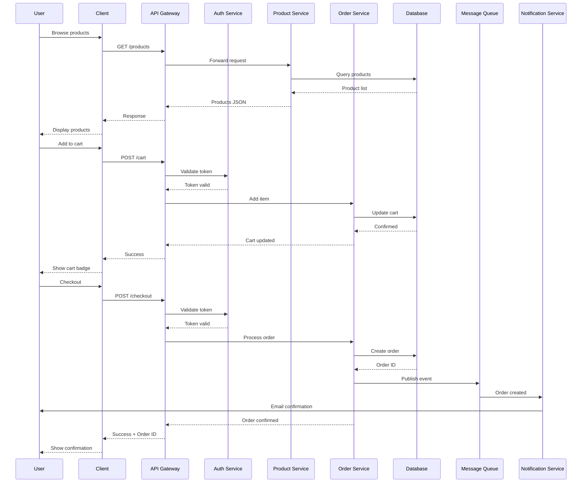
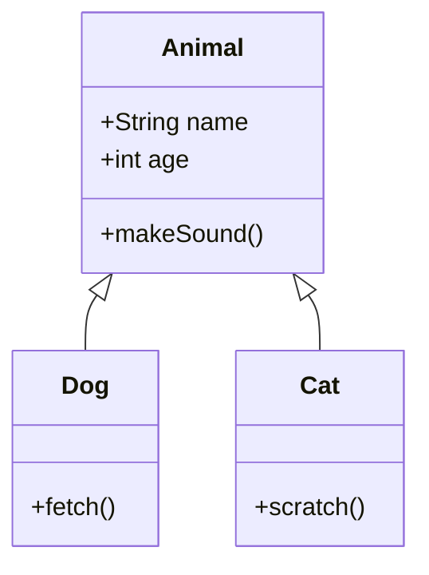
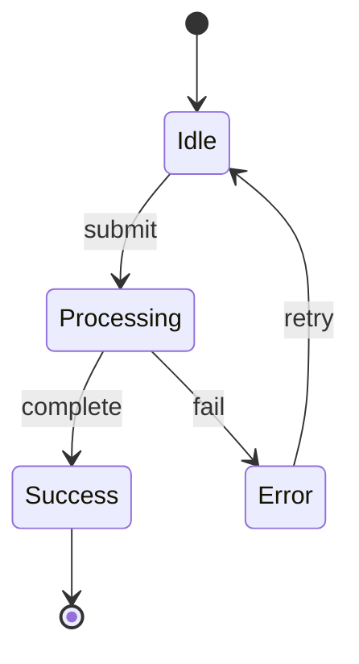
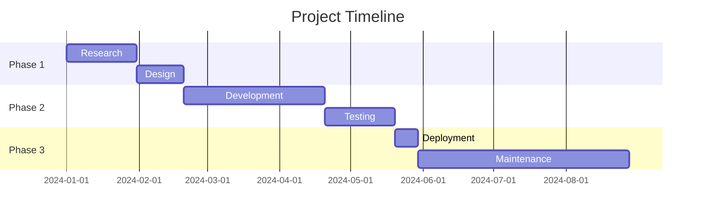
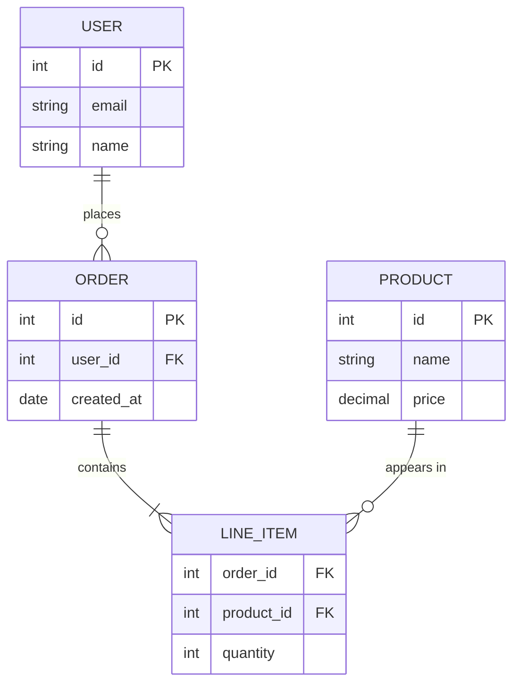

# Mermaid Diagram Varieties

Test file for viewport positioning - tall diagrams should show from top.

## Short Flowchart

## Medium Flowchart

## Tall Flowchart (should show from top)

## Sequence Diagram

## Tall Sequence Diagram (should show from top)

## Class Diagram

## State Diagram

## Gantt Chart (wide)

## ER Diagram

