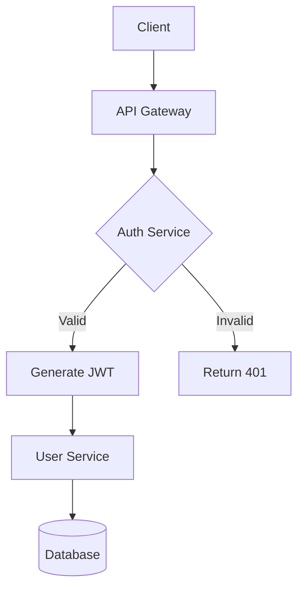
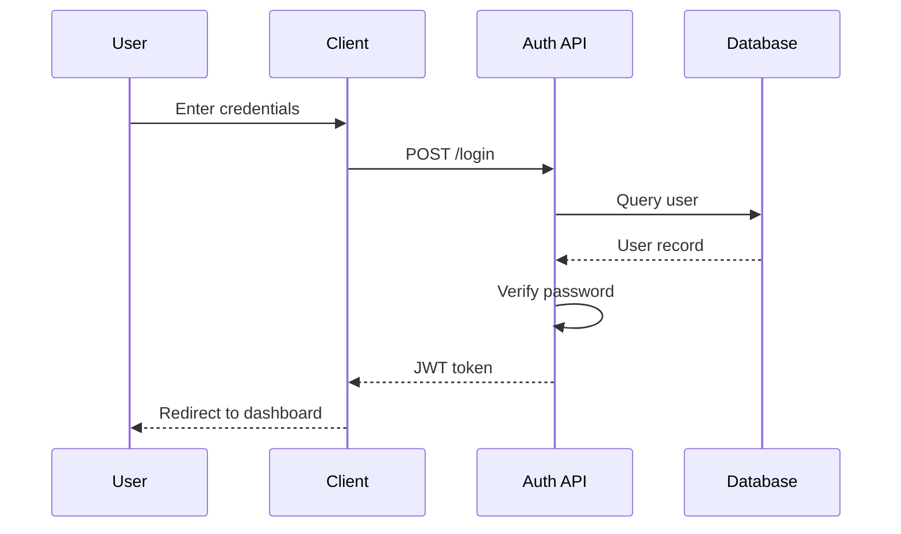
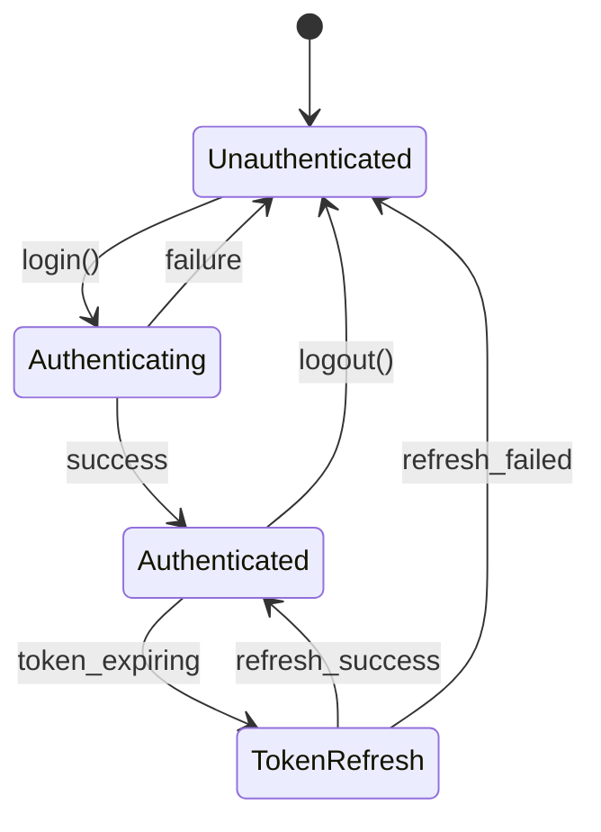
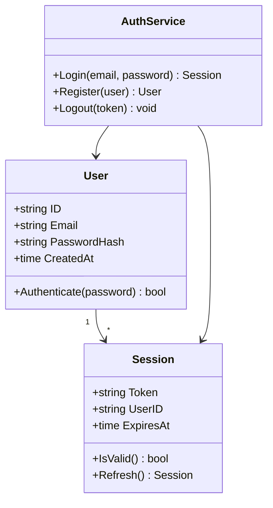

# Authentication Service Design

## Overview

This document outlines the authentication flow for our microservices architecture.

Here's some **bold text**, *italic text*, and ***bold italic*** together. You can also use ~~strikethrough~~ for deleted content. Inline `code` looks like this, and here's a [link to docs](https://example.com/docs).

### Inline Formatting Examples

- **Bold** with double asterisks
- *Italic* with single asterisks
- `inline code` with backticks
- ~~strikethrough~~ with tildes
- [Links](https://example.com) with brackets
- Combined: **bold with `code` inside** and *italic with [link](url)*

## User Registration Flow

1. User submits registration form
2. Backend validates input
3. Password is hashed with bcrypt
4. User record created in database
5. Confirmation email sent

## Architecture Diagram



## Sequence Diagram



## Code Example

```go
func HashPassword(password string) (string, error) {
    bytes, err := bcrypt.GenerateFromPassword([]byte(password), 14)
    return string(bytes), err
}

func CheckPasswordHash(password, hash string) bool {
    err := bcrypt.CompareHashAndPassword([]byte(hash), []byte(password))
    return err == nil
}
```

## State Machine



## API Endpoints

| Method | Endpoint | Description |
|--------|----------|-------------|
| POST | `/auth/login` | Authenticate user |
| POST | `/auth/register` | Create new account |
| POST | `/auth/refresh` | Refresh JWT token |
| DELETE | `/auth/logout` | Invalidate session |

## Error Codes

|Code|Name|Description|Retry?|
|-|-|-|-|
|401|Unauthorized|Invalid or missing credentials|Yes|
|403|Forbidden|Valid credentials but insufficient permissions|No|
|429|TooManyRequests|Rate limit exceeded, wait before retrying|Yes|
|500|InternalError|Unexpected server error, contact support if persistent|Yes|

## Feature Comparison

|Feature|Free Tier|Pro|Enterprise|Notes|
|:--|:-:|:-:|:-:|--:|
|Users|Up to 5|Up to 50|Unlimited|Per organization|
|API calls/month|1,000|50,000|Unlimited|Soft limit|
|SSO|✗|✓|✓|SAML 2.0|
|MFA|✓|✓|✓|TOTP only on Free|
|Audit logs|✗|30 days|Unlimited|Exportable|
|Custom domain|✗|✗|✓|SSL included|
|Priority support|✗|✓|✓|24/7 for Enterprise|

## Sprint Status

|Task|Owner|Status|Priority|
|-|-|-|-|
|Implement OAuth2|Alice|🚀 In Progress|🔴 High|
|Write unit tests|Bob|✅ Done|🟡 Medium|
|Update docs|Carol|📋 Todo|🟢 Low|
|Security audit|Dave|🔍 Review|🔴 High|
|Deploy to staging|Eve|⏸️ Blocked|🟡 Medium|

## Infrastructure Overview

|Service|Region|Instance Type|CPU|Memory|Storage|Monthly Cost|Health|Last Deploy|Owner|Oncall Rotation|SLA|
|-|-|-|-|-|-|-|-|-|-|-|-|
|auth-api|us-east-1|c5.2xlarge|8 vCPU|16 GB|500 GB SSD|$245.00|✅ Healthy|2024-01-15 14:32:01 UTC|Platform Team|weekly|99.99%|
|user-service|us-east-1|m5.xlarge|4 vCPU|16 GB|200 GB SSD|$140.00|✅ Healthy|2024-01-14 09:15:33 UTC|Identity Team|biweekly|99.95%|
|notification-worker|eu-west-1|t3.medium|2 vCPU|4 GB|50 GB SSD|$30.00|⚠️ Degraded|2024-01-10 22:45:00 UTC|Messaging Team|weekly|99.9%|
|analytics-pipeline|us-west-2|r5.4xlarge|16 vCPU|128 GB|2 TB NVMe|$890.00|✅ Healthy|2024-01-12 03:20:15 UTC|Data Engineering|monthly|99.5%|
|cdn-edge|global|CloudFront|N/A|N/A|N/A|$1,200.00|✅ Healthy|N/A|Infrastructure|weekly|99.999%|

## Configuration

```yaml
auth:
  jwt:
    secret: ${JWT_SECRET}
    expiry: 15m
  bcrypt:
    cost: 14
  rate_limit:
    max_attempts: 5
    window: 15m
```

## Class Diagram



## Notes

- All passwords must be at least 12 characters
- JWT tokens expire after 15 minutes
- Refresh tokens are valid for 7 days

> **Warning**: Never log sensitive authentication data

---

## Additional Test Cases

### Nested Lists

- First level item
  - Second level item
  - Another second level
    - Third level deep
- Back to first level
  * Mixed bullet style
  * Another mixed

1. Ordered list
2. Second item
   1. Nested ordered
   2. Another nested
3. Back to top level

### Multiple Blockquote Levels

> Single level blockquote with **bold** and *italic*.

> First level
> > Nested blockquote
> > > Triple nested

> A blockquote with `inline code` and a [link](https://example.com).
>
> Multiple paragraphs in one blockquote.

### Header Levels Demo

#### Level 4: Implementation Details

This section covers **implementation specifics** with `code references`.

##### Level 5: Sub-details

Even more granular information here.

###### Level 6: Micro-details

The deepest header level supported.

##### And a very, very long header level that should wrap to the next line and then more, it needs to be a very long one so that we can see if it can be displayed properly

---

### Horizontal Rules

Above is a dashed rule.

***

Above is an asterisk rule.

___

Above is an underscore rule.

### Edge Cases

- List item with **bold at end**
- List item with `code at end`
- List item ending with [a link](url)

> Blockquote ending with **bold text**

1. Numbered with *italic*
2. Numbered with ~~strikethrough~~

### Code Block Without Language

```
Plain code block
No syntax highlighting
Just raw text
```

### Empty Lines and Spacing

The above and below have empty lines between them.

Single line paragraph.

Another single line.

### Long Line Test

This is a very long line that contains **bold text**, *italic text*, `inline code`, a [hyperlink](https://example.com/very/long/path/to/resource), and ~~strikethrough~~ all in one line to test wrapping and rendering behavior.

### Special Characters

Ampersand: &, Less than: <, Greater than: >, Quote: "double" and 'single'

HTML entities should be escaped: <script>alert('xss')</script>

### Ligatures Test

Common programming ligatures that fonts like Fira Code, JetBrains Mono, or Cascadia Code render specially:

**Arrows and Comparisons:**
`->` `=>` `<-` `<->` `-->` `<--` `<-->` `~>` `->>` `<<-` `|>` `<|`

**Equality and Logic:**
`==` `!=` `===` `!==` `>=` `<=` `&&` `||` `::` `;;`

**Math and Ranges:**
`++` `--` `**` `//` `/*` `*/` `..` `...` `:::`

**Special Symbols:**
`</>` `<!--` `-->` `</` `/>` `#{` `#[` `#(` `www`

**Combined in context:**
```rust
fn main() -> Result<(), Error> {
    let x = a != b && c >= d || e <= f;
    let range = 0..10;
    let spread = vec![...items];
    // Comment with -> arrow
    /* Block comment */
}
```

```typescript
const fn = (x: number): number => x * 2;
const eq = a === b && c !== d;
const arrow = (a, b) => a >= b ? a : b;
// www.example.com
```

```haskell
main :: IO ()
main = do
    let result = map (*2) [1..10]
    print $ result >>= pure
```

**Inline ligatures:** Use `->` for arrows, `=>` for fat arrows, `!=` for not-equal, `>=` and `<=` for comparisons, `&&` and `||` for logic.

### Final Notes

This concludes the **comprehensive** markdown test file with *various* formatting `options` and [links](https://example.com).
