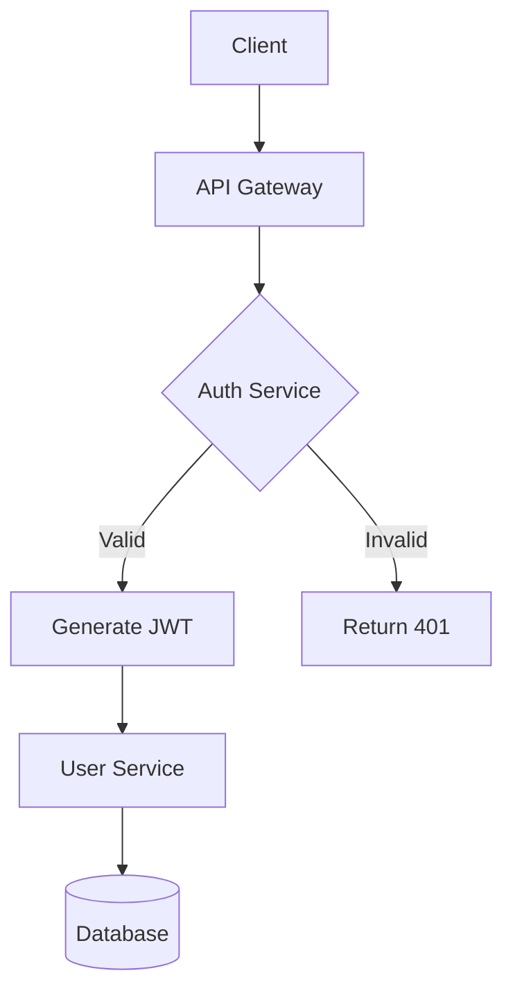
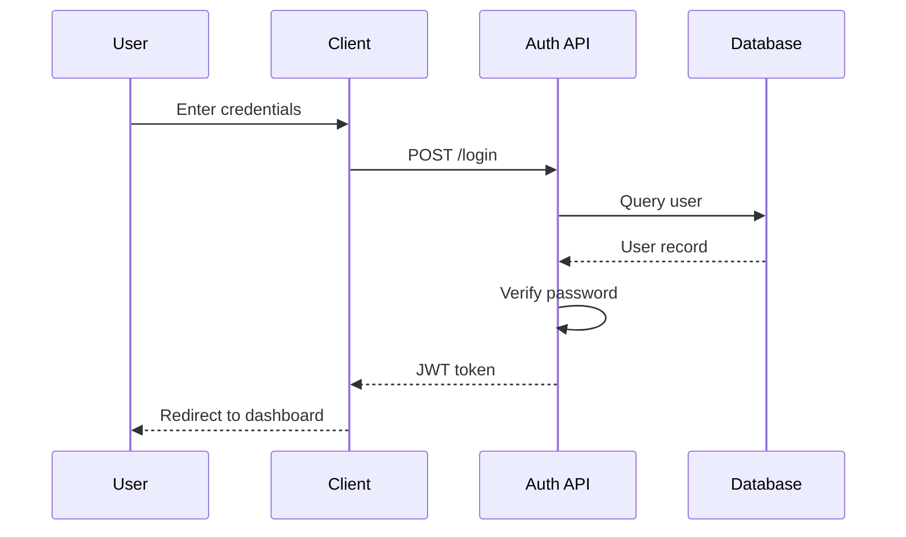
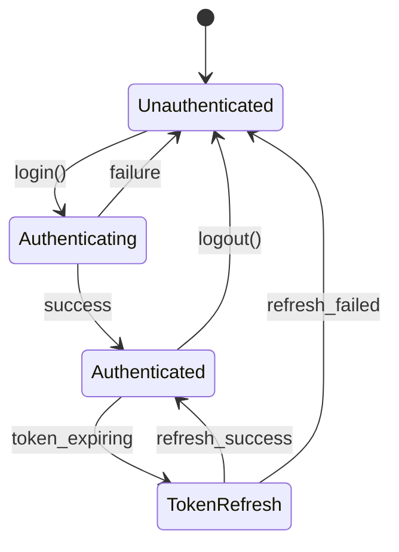
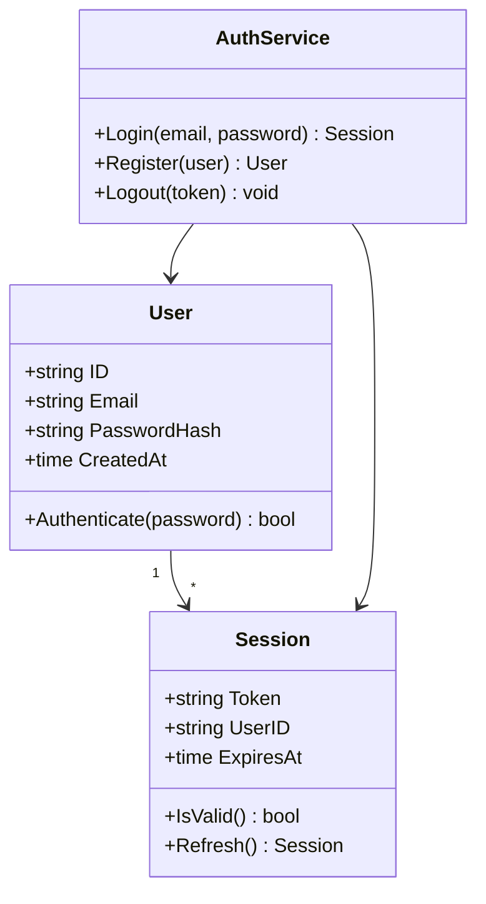
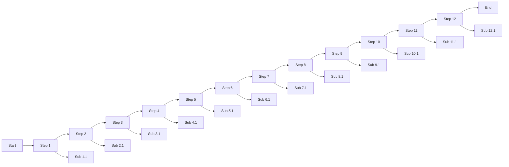
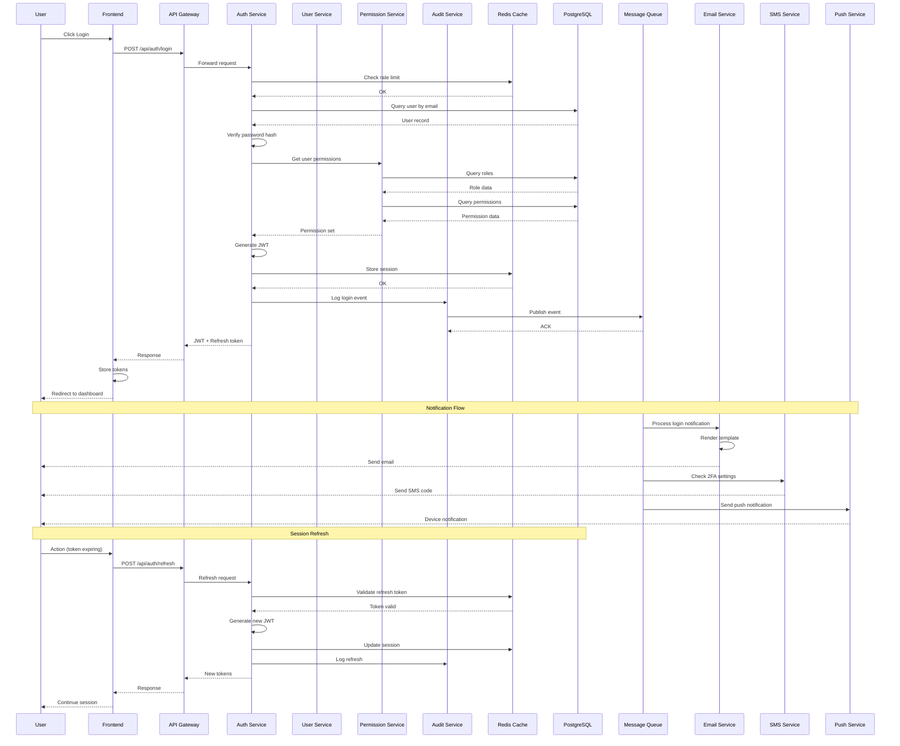

# Authentication Service Design

## Overview

This document outlines the authentication flow for our microservices architecture.

## Highlight Demo

Testing ==subtle==, ===default===, and ====strong==== highlight levels.

Here's some **bold text**, *italic text*, and ***bold italic*** together. You can also use ~~strikethrough~~ for deleted content. Inline `code` looks like this, and here's a [link to docs](https://example.com/docs).

### Inline Formatting Examples

- **Bold** with double asterisks
- *Italic* with single asterisks
- `inline code` with backticks
- ~~strikethrough~~ with tildes
- [Links](https://example.com) with brackets
- Combined: **bold with `code` inside** and *italic with [link](url)*

## User Registration Flow

1. User submits registration form
2. Backend validates input
3. Password is hashed with bcrypt
4. User record created in database
5. Confirmation email sent

## Architecture Diagram



## Sequence Diagram



## Code Example

```go
func HashPassword(password string) (string, error) {
    bytes, err := bcrypt.GenerateFromPassword([]byte(password), 14)
    return string(bytes), err
}

func CheckPasswordHash(password, hash string) bool {
    err := bcrypt.CompareHashAndPassword([]byte(hash), []byte(password))
    return err == nil
}
```

## State Machine



## API Endpoints

| Method | Endpoint | Description |
|--------|----------|-------------|
| POST | `/auth/login` | Authenticate user |
| POST | `/auth/register` | Create new account |
| POST | `/auth/refresh` | Refresh JWT token |
| DELETE | `/auth/logout` | Invalidate session |

## Error Codes

|Code|Name|Description|Retry?|
|-|-|-|-|
|401|Unauthorized|Invalid or missing credentials|Yes|
|403|Forbidden|Valid credentials but insufficient permissions|No|
|429|TooManyRequests|Rate limit exceeded, wait before retrying|Yes|
|500|InternalError|Unexpected server error, contact support if persistent|Yes|

## Feature Comparison

|Feature|Free Tier|Pro|Enterprise|Notes|
|:--|:-:|:-:|:-:|--:|
|Users|Up to 5|Up to 50|Unlimited|Per organization|
|API calls/month|1,000|50,000|Unlimited|Soft limit|
|SSO|✗|✓|✓|SAML 2.0|
|MFA|✓|✓|✓|TOTP only on Free|
|Audit logs|✗|30 days|Unlimited|Exportable|
|Custom domain|✗|✗|✓|SSL included|
|Priority support|✗|✓|✓|24/7 for Enterprise|

## Sprint Status

|Task|Owner|Status|Priority|
|-|-|-|-|
|Implement OAuth2|Alice|🚀 In Progress|🔴 High|
|Write unit tests|Bob|✅ Done|🟡 Medium|
|Update docs|Carol|📋 Todo|🟢 Low|
|Security audit|Dave|🔍 Review|🔴 High|
|Deploy to staging|Eve|⏸️ Blocked|🟡 Medium|

## Infrastructure Overview

|Service|Region|Instance Type|CPU|Memory|Storage|Monthly Cost|Health|Last Deploy|Owner|Oncall Rotation|SLA|
|-|-|-|-|-|-|-|-|-|-|-|-|
|auth-api|us-east-1|c5.2xlarge|8 vCPU|16 GB|500 GB SSD|$245.00|✅ Healthy|2024-01-15 14:32:01 UTC|Platform Team|weekly|99.99%|
|user-service|us-east-1|m5.xlarge|4 vCPU|16 GB|200 GB SSD|$140.00|✅ Healthy|2024-01-14 09:15:33 UTC|Identity Team|biweekly|99.95%|
|notification-worker|eu-west-1|t3.medium|2 vCPU|4 GB|50 GB SSD|$30.00|⚠️ Degraded|2024-01-10 22:45:00 UTC|Messaging Team|weekly|99.9%|
|analytics-pipeline|us-west-2|r5.4xlarge|16 vCPU|128 GB|2 TB NVMe|$890.00|✅ Healthy|2024-01-12 03:20:15 UTC|Data Engineering|monthly|99.5%|
|cdn-edge|global|CloudFront|N/A|N/A|N/A|$1,200.00|✅ Healthy|N/A|Infrastructure|weekly|99.999%|

## Configuration

```yaml
auth:
  jwt:
    secret: ${JWT_SECRET}
    expiry: 15m
  bcrypt:
    cost: 14
  rate_limit:
    max_attempts: 5
    window: 15m
```

## Class Diagram



## Notes

- All passwords must be at least 12 characters
- JWT tokens expire after 15 minutes
- Refresh tokens are valid for 7 days

> **Warning**: Never log sensitive authentication data

---

## Additional Test Cases

### Nested Lists

- First level item
  - Second level item
  - Another second level
    - Third level deep
- Back to first level
  * Mixed bullet style
  * Another mixed

1. Ordered list
2. Second item
   1. Nested ordered
   2. Another nested
3. Back to top level

### Multiple Blockquote Levels

> Single level blockquote with **bold** and *italic*.

> First level
> > Nested blockquote
> > > Triple nested

> A blockquote with `inline code` and a [link](https://example.com).
>
> Multiple paragraphs in one blockquote.

### Header Levels Demo

#### Level 4: Implementation Details

This section covers **implementation specifics** with `code references`.

##### Level 5: Sub-details

Even more granular information here.

###### Level 6: Micro-details

The deepest header level supported.

##### And a very, very long header level that should wrap to the next line and then more, it needs to be a very long one so that we can see if it can be displayed properly

---

### Horizontal Rules

Above is a dashed rule.

***

Above is an asterisk rule.

___

Above is an underscore rule.

### Edge Cases

- List item with **bold at end**
- List item with `code at end`
- List item ending with [a link](url)

> Blockquote ending with **bold text**

1. Numbered with *italic*
2. Numbered with ~~strikethrough~~

### Code Block Without Language

```
Plain code block
No syntax highlighting
Just raw text
```

### Empty Lines and Spacing

The above and below have empty lines between them.

Single line paragraph.

Another single line.

### Long Line Test

This is a very long line that contains **bold text**, *italic text*, `inline code`, a [hyperlink](https://example.com/very/long/path/to/resource), and ~~strikethrough~~ all in one line to test wrapping and rendering behavior.

### Special Characters

Ampersand: &, Less than: <, Greater than: >, Quote: "double" and 'single'

HTML entities should be escaped: <script>alert('xss')</script>

### Ligatures Test

Common programming ligatures that fonts like Fira Code, JetBrains Mono, or Cascadia Code render specially:

**Arrows and Comparisons:**
`->` `=>` `<-` `<->` `-->` `<--` `<-->` `~>` `->>` `<<-` `|>` `<|`

**Equality and Logic:**
`==` `!=` `===` `!==` `>=` `<=` `&&` `||` `::` `;;`

**Math and Ranges:**
`++` `--` `**` `//` `/*` `*/` `..` `...` `:::`

**Special Symbols:**
`</>` `<!--` `-->` `</` `/>` `#{` `#[` `#(` `www`

**Combined in context:**
```rust
fn main() -> Result<(), Error> {
    let x = a != b && c >= d || e <= f;
    let range = 0..10;
    let spread = vec![...items];
    // Comment with -> arrow
    /* Block comment */
}
```

```typescript
const fn = (x: number): number => x * 2;
const eq = a === b && c !== d;
const arrow = (a, b) => a >= b ? a : b;
// www.example.com
```

```haskell
main :: IO ()
main = do
    let result = map (*2) [1..10]
    print $ result >>= pure
```

**Inline ligatures:** Use `->` for arrows, `=>` for fat arrows, `!=` for not-equal, `>=` and `<=` for comparisons, `&&` and `||` for logic.

### Final Notes

This concludes the **comprehensive** markdown test file with *various* formatting `options` and [links](https://example.com).

## Wide Diagram Test



## Tall Diagram Test



---

<!--This means we can use HTML elements in Markdown, such as the comment
element, and they won't be affected by a markdown parser. However, if you
create an HTML element in your markdown file, you cannot use markdown syntax
within that element's contents.-->
```

## Headings

You can create HTML elements `<h1>` through `<h6>` easily by prepending the
text you want to be in that element by a number of hashes (#).

```md
# This is an <h1>
## This is an <h2>
### This is an <h3>
#### This is an <h4>
##### This is an <h5>
###### This is an <h6>
```

Markdown also provides us with two alternative ways of indicating h1 and h2.

```md
This is an h1
=============

This is an h2
-------------
```

## Simple text styles

Text can be easily styled as italic or bold using markdown.

```md
*This text is in italics.*
_And so is this text._

**This text is in bold.**
__And so is this text.__

***This text is in both.***
**_As is this!_**
*__And this!__*
```

In GitHub Flavored Markdown, which is used to render markdown files on
GitHub, we also have strikethrough:

```md
~~This text is rendered with strikethrough.~~
```

## Paragraphs

Paragraphs are a one or multiple adjacent lines of text separated by one or
multiple blank lines.

```md
This is a paragraph. I'm typing in a paragraph isn't this fun?

Now I'm in paragraph 2.
I'm still in paragraph 2 too!


I'm in paragraph three!
```

Should you ever want to insert an HTML `<br />` tag, you can end a paragraph
with two or more spaces and then begin a new paragraph.

```md
I end with two spaces (highlight me to see them).

There's a <br /> above me!
```

Block quotes are easy and done with the > character.

```md
> This is a block quote. You can either
> manually wrap your lines and put a `>` before every line or you can let your lines get really long and wrap on their own.
> It doesn't make a difference so long as they start with a `>`.

> You can also use more than one level
>> of indentation?
> How neat is that?

```

## Lists

Unordered lists can be made using asterisks, pluses, or hyphens.

```md
* Item
* Item
* Another item

or

+ Item
+ Item
+ One more item

or

- Item
- Item
- One last item
```

Ordered lists are done with a number followed by a period.

```md
1. Item one
2. Item two
3. Item three
```

You don't even have to label the items correctly and Markdown will still
render the numbers in order, but this may not be a good idea.

```md
1. Item one
1. Item two
1. Item three
```

(This renders the same as the example above.)

You can also use sublists.

```md
1. Item one
2. Item two
3. Item three
    * Sub-item
    * Sub-item
4. Item four
```

There are even task lists. This creates HTML checkboxes.

```md
Boxes below without the 'x' are unchecked HTML checkboxes.
- [ ] First task to complete.
- [ ] Second task that needs done
This checkbox below will be a checked HTML checkbox.
- [x] This task has been completed
```

## Code blocks

You can indicate a code block (which uses the `<code>` element) by indenting
a line with four spaces or a tab.

```md
    This is code
    So is this
```

You can also re-tab (or add an additional four spaces) for indentation
inside your code.

```md
    my_array.each do |item|
      puts item
    end
```

Inline code can be created using the backtick character `` ` ``.

```md
John didn't even know what the `go_to()` function did!
```

In GitHub Flavored Markdown, you can use a special syntax for code.

````md
```ruby
def foobar
  puts "Hello world!"
end
```
````

The above text doesn't require indenting, plus GitHub will use syntax
highlighting of the language you specify after the opening <code>```</code>.

## Horizontal rule

Horizontal rules (`<hr/>`) are easily added with three or more asterisks or
hyphens, with or without spaces.

```md
***
---
- - -
****************
```

## Links

One of the best things about markdown is how easy it is to make links. Put
the text to display in hard brackets [] followed by the url in parentheses ()

```md
[Click me!](http://test.com/)
```

You can also add a link title using quotes inside the parentheses.

```md
[Click me!](http://test.com/ "Link to Test.com")
```

Relative paths work too.

```md
[Go to music](/music/).
```

Markdown also supports reference style links.

```md
[Click this link][link1] for more info about it!
[Also check out this link][foobar] if you want to.

[link1]: http://test.com/ "Cool!"
[foobar]: http://foobar.biz/ "Alright!"
```

The title can also be in single quotes or in parentheses, or omitted
entirely. The references can be anywhere in your document and the reference IDs
can be anything so long as they are unique.

There is also "implicit naming" which lets you use the link text as the id.

```md
[This][] is a link.

[This]: http://thisisalink.com/
```

But it's not that commonly used.

### Table of contents

Some Markdown flavors even make use of the combination of lists, links and
headings in order to create tables of contents. In this case, heading titles in
lowercase are prepended with hash (`#`) and are used as link ids. Should the
heading have multiple words, they will be connected with a hyphen (`-`), that
also replaces some special characters. (Some other special characters are
omitted though.)

```md
- [Heading](#heading)
- [Another heading](#another-heading)
- [Chapter](#chapter)
  - [Subchapter <h3 />](#subchapter-h3-)
```

Nonetheless, this is a feature that might not be working in all Markdown
implementations the same way.

## Images

Images are done the same way as links but with an exclamation point in front!

```md

```

And reference style works as expected.

```md
![This is the alt-attribute.][myimage]

[myimage]: relative/urls/cool/image.jpg "if you need a title, it's here"
```

## Miscellany

### Auto-links

```md
<http://testwebsite.com/> is equivalent to
[http://testwebsite.com/](http://testwebsite.com/)
```

### Auto-links for emails

```md
<foo@bar.com>
```

### Escaping characters

```md
I want to type *this text surrounded by asterisks* but I don't want it to be
in italics, so I do this: \*this text surrounded by asterisks\*.
```

### Keyboard keys

In GitHub Flavored Markdown, you can use a `<kbd>` tag to represent keyboard
keys.

```md
Your computer crashed? Try sending a
<kbd>Ctrl</kbd>+<kbd>Alt</kbd>+<kbd>Del</kbd>
```

### Tables

Tables are only available in GitHub Flavored Markdown and are slightly
cumbersome, but if you really want it:

```md
| Col1         | Col2     | Col3          |
| :----------- | :------: | ------------: |
| Left-aligned | Centered | Right-aligned |
| blah         | blah     | blah          |
```

or, for the same results

```md
Col 1 | Col2 | Col3
:-- | :-: | --:
Ugh this is so ugly | make it | stop
